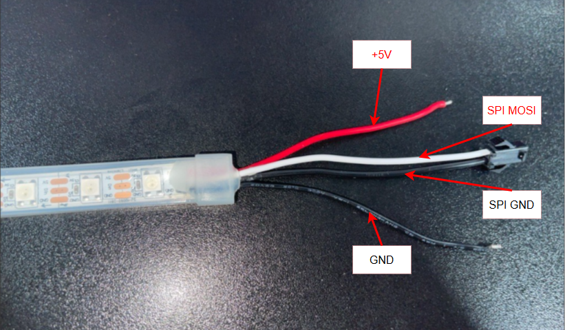
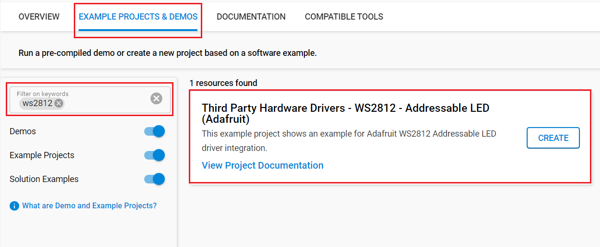

# WS2812 - Addressable LED (Adafruit) #

## Summary ##

This project demonstrates the implementation of a hardware driver for the [WS2812 - Addressable LED (Adafruit)](https://cdn-shop.adafruit.com/datasheets/WS2812.pdf) using the Silicon Labs platform.

The WS2812 is an intelligent RGB LED light source that integrates a control circuit and RGB chip within a 5050 package. It features an intelligent digital data latch, signal reshaping amplification circuit, a precision internal oscillator, and a programmable constant current control mechanism. These components ensure consistent color accuracy across all LEDs in the strip.

The WS2812 uses a single-wire NZR communication protocol for data transfer. Upon power-up, the DIN port receives data from the controller. The first LED captures the initial 24-bit data (8 bits each for Red, Green, and Blue) and stores it in its internal data latch. The remaining data is reshaped and transmitted to the next LED in the chain via the DO port. This cascading process continues, with each LED reducing the data by 24 bits. The WS2812 employs automatic reshaping technology, allowing for an unlimited number of LEDs in the chain, constrained only by the signal transmission speed.

## Required Hardware ##

- 1x Series 2 device (e.g. [BGM220-EK4314A](https://www.silabs.com/development-tools/wireless/bluetooth/bgm220-explorer-kit) or [BRD2703A](https://www.silabs.com/development-tools/wireless/efr32xg24-explorer-kit?tab=overview))
- Or 1x [Wi-Fi Development Kit](https://www.silabs.com/development-tools/wireless/wi-fi) based on SiWG917 (e.g. [SIWX917-DK2605A](https://www.silabs.com/development-tools/wireless/wi-fi/siwx917-dk2605a-wifi-6-bluetooth-le-soc-dev-kit) or [SIWX917-RB4338A](https://www.silabs.com/development-tools/wireless/wi-fi/siwx917-rb4338a-wifi-6-bluetooth-le-soc-radio-board))
- 1x [WS2812 - Addressable LED (Adafruit)](https://cdn-shop.adafruit.com/datasheets/WS2812.pdf)

## Hardware Connection ##

Connect the white DIN wire to the MOSI pin of the board and the adjacent black wire to the GND pin of your board. Additionally, connect the 5V wire to a power source and the corresponding GND wire to the ground of the power source. For optimal performance, it is recommended to use a stable external power source, as the LED requires varying voltage levels depending on the colors displayed. The recommended voltage range is +5.0V to +7.0V. Note that relying on the board's power supply may result in voltage drops, potentially affecting functionality.

> [!TIP]
> Always refer to the device's reference manual to get the correct pin layout.

## Setup ##

You can either create a project based on an example project or start with an empty example project.

> [!IMPORTANT]
> - Make sure that the [Third Party Hardware Drivers](https://github.com/SiliconLabsSoftware/third_party_hw_drivers_extension) extension is installed as part of the SiSDK. If not, follow [this documentation](https://github.com/SiliconLabsSoftware/third_party_hw_drivers_extension/blob/master/README.md#how-to-add-to-simplicity-studio-ide).
> - **Third Party Hardware Drivers** extension must be enabled for the project to install the required components from this extension.

> [!TIP]
> To show all components in the **Third Party Hardware Drivers** extension, the **Evaluation** quality must be enabled in the Software Component view.

### Create a project based on an example project ###

1. From the Launcher Home, add your device to My Products, click on it, and click on the **EXAMPLE PROJECTS & DEMOS** tab. Find the example project filtering by "ws2812".

2. Click **Create** button on the **Third Party Hardware Drivers - WS2812 - Addressable LED (Adafruit)** example Example project creation dialog pops up -> click Create and Finish and Project should be generated.

   

3. Build and flash this example to the board.

### Start with an empty example project ###

1. Create an "Empty C Project" for the your board using Simplicity Studio v5. Use the default project settings.

2. Copy the file `app/example/adafruit_addressable_led_ws2812/app.c` into the project root folder (overwriting existing file).

3. Install the software components:

   - Open the .slcp file in the project.

   - Select the SOFTWARE COMPONENTS tab.

   - Install the following components:
      - With Simplicity EFR32 SoCs:
         - [Application] → [Utility] → [Log]
         - [Services] → [IO Stream] → [IO Stream: EUSART] → default instance name: vcom
         - [Platform] → [Driver] → [SPI] → [SPIDRV] → default instance name: mikroe
         - [Services] → [Timers] → [Sleep Timer]
         - [Third Party Hardware Drivers] → [Display & LED] → [WS2812 - Addressable LED (Adafruit)] → [Configuration] → Set your desired number of LEDs
      - With SiWx917 SoCs:
         - [WiSeConnect 3 SDK] → [Device] → [Si91x] → [MCU] → [Peripheral] → [GSPI]
         - [WiSeConnect 3 SDK] → [Device] → [Si91x] → [MCU] → [Service] → [Sleep Timer for Si91x]
         - [Third Party Hardware Drivers] → [Display & LED] → [WS2812 - Addressable LED (Adafruit)] → [Configuration] → Set your desired number of LEDs
4. Build and flash the project to your device.

## How It Works ##

- The WS2812 is an RGB LED with a built-in controller, using a single-wire serial protocol. Each LED receives 24 bits of data (8 bits each for Green, Red, and Blue) and passes remaining data to the next LED in the chain. A logical ‘1’ and ‘0’ are encoded by precise HIGH/LOW timing (~1.25µs per bit). A 50µs LOW reset signals the end of data. Control is done via a microcontroller using precise timing or protocols like SPI.

- This project demonstrates how to configure the SPI to work with the WS2812, and shows a *scanner light effect* in 3 basic different colors: Red, Green, Blue.

> [!TIP]
> Refers to the official [WS2812 - Addressable LED (Adafruit)](https://cdn-shop.adafruit.com/datasheets/WS2812.pdf) reference manual to get all the mentioned information.

### Testing ###

- The result will be as followed:

   

## Report Bugs & Get Support ##

To report bugs in the Application Examples projects, please create a new "Issue" in the "Issues" section of [third_party_hw_drivers_extension](https://github.com/SiliconLabsSoftware/third_party_hw_drivers_extension) repo. Please reference the board, project, and source files associated with the bug, and reference line numbers. If you are proposing a fix, also include information on the proposed fix. Since these examples are provided as-is, there is no guarantee that these examples will be updated to fix these issues.

Questions and comments related to these examples should be made by creating a new "Issue" in the "Issues" section of [third_party_hw_drivers_extension](https://github.com/SiliconLabsSoftware/third_party_hw_drivers_extension) repo.
