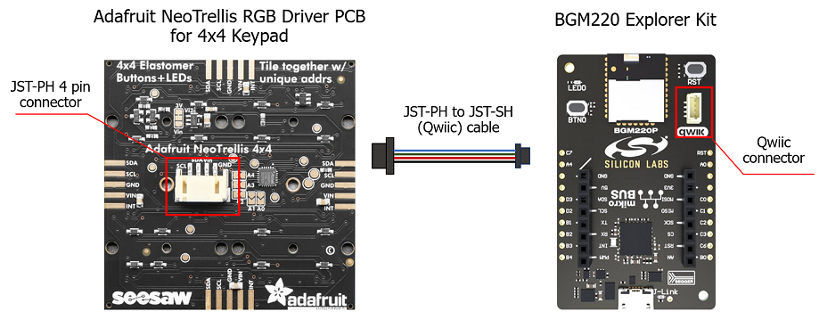
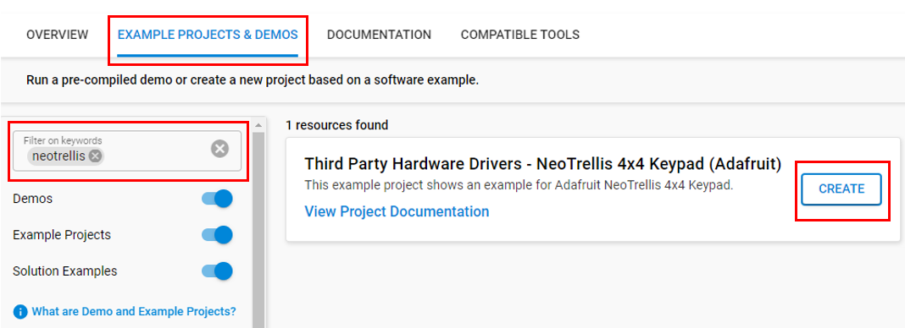

# Neotrellis RGB 4x4 keypad (Adafruit) #

## Summary ##

This project aims to implement a hardware driver interacting with the [Adafruit NeoTrellis RGB for 4x4 Keypad](https://www.adafruit.com/product/3954) using Silicon Labs platform.

Adafruit NeoTrellis 4x4 keypad is a trellis 4x4 elastomer-button keypad kit with a PCB with full-color NeoPixel support. These 4x4 button pad boards are fully tile-able and communicate over I2C. With 5 address pins, you get the ability to connect up to 32 together in any arrangement by soldering them edge-to-edge and soldering closed the I2C address jumpers, then use one I2C connection for all tiled NeoTrellis boards. Each NeoTrellis board comes with a seesaw chip and 16 NeoPixels already soldered in place.

## Required Hardware ##

- 1x [BGM220-EK4314A](https://www.silabs.com/development-tools/wireless/bluetooth/bgm220-explorer-kit) BGM220 Bluetooth Module Explorer Kit
- Or 1x [Wi-Fi Development Kit](https://www.silabs.com/development-tools/wireless/wi-fi) based on SiWG917 (e.g. [SIWX917-DK2605A](https://www.silabs.com/development-tools/wireless/wi-fi/siwx917-dk2605a-wifi-6-bluetooth-le-soc-dev-kit) or [SIWX917-RB4338A](https://www.silabs.com/development-tools/wireless/wi-fi/siwx917-rb4338a-wifi-6-bluetooth-le-soc-radio-board))
- 1x [Adafruit NeoTrellis RGB for 4x4 Keypad](https://www.adafruit.com/product/3954)

## Hardware Connection ##

- **If the BGM220 Explorer Kit board is used**:

  Adafruit NeoTrellis can connect with your board easily via the Qwiic connector. It includes a JST-PH 4-pin connector that provides two I2C wires (SDA and SCL), 3v3, and GND. You can use [the JST PH to JST SH (qwiic) Cable](https://www.adafruit.com/product/4424) to connect to your board.

  The Adafruit NeoTrellis supports Qwiic, so it can connect easily to the Qwiic header of the BGM220 Explorer Kit board. The hardware connection is shown in the image below:

  

- **If the Wi-Fi Development Kit is used**:

  The hardware connection is shown in the table below:

  | Description  | BRD4338A + BRD4002A | BRD2605A    | Adafruit NeoTrellis |
  | -------------| ------------- | ------------------ | ------------------- |
  | I2C_SDA      | ULP_GPIO_6 [EXP_16] | ULP_GPIO_6   | SDA            |
  | I2C_SCL      | ULP_GPIO_7 [EXP_15] | ULP_GPIO_7   | SCL            |

## Setup ##

You can either create a project based on an example project or start with an empty example project.

### Create a project based on an example project ###

1. From the Launcher Home, add your board to My Products, click on it, and click on the **EXAMPLE PROJECTS & DEMOS** tab. Find the example project filtering by "NeoTrellis".

2. Click **Create** button on the **Third Party Hardware Drivers - Neotrellis RGB 4x4 keypad (Adafruit)** example. Example project creation dialog pops up -> click Create and Finish and Project should be generated.

    

3. Build and flash this example to the board.

### Start with an empty example project ###

1. Create an "Empty C Project" for your board using Simplicity Studio v5. Use the default project settings.

2. Copy the file `app/example/adafruit_neotrellis_keypad/app.c` into the project root folder (overwriting the existing file).

3. Install the software components:

   - Open the .slcp file in the project.
   - Select the SOFTWARE COMPONENTS tab.
   - Install the following components:

      **If the BGM220 Explorer Kit is used**

        - [Services] → [IO Stream] → [IO Stream: USART] → default instance name: vcom
        - [Application] → [Utility] → [Log]
        - [Platform] → [Driver] → [I2C] → [I2CSPM] → default instance name: qwiic
        - [Third Party Hardware Drivers] → [Human Machine Interface] → [NeoTrellis 4x4 Keypad (Adafruit)]

      **If the Wi-Fi Development Kit is used:**

        - [WiSeConnect 3 SDK] → [Device] → [Si91x] → [MCU] → [Peripheral] → [I2C] → [i2c2]
        - [Third Party Hardware Drivers] → [Human Machine Interface] → [NeoTrellis 4x4 Keypad (Adafruit)]

4. Build and flash the project to your device.

**Note:**

- Make sure that the **Third Party Hardware Drivers** extension is installed. If not, follow [this documentation](https://github.com/SiliconLabs/third_party_hw_drivers_extension/blob/master/README.md#how-to-add-to-simplicity-studio-ide).

- **Third Party Hardware Drivers** extension must be enabled for the project to install **NeoTrellis 4x4 Keypad (Adafruit)** component.

## How It Works ##

### API Overview ###

```c
 ---------------------------------------------
|                  application                |
|---------------------------------------------|
|           adafruit_neotrellis.c             |
|---------------------------------------------|
|         adafruit_seesawneopixel.c           |
|---------------------------------------------|
|             adafruit_seesaw.c               |
|---------------------------------------------|
```

The Adafruit NeoTrellis driver is implemented based on the Adafruit NeoPixel driver for the seesaw chip and the Adafruit seesaw driver.

- `adafruit_neotrellis.c` : Use to control the keypad functions for interacting with multiple neotrellis boards
- `adafruit_seesawneopixel.c`: This file is part of the Adafruit NeoPixel library used for compatibility with the seesaw chip. It helps control a wide variety of WS2811- and WS2812-based RGB LED devices such as Adafruit FLORA RGB Smart Pixels and NeoPixel strips
- `adafruit_seesaw.c`: Use to communicate with the Microcontroller.

### Testing ###

- The application implements a colorful keypad. Each time a button on the keypad is pressed, the corresponding RGB LED lights.

- The RGB color can be customized on the application.

   

## Report Bugs & Get Support ##

To report bugs in the Application Examples projects, please create a new "Issue" in the "Issues" section of [third_party_hw_drivers_extension](https://github.com/SiliconLabs/third_party_hw_drivers_extension) repo. Please reference the board, project, and source files associated with the bug, and reference line numbers. If you are proposing a fix, also include information on the proposed fix. Since these examples are provided as-is, there is no guarantee that these examples will be updated to fix these issues.

Questions and comments related to these examples should be made by creating a new "Issue" in the "Issues" section of [third_party_hw_drivers_extension](https://github.com/SiliconLabs/third_party_hw_drivers_extension) repo.
