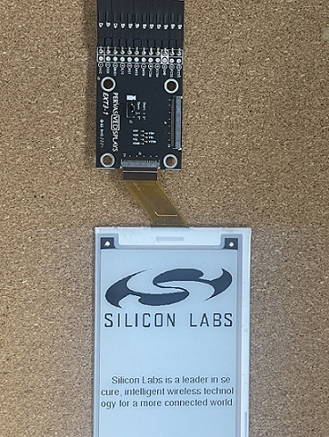

# E-Paper EXT3-1 #

## Summary ##

Electronic paper (E-Paper) or intelligent paper, is a display device that reflects ambient light, mimicking the appearance of ordinary ink on paper. EPD Extension Kit Generation 3 (EXT3 Kit) is a new extension board that connects to E-Paper Display (EPD).
This project aims to implement a hardware driver interacting with the EXT3-1 Kit to control an E-Paper Display.

## Required Hardware ##

- 1x [XG24-EK2703A](https://www.silabs.com/development-tools/wireless/efr32xg24-explorer-kit) EFR32xG24 Explorer Kit
- Or 1x [Wi-Fi Development Kit](https://www.silabs.com/development-tools/wireless/wi-fi) based on SiWG917 (e.g. [SIWX917-DK2605A](https://www.silabs.com/development-tools/wireless/wi-fi/siwx917-dk2605a-wifi-6-bluetooth-le-soc-dev-kit) or [SIWX917-RB4338A](https://www.silabs.com/development-tools/wireless/wi-fi/siwx917-rb4338a-wifi-6-bluetooth-le-soc-radio-board))
- 1x [EPD Extension Kit Generation 3 revision 1](https://www.pervasivedisplays.com/product/epd-extension-kit-gen-3-ext3/#tab-3)
- 1x [5.81″ E-ink displays](https://www.pervasivedisplays.com/product/5-81-e-ink-displays/)

## Hardware Connection ##

To connect the EPD Extension Kit to the EFR32xG24 Explorer Kit, you can see the pins mapping table below.

| BGM220P Explorer Kit | EFR32xG24 Explorer Kit | BRB4338A + BRD4002A | BRB2605A | EXT3-1 Kit | Pin function |
| --- | --- | --- | --- | --- | --- |
| 3V3 | 3V3 | 3V3 | VCC | 3V3 [1] | VCC 3.3V |
| GND | GND | GND | GND | GND [10] |Ground |
| PC3 | PC0 | GPIO_28 [P31]| GPIO_28 | ECSM [9] | Master chip select pin of EPD |
| PC2 | PC1 | GPIO_25 [P25] | GPIO_25 | SCK [2] | SPI SCK |
| PC1 | PC2 | GPIO_26 [P27] | GPIO_26 | MISO [6] | SPI MISO |
| PC0 | PC3 | GPIO_27 [P29] | GPIO_27 | MOSI [7] | SPI MOSI |
| PB4 | PA0 | GPIO_46 [P24] | GPIO_10 | D/C [4] | Serial bus for controlling data or command |
| PB2 | PD5 | GPIO_48 [P28] | GPIO_12 | RST [5] | Reset signal input |
| PB3 | PB1 | GPIO_47 [P26] | GPIO_11 | BUSY [3] |  Busy state output pin |

## Setup ##

You can either create a project based on an example project or start with an empty example project.

> [!IMPORTANT]
> - Make sure that the [Third Party Hardware Drivers](https://github.com/SiliconLabsSoftware/third_party_hw_drivers_extension) extension is installed as part of the SiSDK. If not, follow [this documentation](https://github.com/SiliconLabsSoftware/third_party_hw_drivers_extension/blob/master/README.md#how-to-add-to-simplicity-studio-ide).
> - **Third Party Hardware Drivers** extension must be enabled for the project to install the required components from this extension.

> [!TIP]
> To show all components in the **Third Party Hardware Drivers** extension, the **Evaluation** quality must be enabled in the Software Component view.

### Create a project based on an example project ###

1. From the Launcher Home, add your board to My Products, click on it, and click on the **EXAMPLE PROJECTS & DEMOS** tab. Find the example project filtering by **ext3-1**.

2. Click **Create** button on **Third Party Hardware Drivers - E-paper EXT3-1** examples. Example project creation dialog pops up -> click Create and Finish and Project should be generated.

   

3. Build and flash this example to the board.

### Start with an empty example project ###

1. Create an "Empty C Project" for the "EFR32xG24 Explorer Kit Board" using Simplicity Studio v5. Use the default project settings.

2. Copy the file `app/example/epaper_ext3_1/app.c` and `app/example/epaper_ext3_1/silabs_logo.h` into the project root folder (overwriting the existing file).

3. Install the software components:

   - Open the .slcp file in the project.

   - Select the SOFTWARE COMPONENTS tab.

   - Install the following components:
      - [Third Party Hardware Drivers] → [Display & LED] → [E-Paper EXT3-1 (Pervasive Displays)]
      - [Third Party Hardware Drivers] → [Services] → [GLIB - OLED Graphics Library]

4. Build and flash the project to your device.

## How It Works ##

E-paper (also called ePaper) is an electronic display technology that mimics the appearance of paper. Using the same inks as the traditional printing industry, e-paper displays (EPDs) have tiny capsules filled with charged ink particles. When the proper charge is applied, an EPD creates highly detailed images with the contrast ratio and readability of printed material.

### Testing ###

The E-paper will look something like the picture below.

## Report Bugs & Get Support ##

To report bugs in the Application Examples projects, please create a new "Issue" in the "Issues" section of [third_party_hw_drivers_extension](https://github.com/SiliconLabsSoftware/third_party_hw_drivers_extension) repo. Please reference the board, project, and source files associated with the bug, and reference line numbers. If you are proposing a fix, also include information on the proposed fix. Since these examples are provided as-is, there is no guarantee that these examples will be updated to fix these issues.

Questions and comments related to these examples should be made by creating a new "Issue" in the "Issues" section of [third_party_hw_drivers_extension](https://github.com/SiliconLabsSoftware/third_party_hw_drivers_extension) repo.
