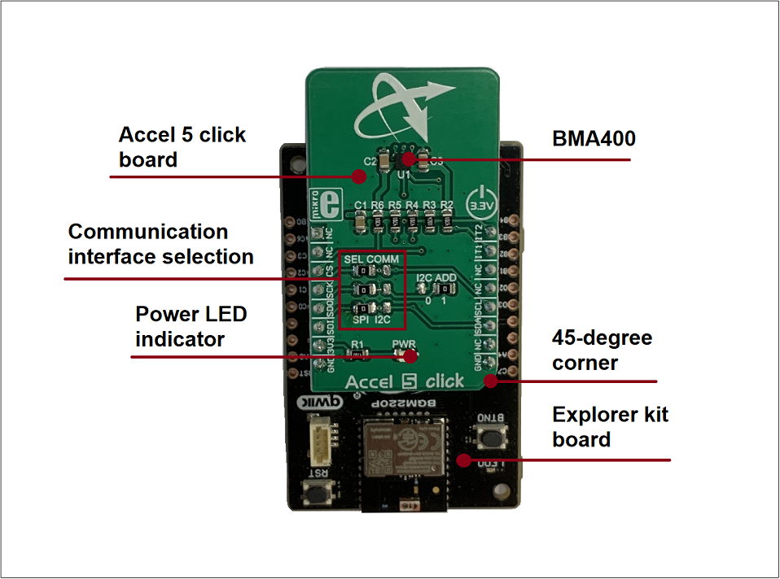
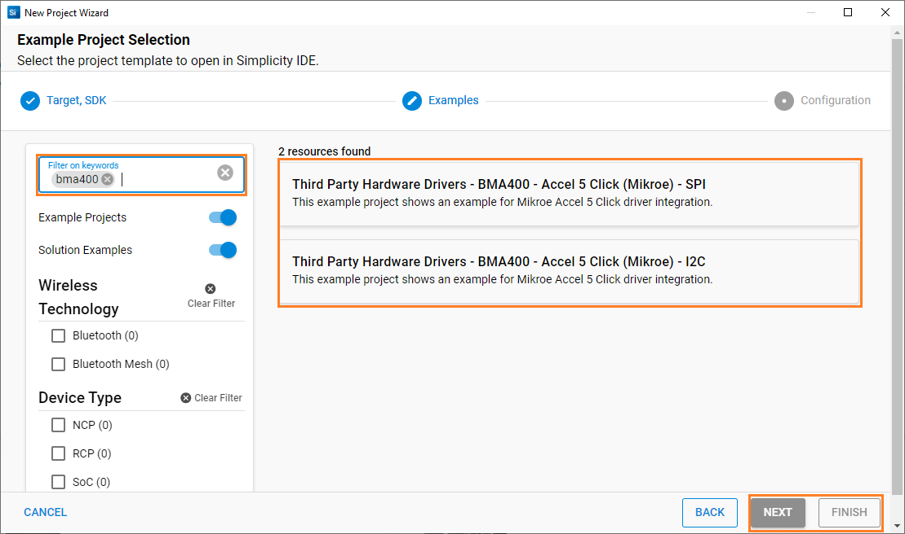

# BMA400 - Accel 5 Click (Mikroe) #

## Summary ##

This project aims to show the hardware driver that is used to interface with the BMA400 Sensor using Silicon Labs platform. This driver is based on [BMA400 Sensor API](https://github.com/BoschSensortec/BMA400-API) from Bosch Sensortec.

The BMA400 is the first real ultra-low power acceleration sensor that minimizes power consumption without compromising performance.

With its ultra-low power consumption, onboard data processing, output data lowpass filtering, and ability to detect many different events, the BMA400 is a perfect solution for IoT applications. It can also be used to develop applications for wearables, smart home applications, drop detection for warranty logging, power management based on motion, and similar.

## Required Hardware ##

- 1x [BGM220-EK4314A](https://www.silabs.com/development-tools/wireless/bluetooth/bgm220-explorer-kit) BGM220 Bluetooth Module Explorer Kit
- Or 1x [Wi-Fi Development Kit](https://www.silabs.com/development-tools/wireless/wi-fi) based on SiWG917 (e.g. [SIWX917-DK2605A](https://www.silabs.com/development-tools/wireless/wi-fi/siwx917-dk2605a-wifi-6-bluetooth-le-soc-dev-kit) or [SIWX917-RB4338A](https://www.silabs.com/development-tools/wireless/wi-fi/siwx917-rb4338a-wifi-6-bluetooth-le-soc-radio-board))
- 1x [Accel 5 Click board](https://www.mikroe.com/accel-5-click)

## Hardware Connection ##

- **If the BGM220 Bluetooth Module Explorer Kit is used**:

  The Accel 5 Click board supports MikroBus; therefore, it can connect easily to the MikroBus header of the BGM220P Explorer Kit. Be sure that the 45-degree corner of the board matches the 45-degree white line of the Explorer Kit. The hardware connection is shown in the image below:

  

- **If the Wi-Fi Development Kit is used**:

  The hardware connection is shown in the table below:

  **If I2C interface is used:**

  | Description  | BRD4338A + BRD4002A | BRD2605A    | Accel 5 Click Board |
  | -------------| ------------- | ------------------ | ------------------- |
  | I2C_SDA      | ULP_GPIO_6 [EXP_16] | ULP_GPIO_6   | SDA            |
  | I2C_SCL      | ULP_GPIO_7 [EXP_15] | ULP_GPIO_7   | SCL            |
  | BMA400_INT1              | GPIO_46 [P24]  | GPIO_10    | IT2               |
  | BMA400_INT2              | GPIO_47 [P26]  | GPIO_11    | IT1               |

    **If SPI interface is used:**

  | Description  | BRD4338A + BRD4002A | BRD2605A    | Accel 5 Click Board |
  | -------------| ------------- | ----------------- | ------------------- |
  | BMA400_INT1              | GPIO_46 [P24]  | GPIO_10    | IT2               |
  | BMA400_INT2              | GPIO_47 [P26]  | GPIO_11    | IT1               |
  | RTE_GSPI_MASTER_CLK_PIN  | GPIO_25 [P25]  | GPIO_25    | SCK               |
  | RTE_GSPI_MASTER_MISO_PIN | GPIO_26 [P27]  | GPIO_26    | SDO               |
  | RTE_GSPI_MASTER_MOSI_PIN | GPIO_27 [P29]  | GPIO_27    | SDI               |
  | RTE_GSPI_MASTER_CS0_PIN  | GPIO_28 [P31]  | GPIO_28    | CS                |

## Setup ##

You can either create a project based on an example project or start with an empty example project.

### Create a project based on an example project ###

1. From the Launcher Home, add your board to My Products, click on it, and click on the **EXAMPLE PROJECTS & DEMOS** tab. Find the example project filtering by "bma400".

2. Click **Create** button on the project:

   - **Third Party Hardware Drivers - BMA400 - Accelerometer Sensor (Mikroe) - I2C** if using the I2C interface.

   - **Third Party Hardware Drivers - BMA400 - Accelerometer Sensor (Mikroe) - SPI** if using the SPI interface.

      

    Example project creation dialog pops up -> click Create and Finish and Project should be generated.

3. Build and flash this example to the board.

### Start with an empty example project ###

1. Create an "Empty C Project" for your board using Simplicity Studio v5. Use the default project settings.

2. Copy the file `app/example/mikroe_accelerometer_bma400/app.c` into the project root folder (overwriting the existing file).

3. Install the software components:

    - Open the .slcp file in the project.
    - Select the SOFTWARE COMPONENTS tab.
    - Install the following components:

        **If the BGM220P Explorer Kit is used:**

        - [Services] → [IO Stream] → [IO Stream: EUSART] → default instance name: vcom
        - [Application] → [Utility] → [Log]
        - If using the I2C interface:
          - [Third Party Hardware Drivers] → [Sensors] → [BMA400 - Accel 5 Click (Mikroe) - I2C] → use default configuration
        - If using the SPI interface:
          - [Third Party Hardware Drivers] → [Sensors] → [BMA400 - Accel 5 Click (Mikroe) - SPI] → use default configuration

        **If the Wi-Fi Development Kit is used:**

        - If using the I2C interface:
          - [WiSeConnect 3 SDK] → [Device] → [Si91x] → [MCU] → [Peripheral] → [I2C] → [i2c2]
          - [Third Party Hardware Drivers] → [Sensors] → [BMA400 - Accel 5 Click (Mikroe) - I2C] → use default configuration
        - If using the SPI interface:
          - [Third Party Hardware Drivers] → [Sensors] → [BMA400 - Accel 5 Click (Mikroe) - SPI] → use default configuration

4. Enable **Printf float**

   - Open Properties of the project.
   - Select C/C++ Build → Settings → Tool Settings → GNU ARM C Linker → General → Check **Printf float**.

5. Build and flash this example to the board.

**Note:**

- Make sure that the **Third Party Hardware Drivers** extension is installed. If not, follow [this documentation](https://github.com/SiliconLabs/third_party_hw_drivers_extension/blob/master/README.md#how-to-add-to-simplicity-studio-ide).

## How It Works ##

You can choose the mode of operation by selecting the corresponding macro MIKROE_BMA400_READ_MODE_INTERRUPT or MIKROE_BMA400_READ_MODE_POLLING is defined in "app.c".

The application reads the accelerometer XYZ data and converts them to Gravity data in m/s^2. You can launch Console that's integrated into Simplicity Studio or use a third-party terminal tool like Tera Term to receive the data from the USB. A screenshot of the console output is shown in the figure below.

## Report Bugs & Get Support ##

To report bugs in the Application Examples projects, please create a new "Issue" in the "Issues" section of [third_party_hw_drivers_extension](https://github.com/SiliconLabs/third_party_hw_drivers_extension) repo. Please reference the board, project, and source files associated with the bug, and reference line numbers. If you are proposing a fix, also include information on the proposed fix. Since these examples are provided as-is, there is no guarantee that these examples will be updated to fix these issues.

Questions and comments related to these examples should be made by creating a new "Issue" in the "Issues" section of [third_party_hw_drivers_extension](https://github.com/SiliconLabs/third_party_hw_drivers_extension) repo.
