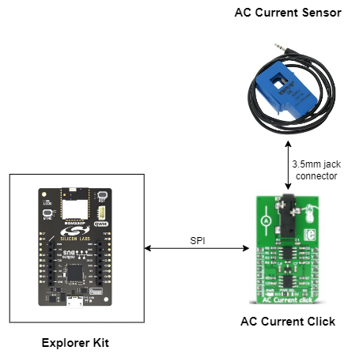
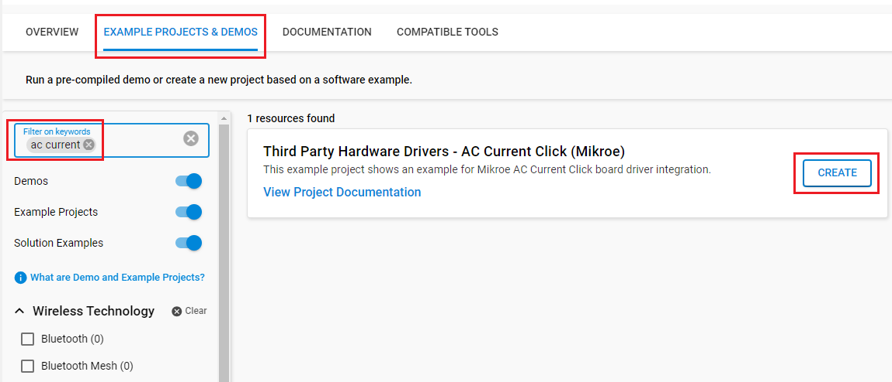
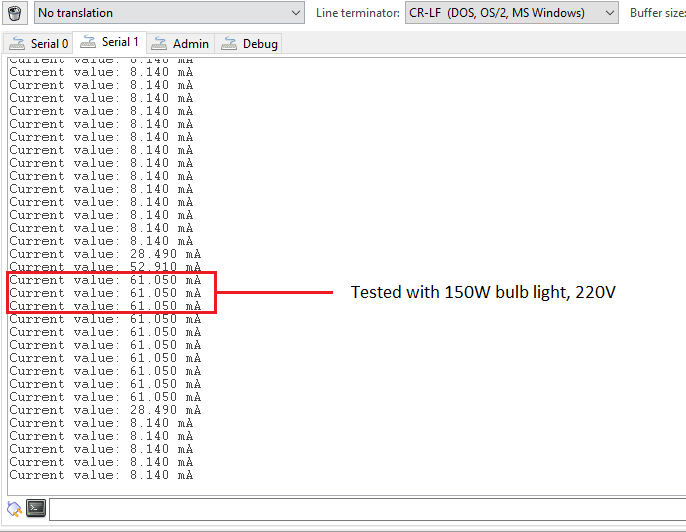

# AC Current Click (Mikroe) #

## Summary ##

This project aims to show the hardware driver that is used to interface with the AC Current driver with the Silicon Labs Platform.

AC Current click is a device that is able to measure the alternating current (AC) running through the conductor. The non-invasive sensor works by utilizing the electromagnetic induction phenomenon, similar to a transformer. The primary coil does not exist though, the electromagnetic field is generated by the AC Current running through the cable which is measured. The low-noise 12-bit SAR A/D converter (ADC) converts the sensor voltage, providing conversion data via the industry-standard SPI interface.

The Click board™ comes equipped with the 3.5mm jack connector which is used to attach the sensing probe. This board also comes as the part of the [AC Current click - bundle](https://www.mikroe.com/ac-current-click-bundle), which also contains the current measuring sensor, calibrated and well suited to work with the AC Current click (10A - 1V).

## Required Hardware ##

- 1x [BGM220-EK4314A](https://www.silabs.com/development-tools/wireless/bluetooth/bgm220-explorer-kit) BGM220 Bluetooth Module Explorer Kit

- Or 1x [Wi-Fi Development Kit](https://www.silabs.com/development-tools/wireless/wi-fi) based on SiWG917 (e.g. [SIWX917-DK2605A](https://www.silabs.com/development-tools/wireless/wi-fi/siwx917-dk2605a-wifi-6-bluetooth-le-soc-dev-kit) or [SIWX917-RB4338A](https://www.silabs.com/development-tools/wireless/wi-fi/siwx917-rb4338a-wifi-6-bluetooth-le-soc-radio-board))

- 1x [AC Current Click board](https://www.mikroe.com/ac-current-click)

## Hardware Connection ##

- If the BGM220 Explorer Kit is used:

  The AC Current Click board supports MikroBus, so it can connect easily to the Explorer Kit via MikroBus header. Assure that the 45-degree corner of the Click board matches the 45-degree white line of the Explorer Kit.

  The hardware connection is shown in the image below:

  

- If the Wi-Fi Development Kit is used:

  | Description | BRD4338A + BRD4002A  | BRD2605A | AC Current Click |
  | ----------- | -------------  | ------------------ | ---------------- |
  | RTE_GSPI_MASTER_CLK_PIN  | GPIO_25 [P25]  | GPIO_25  | SCK           |
  | RTE_GSPI_MASTER_MISO_PIN | GPIO_26 [P27]  | GPIO_26  | SDO           |
  | RTE_GSPI_MASTER_CS0_PIN  | GPIO_28 [P31]  | GPIO_28  | CS            |

## Setup ##

You can either create a project based on an example project or start with an empty example project.

### Create a project based on an example project ###

1. From the Launcher Home, add your board to My Products, click on it, and click on the **EXAMPLE PROJECTS & DEMOS** tab. Find the example project filtering by 'accurrent'.

2. Click **Create** button on the **Third Party Hardware Drivers - AC Current Click (Mikroe)** example. Example project creation dialog pops up -> click Create and Finish and Project should be generated.

   

3. Build and flash this example to the board.

### Start with an empty example project ###

1. Create an "Empty C Project" for the your board using Simplicity Studio v5. Use the default project settings.

2. Copy the file `app/example/mikroe_accurrent/app.c` into the project root folder (overwriting the existing file).

3. Install the software components:

    - Open the .slcp file in the project.

    - Select the SOFTWARE COMPONENTS tab.

    - Install the following components:

    **If the BGM220P Explorer Kit is used:**

      - [Services] → [IO Stream] → [IO Stream: EUSART] → default instance name: vcom
      - [Application] → [Utility] → [Log]
      - [Services] → [Timers] → [Sleep Timer]
      - [Third Party Hardware Drivers] → [Sensors] → [AC Current Click (Mikroe)]

    **If the Wi-Fi Development Kit is used:**

      - [WiSeConnect 3 SDK] → [Device] → [Si91x] → [MCU] → [Service] → [Sleep Timer for Si91x]
      - [Third Party Hardware Drivers] → [Sensors] → [AC Current Click (Mikroe)]

4. Build and flash this example to the board.

**Note:**

- Make sure that the **Third Party Hardware Drivers** extension is installed. If not, follow [this documentation](https://github.com/SiliconLabs/third_party_hw_drivers_extension/blob/master/README.md#how-to-add-to-simplicity-studio-ide).

- **Third Party Hardware Drivers** extension must be enabled for the project to install the "AC Current Click (Mikroe)" component.

## How It Works ##

AC Current Click Click communicates with the Silicon Labs hardware via SPI interface. The example measuring AC current and shows a message on the log screen.

You can launch Console which is integrated into Simplicity Studio or use a third-party terminal tool like Putty to receive the data from the USB. A screenshot of the console output and an actual test image are shown in the figure below.

## Report Bugs & Get Support ##

To report bugs in the Application Examples projects, please create a new "Issue" in the "Issues" section of [third_party_hw_drivers_extension](https://github.com/SiliconLabs/third_party_hw_drivers_extension) repo. Please reference the board, project, and source files associated with the bug, and reference line numbers. If you are proposing a fix, also include information on the proposed fix. Since these examples are provided as-is, there is no guarantee that these examples will be updated to fix these issues.

Questions and comments related to these examples should be made by creating a new "Issue" in the "Issues" section of [third_party_hw_drivers_extension](https://github.com/SiliconLabs/third_party_hw_drivers_extension) repo.
