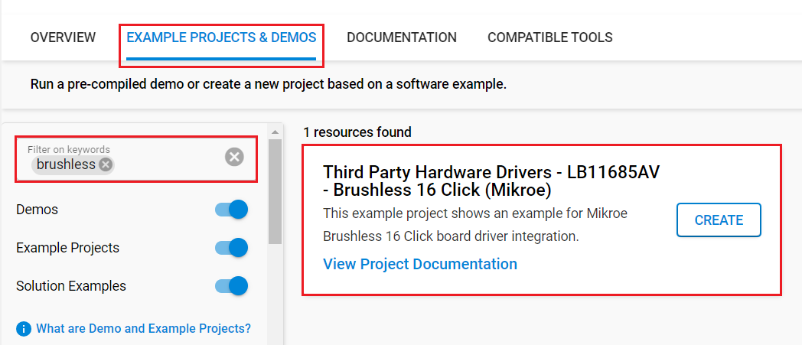

# LB11685AV - Brushless 16 Click (Mikroe) #

## Summary ##

This project shows the driver implementation for the Brushless 16 Click Board to control a BLDC motor using Silicon Labs Platform.

Brushless 16 Click as its foundation uses the LB11685AV, a three-phase full-wave current-linear-drive motor driver from ON Semiconductor. The LB11685AV adopts a sensorless control system without the use of a Hall-effect device. It features a current soft switching circuit for silent operation. Not only can it be used for home appliances such as air-conditioners, cooling fans, air purifiers, but it is appropriate for industrial equipment too.

## Required Hardware ##

- 1x [BGM220-EK4314A](https://www.silabs.com/development-tools/wireless/bluetooth/bgm220-explorer-kit) BGM220 Bluetooth Module Explorer Kit

- Or 1x [Wi-Fi Development Kit](https://www.silabs.com/development-tools/wireless/wi-fi) based on SiWG917 (e.g. [SIWX917-DK2605A](https://www.silabs.com/development-tools/wireless/wi-fi/siwx917-dk2605a-wifi-6-bluetooth-le-soc-dev-kit) or [SIWX917-RB4338A](https://www.silabs.com/development-tools/wireless/wi-fi/siwx917-rb4338a-wifi-6-bluetooth-le-soc-radio-board))

- 1x [Brushless 16 Click board](https://www.mikroe.com/brushless-16-click) based on LB11685AV

## Hardware Connection ##

- If the BGM220P Explorer Kit is used:

  The Brushless 16 board supports MikroBus, so it can connect easily to the Explorer Kit via MikroBus header. Assure that the 45-degree corner of the Click board matches the 45-degree white line of the Explorer Kit.

  The hardware connection is shown in the image below:

  

- If the Wi-Fi Development Kit is used:

  | Description  | BRD4338A + BRD4002A | BRD2605A    | Brushless 16 Click |
  | ------------------------- | ------------- | ---------------- | ------------------ |
  | Enable                    | GPIO_48 [P28]      | GPIO_12     | EN                 |
  | Rotation Speed Indication | GPIO_47 [P26]      | GPIO_11     | FG                 |
  | Motor Lock Detection      | GPIO_46 [P24]      | GPIO_10     | RD                 |

## Setup ##

You can either create a project based on an example project or start with an empty example project.

> [!IMPORTANT]
> - Make sure that the [Third Party Hardware Drivers](https://github.com/SiliconLabsSoftware/third_party_hw_drivers_extension) extension is installed as part of the SiSDK. If not, follow [this documentation](https://github.com/SiliconLabsSoftware/third_party_hw_drivers_extension/blob/master/README.md#how-to-add-to-simplicity-studio-ide).
> - **Third Party Hardware Drivers** extension must be enabled for the project to install the required components from this extension.

> [!TIP]
> To show all components in the **Third Party Hardware Drivers** extension, the **Evaluation** quality must be enabled in the Software Component view.

### Create a project based on an example project ###

1. From the Launcher Home, add your device to My Products, click on it, and click on the **EXAMPLE PROJECTS & DEMOS** tab. Find the example project filtering by *brushless*.

2. Click **Create** button on the **Third Party Hardware Drivers - LB11685AV - Brushless 16 Click (Mikroe)** example. Example project creation dialog pops up -> click Create and Finish and Project should be generated.

   

3. Build and flash this example to the board.

### Start with an empty example project ###

1. Create an "Empty C Project" for your board using Simplicity Studio v5. Use the default project settings.

2. Copy the file `app/example/mikroe_brushless16_lb11685av/app.c` into the project root folder (overwriting existing file).

3. Install the software components:

    - Open the .slcp file in the project.

    - Select the SOFTWARE COMPONENTS tab.

    - Install the following components:

      **If the BGM220P Explorer Kit is used:**
        - [Services] → [Timers] → [Sleep Timer]
        - [Services] → [IO Stream] → [IO Stream: USART] → default instance name: vcom
        - [Application] → [Utility] → [Log]
        - [Application] → [Utility] → [Assert]
        - [Third Party Hardware Drivers] → [Motor Control] → [LB11685AV - Brushless 16 Click (Mikroe)] → use default configuration

      **If the Wi-Fi Development Kit is used:**
        - [Application] → [Utility] → [Assert]
        - [WiSeConnect 3 SDK] → [Device] → [Si91x] → [MCU] → [Service] → [Sleep Timer for Si91x]
        - [Third Party Hardware Drivers] → [Motor Control] → [LB11685AV - Brushless 16 Click (Mikroe)] → use default configuration

4. Build and flash this example to the board.

## How It Works ##

The application checks the state of information pins, and stops and starts motor output every second.
The workflow of this example is the following image:

## Report Bugs & Get Support ##

To report bugs in the Application Examples projects, please create a new "Issue" in the "Issues" section of [third_party_hw_drivers_extension](https://github.com/SiliconLabsSoftware/third_party_hw_drivers_extension) repo. Please reference the board, project, and source files associated with the bug, and reference line numbers. If you are proposing a fix, also include information on the proposed fix. Since these examples are provided as-is, there is no guarantee that these examples will be updated to fix these issues.

Questions and comments related to these examples should be made by creating a new "Issue" in the "Issues" section of [third_party_hw_drivers_extension](https://github.com/SiliconLabsSoftware/third_party_hw_drivers_extension) repo.
