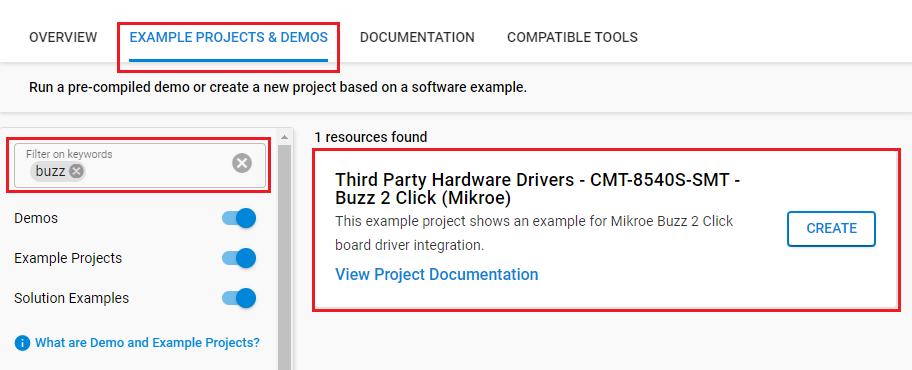

# CMT-8540s-SMT - Buzz 2 Click (Mikroe) #

## Summary ##

This project shows the driver implementation of a magnetic buzzer using the CMT-8540S-SMT with Silicon Labs Platform. The buzzer’s resonant frequency is 4kHz. The click is designed to run on either 3.3V or 5V power supply. The buzzer is ideal for extending your prototype environment with audio signals.

## Required Hardware ##

- 1x [BGM220-EK4314A](https://www.silabs.com/development-tools/wireless/bluetooth/bgm220-explorer-kit) BGM220 Bluetooth Module Explorer Kit

- Or 1x [Wi-Fi Development Kit](https://www.silabs.com/development-tools/wireless/wi-fi) based on SiWG917 (e.g. [SIWX917-DK2605A](https://www.silabs.com/development-tools/wireless/wi-fi/siwx917-dk2605a-wifi-6-bluetooth-le-soc-dev-kit) or [SIWX917-RB4338A](https://www.silabs.com/development-tools/wireless/wi-fi/siwx917-rb4338a-wifi-6-bluetooth-le-soc-radio-board))

- 1x [Buzz 2 Click board](https://www.mikroe.com/buzz-2-click) based on CMT-8540S-SMT

## Hardware Connection ##

- If the BGM220 Explorer Kit is used:

  The BUZZ2 Click board supports MikroBus, so it can connect easily to the Explorer Kit via MikroBus header. Assure that the 45-degree corner of Click board matches the 45-degree white line of the Explorer Kit.

  The hardware connection is shown in the image below:

  

- If the Wi-Fi Development Kit is used:

  | Description  | BRD4338A + BRD4002A | BRD2605A    | Buzz 2 Click         |
  | -------------| ---------------| ---------------------| -------------------- |
  | PWM_H        | GPIO_7 [P20]   | GPIO_7               | PWM                  |

## Setup ##

You can either create a project based on an example project or start with an empty example project.

### Create a project based on an example project ###

1. From the Launcher Home, add your board to My Products, click on it, and click on the **EXAMPLE PROJECTS & DEMOS** tab. Find the example project filtering by *buzz*.

2. Click **Create** button on the **Third Party Hardware Drivers - CMT-8540S-SMT - Buzz 2 Click (Mikroe)** example. Example project creation dialog pops up -> click Create and Finish and Project should be generated.

   

3. Build and flash this example to the board.

### Start with an empty example project ###

1. Create an "Empty C Project" for your board using Simplicity Studio v5. Use the default project settings.

2. Copy the file `app/example/mikroe_buzz2_cmt_8540s_smt/app.c` into the project root folder (overwriting the existing file).

3. Install the software components:

    - Open the .slcp file in the project.

    - Select the SOFTWARE COMPONENTS tab.

    - Install the following components:

      **If the BGM220 Explorer Kit is used:**

        - [Services] → [Timers] → [Sleep Timer]
        - [Services] → [IO Stream] → [IO Stream: USART] → default instance name: vcom
        - [Application] → [Utility] → [Log]
        - [Third Party Hardware Drivers] → [Mikroe Click] → [Audio & Voice] → [CMT-8540S-SMT - Buzz 2 Click (Mikroe)]

      **If the Wi-Fi Development Kit is used:**

        - [WiSeConnect 3 SDK] → [Device] → [Si91x] → [MCU] → [Service] → [Sleep Timer for Si91x]
        - [WiSeConnect 3 SDK] → [Device] → [Si91x] → [MCU] → [Peripheral] → [PWM] → [channel_0] → use default configuration
        - [Third Party Hardware Drivers] → [Mikroe Click] → [Audio & Voice] → [CMT-8540S-SMT - Buzz 2 Click (Mikroe)]

4. Build and flash this example to the board.

**Note:**

- Make sure that the **Third Party Hardware Drivers** extension is installed. If not, follow [this documentation](https://github.com/SiliconLabs/third_party_hw_drivers_extension/blob/master/README.md#how-to-add-to-simplicity-studio-ide).

- **Third Party Hardware Drivers** extension must be enabled for the project to install "CMT-8540S-SMT - Buzz 2 Click (Mikroe)" component.

## How It Works ##

The buzzer plays a pre-programmed melody. You can hear this melody when running the program.

You can launch Console that's integrated into Simplicity Studio or use a third-party terminal tool like TeraTerm to receive the data from the USB. A screenshot of the console output is shown in the figure below.

## Report Bugs & Get Support ##

To report bugs in the Application Examples projects, please create a new "Issue" in the "Issues" section of [third_party_hw_drivers_extension](https://github.com/SiliconLabs/third_party_hw_drivers_extension) repo. Please reference the board, project, and source files associated with the bug, and reference line numbers. If you are proposing a fix, also include information on the proposed fix. Since these examples are provided as-is, there is no guarantee that these examples will be updated to fix these issues.

Questions and comments related to these examples should be made by creating a new "Issue" in the "Issues" section of [third_party_hw_drivers_extension](https://github.com/SiliconLabs/third_party_hw_drivers_extension) repo.
