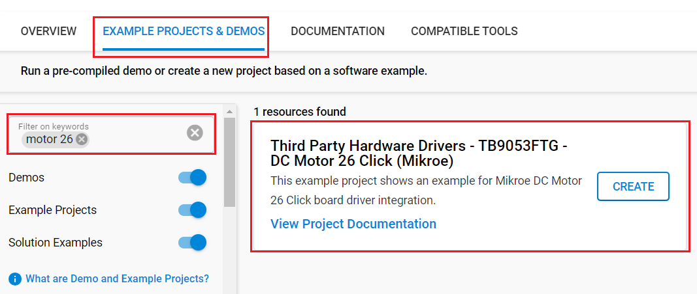
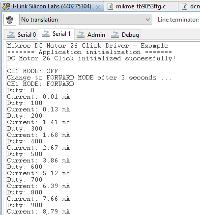

# TB9053FTG - DC Motor 26 Click (Mikroe) #

## Summary ##

MikroE DC Motor 26 Click features the TB9053FTG, a PWM-type, dual-channel, H-bridge, brushed DC motor driver. The TB9053FTG is rated for an operating voltage range from 4.5V to 28V, with the motor controlled directly through a PWM signal or SPI serial interface. This board can control one or two DC motors, selectable motor control functions and operational modes, current monitoring and more.

The example demonstrates the use of MikroE DC Motor 26 Click board by controlling the speed of a DC motor over the PWM duty cycle as well as displaying the current consumption of the motor with the Silicon Labs Platform.

## Required Hardware ##

- 1x [XG24-EK2703A](https://www.silabs.com/development-tools/wireless/efr32xg24-explorer-kit) EFR32xG24 Explorer Kit

- Or 1x [Wi-Fi Development Kit](https://www.silabs.com/development-tools/wireless/wi-fi) based on SiWG917 (e.g. [SIWX917-DK2605A](https://www.silabs.com/development-tools/wireless/wi-fi/siwx917-dk2605a-wifi-6-bluetooth-le-soc-dev-kit) or [SIWX917-RB4338A](https://www.silabs.com/development-tools/wireless/wi-fi/siwx917-rb4338a-wifi-6-bluetooth-le-soc-radio-board))

- 1x [DC Motor 26 Click](https://www.mikroe.com/dc-motor-26-click)

## Hardware Connection ##

- If the EFR32xG24 Explorer Kit is used:

  The DC Motor 26 Click board supports mikroBUS™, so it can connect easily to the Explorer Kit via MikroBus header. Assure that the 45-degree corner of Click board matches the 45-degree white line of the Explorer Kit.

  The hardware connection is shown in the image below:

  

- If the Wi-Fi Development Kit is used:

  | Description  | BRD4338A + BRD4002A | BRD2605A     | DC Motor 26 Click |
  | ------------ | ------------- | ------------------ | ----------------- |
  | I2C_SDA      | ULP_GPIO_6 [EXP_16] | ULP_GPIO_6   | SDA               |
  | I2C_SCL      | ULP_GPIO_7 [EXP_15] | ULP_GPIO_7   | SCL               |
  | Channel Current Monitor  | ULP_GPIO_1 [P16]  | ULP_GPIO_1 | CM        |
  | Sleep / ID SEL           | GPIO_46 [P24] | GPIO_10        | SLP       |
  | Interrupt                | GPIO_47 [P26] | GPIO_11        | INT       |
  | PWM Signal               | GPIO_48 [P28] | GPIO_12        | PWM       |
  | CS                       | GPIO_49 [P30] | GPIO_6         | CS        |
  | RTE_SSI_MASTER_SCK_PIN   | GPIO_25 [P25] | GPIO_25        | SCK       |
  | RTE_SSI_MASTER_MOSI_PIN  | GPIO_26 [P27] | GPIO_26        | SDI       |
  | RTE_SSI_MASTER_MISO_PIN  | GPIO_27 [P29] | GPIO_27        | SDO       |

**Note:**

- The DC Motor 26 click board switches should be set as follows: SW 1-2-3-4 : H-H-L-L. This sets the click board as a SPI controlled single-channel device so the motor should be connected to OUT1/2 and OUT3/4.

## Setup ##

You can either create a project based on an example project or start with an empty example project.

### Create a project based on an example project ###

1. From the Launcher Home, add your device to My Products, click on it, and click on the **EXAMPLE PROJECTS & DEMOS** tab. Find the example project filtering by **"motor 26"**.

2. Click the **Create** button on the **Third Party Hardware Drivers - TB9053FTG - DC Motor 26 Click (Mikroe)** example. Example project creation dialog pops up -> click Create and Finish and Project should be generated.

    

3. Build and flash this example to the board.

### Start with an empty example project ###

1. Create an "Empty C Project" for your board using Simplicity Studio v5. Use the default project settings.

2. Copy the file `app/example/mikroe_dcmotor26_tb9053ftg/app.c` into the project root folder (overwriting the existing file).

3. Install the software components:

    - Open the .slcp file in the project.

    - Select the SOFTWARE COMPONENTS tab.

    - Install the following components:

    **If the BGM220P Explorer Kit is used:**

      - [Services] → [IO Stream] → [IO Stream: EUSART] → default instance name: vcom.
      - [Application] → [Utility] → [Log]
      - [Application] → [Utility] → [Assert]
      - [Services] → [Timers] → [Sleep Timer]
      - [Third Party Hardware Drivers] → [Motor Control] → [TB9053FTG - DC Motor 26 Click (Mikroe)] → use default configuration

    **If the Wi-Fi Development Kit is used:**

      - [WiSeConnect 3 SDK] → [Device] → [Si91x] → [MCU] → [Service] → [Sleep Timer for Si91x]
      - [WiSeConnect 3 SDK] → [Device] → [Si91x] → [MCU] → [Peripheral] → [PWM] → [channel_0] → use default configuration
      - [WiSeConnect 3 SDK] → [Device] → [Si91x] → [MCU] → [Peripheral] → [ADC] → [channel_1] → use default configuration
      - [WiSeConnect 3 SDK] → [Device] → [Si91x] → [MCU] → [Peripheral] → [I2C] → [i2c2] → use default configuration
      - [WiSeConnect 3 SDK] → [Device] → [Si91x] → [MCU] → [Peripheral] → [SSI] → [primary] → use default configuration
      - [Third Party Hardware Drivers] → [Motor Control] → [TB9053FTG - DC Motor 26 Click (Mikroe)] → use default configuration

4. Enable **Printf float**

   - Open Properties of the project.
   - Select C/C++ Build → Settings → Tool Settings → GNU ARM C Linker → General → Check **Printf float**.

5. Build and flash this example to the board.

**Note:**

- Make sure that the **Third Party Hardware Drivers** extension is installed. If not, follow [this documentation](https://github.com/SiliconLabs/third_party_hw_drivers_extension/blob/master/README.md#how-to-add-to-simplicity-studio-ide).

- **Third Party Hardware Drivers** extension must be enabled for the project to install the **"TB9053FTG - DC Motor 26 Click (Mikroe)"** component.

## How It Works ##

The example controls a DC motor combined with two channels and monitors the power consumption of the motor. When the rotation direction is about to change, the DC motor shuts off for 3 seconds prior to starting in forward mode. As the motor starts to rev up, the rotation speed increases to the maximum speed controlled by the PWM signal. Then, it starts to change its function to brake mode after 3 seconds of operation. In the brake mode, the DC motor stops immediately, then the DC motor runs in the reverse direction and the motor speeds up again.

You can launch Console, which is integrated into Simplicity Studio, or you can use a third-party terminal tool like Putty to receive the data from USB. A screenshot of the console output and an actual test image are shown in the figure below.

## Report Bugs & Get Support ##

To report bugs in the Application Examples projects, please create a new "Issue" in the "Issues" section of [third_party_hw_drivers_extension](https://github.com/SiliconLabs/third_party_hw_drivers_extension) repo. Please reference the board, project, and source files associated with the bug, and reference line numbers. If you are proposing a fix, also include information on the proposed fix. Since these examples are provided as-is, there is no guarantee that these examples will be updated to fix these issues.

Questions and comments related to these examples should be made by creating a new "Issue" in the "Issues" section of [third_party_hw_drivers_extension](https://github.com/SiliconLabs/third_party_hw_drivers_extension) repo.
