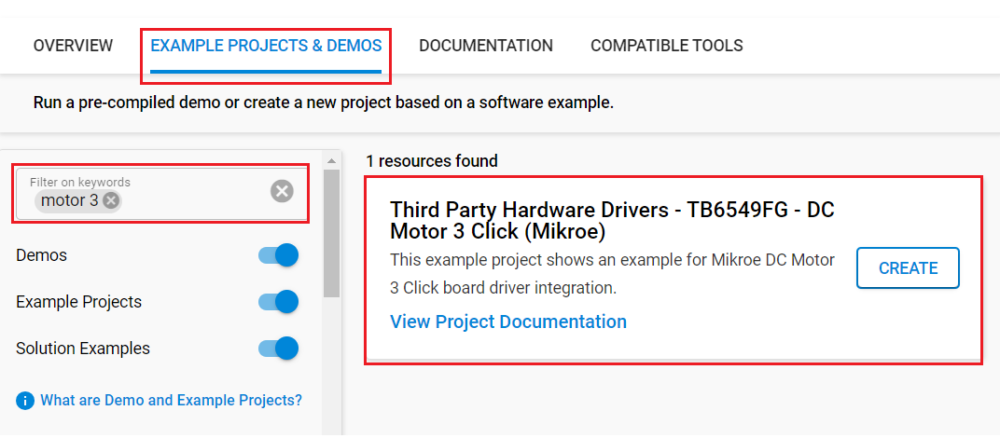
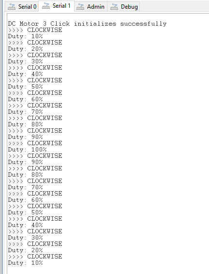

# TB6549FG - DC Motor 3 Click (Mikroe) #

## Summary ##

This project aims to show the hardware driver that is used to interface with the DC motor driver using the TB6549FG from Toshiba with the Silicon Labs Platform.

DC MOTOR 3 Click is a mikroBUS™ add-on board with a Toshiba TB6549FG full-bridge driver for direct current motors. The IC is capable of outputting currents of up to 3.5 A with 30V, making it suitable for high-power motors.

## Required Hardware ##

- 1x [BGM220-EK4314A](https://www.silabs.com/development-tools/wireless/bluetooth/bgm220-explorer-kit) BGM220 Bluetooth Module Explorer Kit

- Or 1x [Wi-Fi Development Kit](https://www.silabs.com/development-tools/wireless/wi-fi) based on SiWG917 (e.g. [SIWX917-DK2605A](https://www.silabs.com/development-tools/wireless/wi-fi/siwx917-dk2605a-wifi-6-bluetooth-le-soc-dev-kit) or [SIWX917-RB4338A](https://www.silabs.com/development-tools/wireless/wi-fi/siwx917-rb4338a-wifi-6-bluetooth-le-soc-radio-board))

- 1x [DC Motor 3 Click](https://www.mikroe.com/dc-motor-3-click)

## Hardware Connection ##

- If the BGM220P Explorer Kit is used:

  The DC Motor 3 Click board supports MikroBus, so it can connect easily to the Explorer Kit via MikroBus header. Assure that the 45-degree corner of the Click board matches the 45-degree white line of the Explorer Kit.

  The hardware connection is shown in the image below:

  

- If the Wi-Fi Development Kit is used:

  | Description  | BRD4338A + BRD4002A | BRD2605A    | DC Motor 3 Click |
  | ----------- | ------------- | ------------------ | ---------------- |
  | IN1         | GPIO_48 [P28]      | GPIO_12       | IN1              |
  | IN2         | GPIO_47 [P26]      | GPIO_11       | IN2              |
  | SLP         | GPIO_46 [P24]      | GPIO_10       | SLP              |
  | PWM         | GPIO_7 [P20]       | GPIO_7        | PWM              |

## Setup ##

You can either create a project based on an example project or start with an empty example project.

> [!IMPORTANT]
> - Make sure that the [Third Party Hardware Drivers](https://github.com/SiliconLabsSoftware/third_party_hw_drivers_extension) extension is installed as part of the SiSDK. If not, follow [this documentation](https://github.com/SiliconLabsSoftware/third_party_hw_drivers_extension/blob/master/README.md#how-to-add-to-simplicity-studio-ide).
> - **Third Party Hardware Drivers** extension must be enabled for the project to install the required components from this extension.

> [!TIP]
> To show all components in the **Third Party Hardware Drivers** extension, the **Evaluation** quality must be enabled in the Software Component view.

### Create a project based on an example project ###

1. From the Launcher Home, add your board to My Products, click on it, and click on the **EXAMPLE PROJECTS & DEMOS** tab. Find the example project filtering by *dc*

2. Click **Create** button on the **Third Party Hardware Drivers - TB6549FG - DC Motor 3 Click (Mikroe)** example. Example project creation dialog pops up -> click Create and Finish and Project should be generated.

   

3. Build and flash this example to the board.

### Start with an empty example project ###

1. Create an "Empty C Project" for your board using Simplicity Studio v5. Use the default project settings.

2. Copy the file `app/example/mikroe_dcmotor3_tb6549fg/app.c` into the project root folder (overwriting the existing file).

3. Install the software components:

    - Open the .slcp file in the project.

    - Select the SOFTWARE COMPONENTS tab.

    - Install the following components:

      **If the BGM220P Explorer Kit is used:**

        - [Services] → [IO Stream] → [IO Stream: USART] → default instance name: vcom
        - [Application] → [Utility] → [Log]
        - [Services] → [Timers] → [Sleep Timer]
        - [Third Party Hardware Drivers] → [Miscellaneous] → [TB6549FG - DC MOTOR 3 Click (Mikroe)]

      **If the Wi-Fi Development Kit is used:**

        - [WiSeConnect 3 SDK] → [Device] → [Si91x] → [MCU] → [Service] → [Sleep Timer for Si91x]
        - [WiSeConnect 3 SDK] → [Device] → [Si91x] → [MCU] → [Peripheral] → [PWM] → [channel_0] → use default configuration
        - [Third Party Hardware Drivers] → [Miscellaneous] → [TB6549FG - DC MOTOR 3 Click (Mikroe)]

4. Build and flash this example to the board.

## How It Works ##

This example demonstrates the use of DC Motor 3 Click board. DC Motor 3 Click communicates with the register via PWM interface.
It shows moving in the left direction from slow to fast speed and from fast to slow speed.
Results are being sent to the USART Terminal where you can track their changes.

You can launch Console that's integrated into Simplicity Studio or use a third-party terminal tool like Tera Term to receive the data from the USB. A screenshot of the console output and an actual test image are shown in the figure below.

## Report Bugs & Get Support ##

To report bugs in the Application Examples projects, please create a new "Issue" in the "Issues" section of [third_party_hw_drivers_extension](https://github.com/SiliconLabsSoftware/third_party_hw_drivers_extension) repo. Please reference the board, project, and source files associated with the bug, and reference line numbers. If you are proposing a fix, also include information on the proposed fix. Since these examples are provided as-is, there is no guarantee that these examples will be updated to fix these issues.

Questions and comments related to these examples should be made by creating a new "Issue" in the "Issues" section of [third_party_hw_drivers_extension](https://github.com/SiliconLabsSoftware/third_party_hw_drivers_extension) repo.
