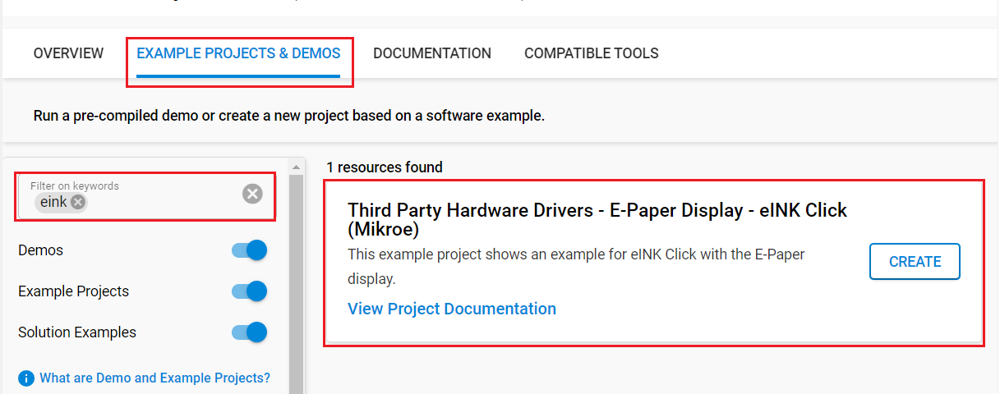

# E-Paper Display - eINK Click (Mikroe) #

## Summary ##

This project aims to show the hardware driver that is used to interface with eINK Click and E-Paper display using the Silicon Labs platform.

E-Paper display is based on Active Matrix Electrophoretic Display (AMEPD) technology and has an integrated pixel driver, which uses the SPI interface to communicate with the host MCU. The screen displays a clear and crisp graphics, and has an ultra-wide viewing range. Another key feature of the E-Ink technology is the extremely low power consumption, even when the display actively refresh its content.

## Required Hardware ##

- [EFR32xG24 Explorer Kit](https://www.silabs.com/development-tools/wireless/efr32xg24-explorer-kit?tab=overview)

- Or [SiWx917 Wi-Fi 6 and Bluetooth LE 8 MB Flash SoC Pro Kit](https://www.silabs.com/development-tools/wireless/wi-fi/siwx917-pk6031a-wifi-6-bluetooth-le-soc-pro-kit?tab=overview) (BRD4002 + BRD4338A)

- [EINK CLICK - WITHOUT DISPLAY](https://www.mikroe.com/eink-click-without-display)

- [E-Paper display 1,54" 200x200 dots](https://www.mikroe.com/e-paper-display-154-200x200-dots)
- Or [E-Paper display 2,13" 122x250 dots](https://www.mikroe.com/e-paper-display-213-122x250-dots)
- Or [E-Paper display 2,9" 296x128 dots](https://www.mikroe.com/e-paper-display-29-inches)

## Hardware Connection ##

- If the EFR32xG24 Explorer Kit is used:

    eINK display needs an external adapter to interface with the EFR32xG24 Explorer Kit. The hardware connection is shown in the image below:

    

- If the SiWx917 Wi-Fi 6 and Bluetooth LE 8 MB Flash SoC Pro Kit is used:

    | Description              | BRD4338A GPIO  | BRD4002 Breakout Pad | EINK CLICK - WITHOUT DISPLAY Board |
    | -------------------------| ---------------| ---------------------| --------------------|
    | Reset                    | GPIO_46        | P24                  | RTS                 |
    | Busy indicator           | GPIO_47        | P26                  | BSY                 |
    | Data/Config              | GPIO_48        | P28                  | D/C                 |
    | RTE_GSPI_MASTER_CLK_PIN  | GPIO_25        | P25                  | SCK                 |
    | RTE_GSPI_MASTER_MOSI_PIN | GPIO_27        | P29                  | SDI                 |
    | RTE_GSPI_MASTER_CS0_PIN  | GPIO_28        | P31                  | CS                  |

## Setup ##

You can either create a project based on an example project or start with an empty example project.

### Create a project based on an example project ###

1. From the Launcher Home, add your device to My Products, click on it, and click on the **EXAMPLE PROJECTS & DEMOS** tab. Find the example project filtering by **eink**.

2. Click **Create** button on the **Third Party Hardware Drivers - E-Paper Display - eINK Click (Mikroe)** example. Example project creation dialog pops up -> click Create and Finish and Project should be generated.

    

3. Build and flash this example to the board.

### Start with an empty example project ###

1. Create an "Empty C Project" for the your board using Simplicity Studio v5. Use the default project settings.

2. Copy the file `app/example/mikroe_eink_display/app.c` into the project root folder (overwriting the existing file).

3. Install the software components:

    - Open the .slcp file in the project.

    - Select the SOFTWARE COMPONENTS tab.

    - Install the following components:

    **If the EFR32xG24 Explorer Kit is used:**

      - [Third Party Hardware Drivers] → [Display & LED] → [E-Paper display 1.54" 200x200 dots (Mikroe)]
      - [Third Party Hardware Drivers] → [Services] → [GLIB - OLED Graphics Library]

    **If the SiWx917 Wi-Fi 6 and Bluetooth LE 8 MB Flash SoC Pro Kit is used:**

      - [Third Party Hardware Drivers] → [Display & LED] → [E-Paper display 1.54" 200x200 dots (Mikroe)]
      - [Third Party Hardware Drivers] → [Services] → [GLIB - OLED Graphics Library]

4. Build and flash this example to the board.

**Note:**

- Make sure that the **Third Party Hardware Drivers** extension is installed. If not, follow [this documentation](https://github.com/SiliconLabs/third_party_hw_drivers_extension/blob/master/README.md#how-to-add-to-simplicity-studio-ide).

- Third-party Drivers Extension must be enabled for the project to install "E-Paper Display (Mikroe)" component.

## How It Works ##

### Testing ###

After setting up all the required components, flash the code to the Explorer Kit and you will see the result looks like below.

## Report Bugs & Get Support ##

To report bugs in the Application Examples projects, please create a new "Issue" in the "Issues" section of [third_party_hw_drivers_extension](https://github.com/SiliconLabs/third_party_hw_drivers_extension) repo. Please reference the board, project, and source files associated with the bug, and reference line numbers. If you are proposing a fix, also include information on the proposed fix. Since these examples are provided as-is, there is no guarantee that these examples will be updated to fix these issues.

Questions and comments related to these examples should be made by creating a new "Issue" in the "Issues" section of [third_party_hw_drivers_extension](https://github.com/SiliconLabs/third_party_hw_drivers_extension) repo.
