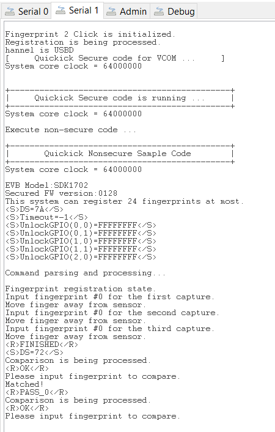

# A-172-MRQ - Fingerprint 2 Click (Mikroe) #

## Summary ##

This example project shows an example for Mikroe Fingerprint 2 Click board driver integration with Silicon Labs Platform.

The Mikroe Fingerprint 2 Click board is a fingerprint sensor module that allows for easy integration of fingerprint recognition functionality into a wide range of projects. It uses a high-quality A-172-MRQ fingerprint sensor that can quickly and accurately capture and compare fingerprints. The board includes an onboard microcontroller that handles all of the necessary processing, and it communicates with the host controller through an easy-to-use UART interface.

The board also includes some features such as the ability to store and match up to 24 fingerprints. It also includes two onboard LEDs to indicate the status of the sensor. This Click board can be used in various projects like security systems, attendance systems, access control etc and is a cost-effective solution for adding fingerprint recognition to your project.

## Required Hardware ##

- 1x [XG24-EK2703A](https://www.silabs.com/development-tools/wireless/efr32xg24-explorer-kit) EFR32xG24 Explorer Kit
- Or 1x [Wi-Fi Development Kit](https://www.silabs.com/development-tools/wireless/wi-fi) based on SiWG917 (e.g. [SIWX917-DK2605A](https://www.silabs.com/development-tools/wireless/wi-fi/siwx917-dk2605a-wifi-6-bluetooth-le-soc-dev-kit) or [SIWX917-RB4338A](https://www.silabs.com/development-tools/wireless/wi-fi/siwx917-rb4338a-wifi-6-bluetooth-le-soc-radio-board))
- 1x [Fingerprint 2 Click board](https://www.mikroe.com/fingerprint-2-click) based on A-172-MRQ

## Hardware Connection ##

- If the EFR32xG24 Explorer Kit is used:

  The Fingerprint 2 Click board supports MikroBus, so it can connect easily to the Explorer Kit via MikroBus header. Assure that the 45-degree corner of Click board matches the 45-degree white line of the Explorer Kit.

  The hardware connection is shown in the image below:

  

- If the Wi-Fi Development Kit is used:

  | Description  | BRD4338A + BRD4002A | BRD2605A     | Fingerprint 2 click |
  | ----------------- | -------------- | ------------ | ----------- |
  | UART1_RX_PIN      | GPIO_6 [P19]   | GPIO_6       | TX          |
  | UART1_TX_PIN      | GPIO_7 [P20]   | GPIO_7       | RX          |
  | RESET             | GPIO_46 [P24]  | GPIO_10      | RST         |
  | Compare indicator | GPIO_47 [P26]  | GPIO_11      | LD1         |
  | Compare indicator | GPIO_48 [P28]  | GPIO_12      | LD2         |
  | General Purpose   | GPIO_49 [P30]  | GPIO_29      | GP1         |
  | General Purpose   | GPIO_50 [P32]  | GPIO_30      | GP2         |

## Setup ##

You can either create a project based on an example project or start with an empty example project.

### Create a project based on an example project ###

1. From the Launcher Home, add your device to My Products, click on it, and click on the **EXAMPLE PROJECTS & DEMOS** tab. Find the example project filtering by *fingerprint*.

2. Click **Create** button on the **Third Party Hardware Drivers - A-172-MRQ - Fingerprint 2 Click (Mikroe)** example. Example project creation dialog pops up -> click Create and Finish and Project should be generated.

   

3. Build and flash this example to the board.

### Start with an empty example project ###

1. Create an "Empty C Project" for your board using Simplicity Studio v5. Use the default project settings.

2. Copy the file `app/example/mikroe_fingerprint2_a172mrq/app.c` into the project root folder (overwriting existing file).

3. Install the software components:

    - Open the .slcp file in the project.

    - Select the SOFTWARE COMPONENTS tab.

    - Install the following components:

      **If the EFR32xG24 Explorer Kit is used:**

        - [Services] → [Timers] → [Sleep Timer]
        - [Services] → [IO Stream] → [IO Stream: EUSART] → default instance name: **vcom**
        - [Services] → [IO Stream] → [IO Stream: USART] → default instance name: **mikroe** → Set "Receive buffer size" to 800
        - [Third Party Hardware Drivers] → [Human Machine Interface] → [A-172-MRQ - Fingerprint 2 Click (Mikroe)] → use default configuration
        - [Application] → [Utility] → [Assert]
        - [Application] → [Utility] → [Log]

      **If the Wi-Fi Development Kit is used:**

        - [WiSeConnect 3 SDK] → [Device] → [Si91x] → [MCU] → [Service] → [Sleep Timer for Si91x]
        - [Third Party Hardware Drivers] → [Sensors] → [MM5D91-00 - Radar Click (Mikroe)] → use default configuration
        - [WiSeConnect 3 SDK] → [Device] → [Si91x] → [MCU] → [Peripheral] → [UART] → disable "UART1 DMA"

4. Build and flash this example to the board.

**Note :**

- Make sure that the **Third Party Hardware Drivers** extension is installed. If not, follow [this documentation](https://github.com/SiliconLabs/third_party_hw_drivers_extension/blob/master/README.md#how-to-add-to-simplicity-studio-ide).

- **Third Party Hardware Drivers** extension must be enabled for the project to install "A-172-MRQ - Fingerprint 2 Click (Mikroe)" component.

## How It Works ##

### Driver Layer Diagram ###

### Testing ###

The example compares a fingerprint on input to the registered fingerprint and shows a message on the console screen on which input fingerprint is identified or on which input fingerprint is not identified.

You can launch Console that's integrated into Simplicity Studio or use a third-party terminal tool like TeraTerm to receive the data from the USB. A screenshot of the console output is shown in the figure below.

## Report Bugs & Get Support ##

To report bugs in the Application Examples projects, please create a new "Issue" in the "Issues" section of [third_party_hw_drivers_extension](https://github.com/SiliconLabs/third_party_hw_drivers_extension) repo. Please reference the board, project, and source files associated with the bug, and reference line numbers. If you are proposing a fix, also include information on the proposed fix. Since these examples are provided as-is, there is no guarantee that these examples will be updated to fix these issues.

Questions and comments related to these examples should be made by creating a new "Issue" in the "Issues" section of [third_party_hw_drivers_extension](https://github.com/SiliconLabs/third_party_hw_drivers_extension) repo.
