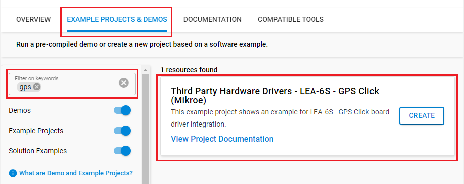
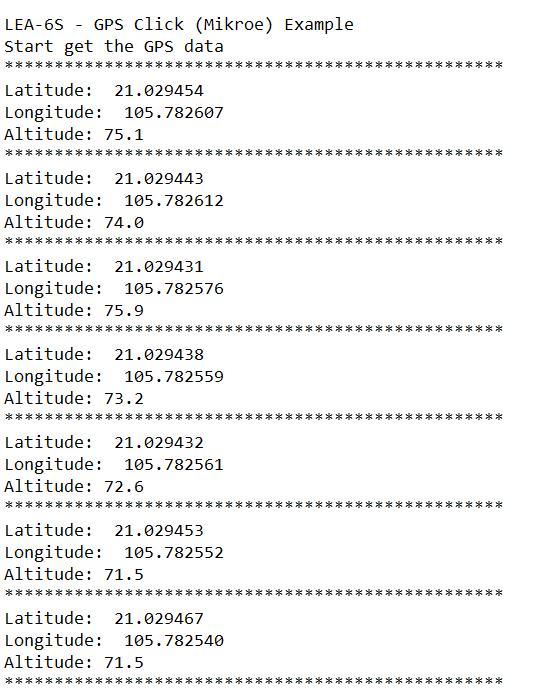

# LEA-6S - GPS Click (Mikroe) #

## Summary ##

This project shows the implementation of a GPS Click driver using LEA-6S from Mikroe Integrated with BGM220P Explorer Kit based on UART communication.
GPS click is a compact solution for adding GPS functionality to your device. It carries the u-blox LEA-6S high-performance position engine. The click is designed to run on a 3.3V power supply and communicates with the target MCU through UART. GPS click can simultaneously track up to 16 satellites while searching for new ones. The LEA-6S module’s TTFF (time to first fix) is less than one second — this is the measure of time necessary for a GPS receiver to get satellite signals and navigation data, and based on this information, calculate a position (a fix).

## Required Hardware ##

- [**BGM220-EK4314A** BGM220 Bluetooth Module Explorer Kit (BRD4314A BGM220 Explorer Kit Board)](https://www.silabs.com/development-tools/wireless/bluetooth/bgm220-explorer-kit)

- Or [SiWx917 Wi-Fi 6 and Bluetooth LE 8 MB Flash SoC Pro Kit](https://www.silabs.com/development-tools/wireless/wi-fi/siwx917-pk6031a-wifi-6-bluetooth-le-soc-pro-kit) (BRD4002 + BRD4338A)

- [**GPS Click** board based on LEA-6S from Mikroe Integrated](https://www.mikroe.com/gps-click)

- Option: [GPS/GNSS Magnetic Mount Antenna](https://www.sparkfun.com/products/14986)

## Hardware Connection ##

- If the BGM220 Explorer Kit is used:

  The GPS Click board supports MikroBus, so it can connect easily to the Explorer Kit via MikroBus header. Assure that the 45-degree corner of Click board matches the 45-degree white line of the Explorer Kit. The GPS antenna needs to be connected to the GPS click board to ensure that the satellite signals can be received.

  

- If the SiWx917 Wi-Fi 6 and Bluetooth LE 8 MB Flash SoC Pro Kit is used:

  | Description  | BRD4338A GPIO   | BRD4002 Breakout Pad | GPS click   |
  | ------------ | --------------- | -------------------- | ----------- |
  | UART1_RX_PIN | GPIO_6          | P19                  | TX          |
  | UART1_TX_PIN | GPIO_7          | P20                  | RX          |
  | RESET        | GPIO_46         | P24                  | RST         |
  | Time Pulse   | GPIO_47         | P26                  | TP          |

## Setup ##

You can either create a project based on an example project or start with an empty example project.

### Create a project based on an example project ###

1. From the Launcher Home, add your board to My Products, click on it, and click on the **EXAMPLE PROJECTS & DEMOS** tab. Find the example project filtering by *gps*.

2. Click **Create** button on the **Third Party Hardware Drivers - LEA-6S - GPS Click (Mikroe)** example. Example project creation dialog pops up -> click Create and Finish and Project should be generated.

   

3. Build and flash this example to the board.

### Start with an empty example project ###

1. Create an "Empty C Project" for your board using Simplicity Studio v5. Use the default project settings.

2. Copy the file `app/example/mikroe_gpsclick_lea6s/app.c` into the project root folder (overwriting the existing file).

3. Install the software components:

    - Open the .slcp file in the project.

    - Select the SOFTWARE COMPONENTS tab.

    - Install the following components:

      **If the BGM220 Explorer Kit is used:**

        - [Services] → [Timers] → [Sleep Timer]
        - [Services] → [IO Stream] → [IO Stream: EUSART] → default instance name: vcom
        - [Services] → [IO Stream] → [IO Stream: USART] → default instance name: mikroe
        - [Application] → [Utility] → [Log]
        - [Application] → [Utility] → [Application Queue]
        - [Third Party Hardware Drivers] → [Sensors] → [LEA-6S - GPS Click (Mikroe)]

      **If the SiWx917 Wi-Fi 6 and Bluetooth LE 8 MB Flash SoC Pro Kit is used:**

        - [WiSeConnect 3 SDK] → [Device] → [Si91x] → [MCU] → [Service] → [Sleep Timer for Si91x]
        - [Third Party Hardware Drivers] → [Sensors] → [LEA-6S - GPS Click (Mikroe)] → use default configuration
        - [WiSeConnect 3 SDK] → [Device] → [Si91x] → [MCU] → [Peripheral] → [UART] → disable "UART1 DMA"

4. Install printf float

    - Open Properties of the project.
    - Select C/C++ Build > Settings > Tool Settings >GNU ARM C Linker > General. Check Printf float.

5. Build and flash this example to the board.

**Note:**

- Make sure that the **Third Party Hardware Drivers** extension is installed. If not, follow [this documentation](https://github.com/SiliconLabs/third_party_hw_drivers_extension/blob/master/README.md#how-to-add-to-simplicity-studio-ide).

- SDK Extension must be enabled for the project to install "LEA-6S - GPS Click (Mikroe)" component.

## How It Works ##

This example reads and processes data from GPS clicks.
You can launch Console that's integrated into Simplicity Studio or use a third-party terminal tool like TeraTerm to receive the data from the USB. A screenshot of the console output is shown in the figure below.

## Report Bugs & Get Support ##

To report bugs in the Application Examples projects, please create a new "Issue" in the "Issues" section of [third_party_hw_drivers_extension](https://github.com/SiliconLabs/third_party_hw_drivers_extension) repo. Please reference the board, project, and source files associated with the bug, and reference line numbers. If you are proposing a fix, also include information on the proposed fix. Since these examples are provided as-is, there is no guarantee that these examples will be updated to fix these issues.

Questions and comments related to these examples should be made by creating a new "Issue" in the "Issues" section of [third_party_hw_drivers_extension](https://github.com/SiliconLabs/third_party_hw_drivers_extension) repo.
