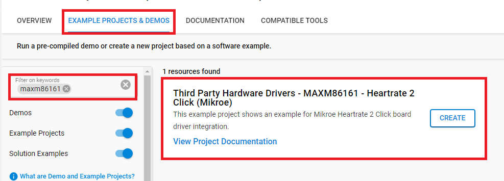

# MAXM86161 - Heart Rate 2 Click (Mikroe) #

## Summary ##

This project shows the implementation of Bio-sensor driver using Maxm86161 from Maxim Integrated with the Silicon Labs platform based on I2C communication.

Heart Rate 2 Click board™ is an add-on board based on MAXM86161 integrated optical module from Analog Devices (AD). It is a complete, integrated, optical data acquisition system, ideal for optical pulse-oximetry (SpO2) and heart-rate (HR) detection applications. It can be implemented in various wearable health-related devices, like optimized for in-ear applications, or miniature package for mobile applications.

## Required Hardware ##

- 1x [BGM220-EK4314A](https://www.silabs.com/development-tools/wireless/bluetooth/bgm220-explorer-kit) BGM220 Bluetooth Module Explorer Kit

- Or 1x [Wi-Fi Development Kit](https://www.silabs.com/development-tools/wireless/wi-fi) based on SiWG917 (e.g. [SIWX917-DK2605A](https://www.silabs.com/development-tools/wireless/wi-fi/siwx917-dk2605a-wifi-6-bluetooth-le-soc-dev-kit) or [SIWX917-RB4338A](https://www.silabs.com/development-tools/wireless/wi-fi/siwx917-rb4338a-wifi-6-bluetooth-le-soc-radio-board))

- 1x [Heart Rate 2 Click board](https://www.mikroe.com/heart-rate-2-click) based on MAXM86161

## Hardware Connection ##

- If the BGM220P Explorer Kit is used:

  The Heart Rate 2 Click board supports MikroBus, so it can connect easily to BGM220P Explorer Kit via MikroBus header. Assure that the 45-degree corner of Click board matches the 45-degree white line of the Explorer Kit.
  The board also has the I2C-bus pull-ups. Just be sure that the click board is configured into I2C-mode (the default) by the resistors and not into SPI-mode.

  

- If the Wi-Fi Development Kit is used:

  | Description  | BRD4338A + BRD4002A | BRD2605A     | Heartrate 2 Click  |
  | ----------------| --------------- | ------------- | ------------------ |
  | I2C_SDA      | ULP_GPIO_6 [EXP_16]   | ULP_GPIO_6 | SDA                |
  | I2C_SCL      | ULP_GPIO_7 [EXP_15]   | ULP_GPIO_7 | SCL                |
  | General Purpose | GPIO_46 [P24]      | GPIO_10    | GP                 |
  | Enable Input    | GPIO_47 [P26]      | GPIO_11    | EN                 |
  | Interrupt       | GPIO_48 [P28]      | GPIO_12    | INT                |

## Setup ##

You can either create a project based on an example project or start with an empty example project.

> [!IMPORTANT]
> - Make sure that the [Third Party Hardware Drivers](https://github.com/SiliconLabsSoftware/third_party_hw_drivers_extension) extension is installed as part of the SiSDK. If not, follow [this documentation](https://github.com/SiliconLabsSoftware/third_party_hw_drivers_extension/blob/master/README.md#how-to-add-to-simplicity-studio-ide).
> - **Third Party Hardware Drivers** extension must be enabled for the project to install the required components from this extension.

> [!TIP]
> To show all components in the **Third Party Hardware Drivers** extension, the **Evaluation** quality must be enabled in the Software Component view.

### Create a project based on an example project ###

1. From the Launcher Home, add your device to My Products, click on it, and click on the **EXAMPLE PROJECTS & DEMOS** tab. Find the example project filtering by *maxm86161*.

2. Click **Create** button on the **Third Party Hardware Drivers - MAXM86161 - Heartrate 2 Click (Mikroe)** example. Example project creation dialog pops up -> click Create and Finish and Project should be generated.

   

3. Build and flash this example to the board.

### Start with an empty example project ###

1. Create an "Empty C Project" for your board using Simplicity Studio v5. Use the default project settings.

2. Copy the file `app/example/mikroe_heartrate2_maxm86161/app.c` into the project root folder (overwriting existing file).

3. Install the software components:

    - Open the .slcp file in the project.

    - Select the SOFTWARE COMPONENTS tab.

    - Install the following components:

      **If the BGM220P Explorer Kit is used:**

        - [Services] → [Timers] → [Sleep Timer]
        - [Services] → [IO Stream] → [IO Stream: USART] → default instance name: vcom
        - [Application] → [Utility] → [Log]
        - [Third Party Hardware Drivers] → [Sensors] → [MAXM86161 - Heart Rate 2 Click (Mikroe)] -> use default configuration

      **If the Wi-Fi Development Kit is used:**

        - [WiSeConnect 3 SDK] → [Device] → [Si91x] → [MCU] → [Service] → [Sleep Timer for Si91x]
        - [WiSeConnect 3 SDK] → [Device] → [Si91x] → [MCU] → [Peripheral] → [I2C] → [i2c2]
        - [Third Party Hardware Drivers] → [Sensors] → [MAXM86161 - Heart Rate 2 Click (Mikroe)] -> use default configuration

4. Build and flash this example to the board.

## How It Works ##

This example demonstrates the use of the Heart Rate 2 Click board. After resetting, the application reads the data from the Green diode and displays the results on USB UART if the measured data is above the defined threshold.
You can launch Console that's integrated into Simplicity Studio or use a third-party terminal tool like TeraTerm to receive the data from the USB. A screenshot of the console output is shown in the figure below.

## Report Bugs & Get Support ##

To report bugs in the Application Examples projects, please create a new "Issue" in the "Issues" section of [third_party_hw_drivers_extension](https://github.com/SiliconLabsSoftware/third_party_hw_drivers_extension) repo. Please reference the board, project, and source files associated with the bug, and reference line numbers. If you are proposing a fix, also include information on the proposed fix. Since these examples are provided as-is, there is no guarantee that these examples will be updated to fix these issues.

Questions and comments related to these examples should be made by creating a new "Issue" in the "Issues" section of [third_party_hw_drivers_extension](https://github.com/SiliconLabsSoftware/third_party_hw_drivers_extension) repo.
