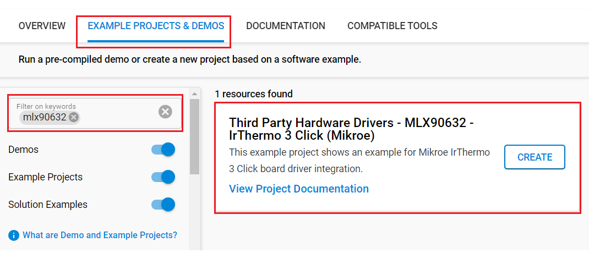
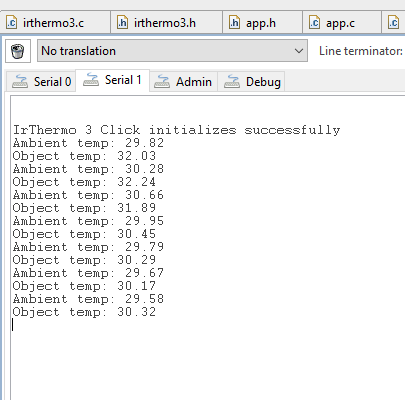

# MLX90632 - IrThermo 3 Click (Mikroe) #

## Summary ##

This project aims to show the hardware driver that is used to interface with the contactless temperature sensor using the Silicon Labs.

IRThermo 3 click uses the MLX90632 FIR sensor from Melexis as the contactless temperature sensor. This sensor is a thermopile IR sensor. A thermopile sensor is actually a serially connected thermocouple array, with hot junctions located on the heat-absorbing membrane. It uses a highly advanced MLX90632 FIR sensor, which detects the average temperature of objects within its field of view (FOV), which is typically ±25°. It is factory calibrated, with the calibration constants stored in its internal EEPROM. Besides EEPROM used for storing trimming values, device settings, and calibration constants, it has an additional RAM area that can be used for auxiliary measurement data storage. The integrated temperature sensor provides ambient temperature measurement, necessary for proper calibration. The device is calibrated to sense objects with a temperature ranging from -20 ℃ up to 200 ℃, and an ambient temperature ranging up to 80℃. The measurement resolution is 0.02℃. Measured data is available via the industry standard I2C communication bus.

## Required Hardware ##

- 1x [XG24-EK2703A](https://www.silabs.com/development-tools/wireless/efr32xg24-explorer-kit) EFR32xG24 Explorer Kit

- Or 1x [Wi-Fi Development Kit](https://www.silabs.com/development-tools/wireless/wi-fi) based on SiWG917 (e.g. [SIWX917-DK2605A](https://www.silabs.com/development-tools/wireless/wi-fi/siwx917-dk2605a-wifi-6-bluetooth-le-soc-dev-kit) or [SIWX917-RB4338A](https://www.silabs.com/development-tools/wireless/wi-fi/siwx917-rb4338a-wifi-6-bluetooth-le-soc-radio-board))

- 1x [IrThermo 3 Click](https://www.mikroe.com/ir-thermo-3-click)

## Hardware Connection ##

- If the EFR32xG24 Explorer Kit is used:

  The IrThermo 3 Click board support MikroBus, so it can connect easily to EFR32xG24 Explorer Kit's MikroBus header. Be sure that the board's 45-degree corner matches the Explorer Kit's 45-degree white line.

  The hardware connection is shown in the image below:

  

- If the Wi-Fi Development Kit is used:

  | Description  | BRD4338A + BRD4002A | BRD2605A     | IrThermo 3 Click   |
  | -------------| -----------| -------------| ------------------------|
  | I2C_SDA      | ULP_GPIO_6 [EXP_16] | ULP_GPIO_6   | SDA            |
  | I2C_SCL      | ULP_GPIO_7 [EXP_15] | ULP_GPIO_7   | SCL            |

## Setup ##

You can either create a project based on an example project or start with an empty example project.

### Create a project based on an example project ###

1. From the Launcher Home, add your device to My Products, click on it, and click on the **EXAMPLE PROJECTS & DEMOS** tab. Find the example project filtering by *mlx90632*

2. Click **Create** button on the **Third Party Hardware Drivers - MLX90632 - IrThermo 3 Click (Mikroe)** example. Example project creation dialog pops up -> click Create and Finish and Project should be generated.

   

3. Build and flash this example to the board.

### Start with an empty example project ###

1. Create an "Empty C Project" for your board using Simplicity Studio v5. Use the default project settings.

2. Copy the file `app/example/mikroe_irthermo3_mlx90632/app.c` into the project root folder (overwriting the existing file).

3. Install the software components:

    - Open the .slcp file in the project.

    - Select the SOFTWARE COMPONENTS tab.

    - Install the following components:

      **If the EFR32xG24 Explorer Kit is used:**

        - **[Services] → [Timer] → [Sleep Timer]**
        - **[Services] → [IO Stream] → [IO Stream: USART]** → default instance name: vcom
        - **[Application] → [Utility] → [Log]**
        - **[Third Party Hardware Drivers] → [Sensors] → [MLX90632 - IrThermo 3 Click (Mikroe)]** -> use default configuration.

      **If the Wi-Fi Development Kit is used:**

        - [WiSeConnect 3 SDK] → [Device] → [Si91x] → [MCU] → [Service] → [Sleep Timer for Si91x]
        - [WiSeConnect 3 SDK] → [Device] → [Si91x] → [MCU] → [Peripheral] → [I2C] → [i2c2]
        - [Third Party Hardware Drivers] → [Sensors] → [MLX90632 - IrThermo 3 Click (Mikroe)] -> use default configuration.

4. Enable **Printf float**

   - Open Properties of the project.
   - Select C/C++ Build → Settings → Tool Settings → GNU ARM C Linker → General → Check **Printf float**.

      

5. Build and flash this example to the board.

**Note:**

- Make sure that the **Third Party Hardware Drivers** extension is installed. If not, follow [this documentation](https://github.com/SiliconLabs/third_party_hw_drivers_extension/blob/master/README.md#how-to-add-to-simplicity-studio-ide).

- **Third Party Hardware Drivers** extension must be enabled for the project to install "MLX90632 - IrThermo 3 Click (Mikroe)" component.

## How It Works ##

The application measures ambient and object temperatures and displays data in degree centigrade every second.
You can launch Console that's integrated into Simplicity Studio or use a third-party terminal tool like TeraTerm to receive the data from the USB. A screenshot of the console output and an actual test image are shown in the figure below.

## Report Bugs & Get Support ##

To report bugs in the Application Examples projects, please create a new "Issue" in the "Issues" section of [third_party_hw_drivers_extension](https://github.com/SiliconLabs/third_party_hw_drivers_extension) repo. Please reference the board, project, and source files associated with the bug, and reference line numbers. If you are proposing a fix, also include information on the proposed fix. Since these examples are provided as-is, there is no guarantee that these examples will be updated to fix these issues.

Questions and comments related to these examples should be made by creating a new "Issue" in the "Issues" section of [third_party_hw_drivers_extension](https://github.com/SiliconLabs/third_party_hw_drivers_extension) repo.
