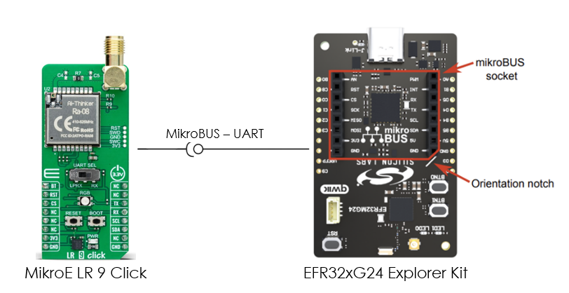
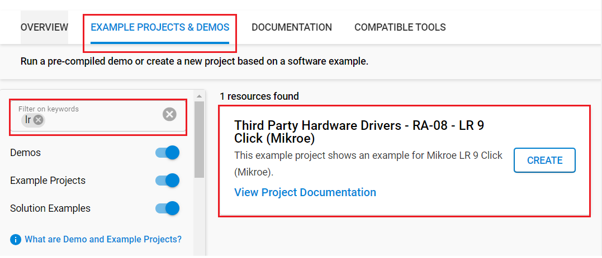
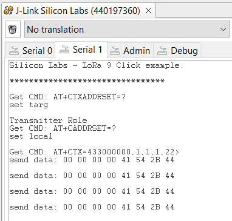
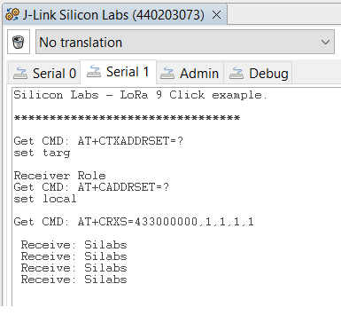

# RA-08 - LR 9 Click (Mikroe) #

## Summary ##

This example project shows an example of Mikroe LR 9 Click board driver integration with the Silicon Labs Platform.

LR 9 Click is based on the RA-08, a LoRaWAN module from Ai-Thinker Technology. This module is made for ultra-long-range spread spectrum communication tasks powered by the ASR6601. The ASR6601 is an LPWAN wireless communication system-on-chip (SoC) that combines RF transceivers, modems, and a 32-bit RISC microcontroller (MCU).

This example demonstrates the ability to transmit and receive data via the LoRaWan network between two Silicon Labs boards using the AT instruction set. The example uses LR 9 click to process incoming data and display them on the screen.

## Required Hardware ##

- 1x [XG24-EK2703A](https://www.silabs.com/development-tools/wireless/efr32xg24-explorer-kit) EFR32xG24 Explorer Kit

- Or 1x [Wi-Fi Development Kit](https://www.silabs.com/development-tools/wireless/wi-fi) based on SiWG917 (e.g. [SIWX917-DK2605A](https://www.silabs.com/development-tools/wireless/wi-fi/siwx917-dk2605a-wifi-6-bluetooth-le-soc-dev-kit) or [SIWX917-RB4338A](https://www.silabs.com/development-tools/wireless/wi-fi/siwx917-rb4338a-wifi-6-bluetooth-le-soc-radio-board))

- 2x [LR 9 Click](https://www.mikroe.com/lr-9-click)

## Hardware Connection ##

- If the Explorer Kit is used:

   The LR 9 Click board supports MikroBus, so it can connect easily to Explorer Kit via MikroBus header. Assure that the 45-degree corner of the Click board matches the 45-degree white line of the Explorer Kit.

   The hardware connection is shown in the image below:

   

- If the Wi-Fi Development Kit is used:

  | Description  | BRD4338A + BRD4002A | BRD2605A     | LR 9 Click |
  | ----------------- | -------------- | ------------ | ----------- |
  | UART1_RX_PIN      | GPIO_6 [P19]   | GPIO_6       | TX          |
  | UART1_TX_PIN      | GPIO_7 [P20]   | GPIO_7       | RX          |
  | RESET             | GPIO_46 [P24]  | GPIO_10      | RST         |

**Note:**

- There is a switch on the board allows the selection of the UART interface's function. Make sure that it is in the LPRX position for exchanging AT commands.

- Don't need to connect to the BT pin since the default of this pin is low for normal operating mode. For more details, please check [RA-08_datasheet](https://download.mikroe.com/documents/datasheets/RA-08_datasheet.pdf).

## Setup ##

You can either create a project based on an example project or start with an empty example project.

1. From the Launcher Home, add your board to My Products, click on it, and click on the **EXAMPLE PROJECTS & DEMOS** tab. Find the example project filtering by *lr*.

2. Click the **Create** button on the **Third Party Hardware Drivers - RA-08 - LR 9 Click (Mikroe)** example. Example project creation dialog pops up -> click Create and Finish and Project should be generated.

   

3. Build and flash this example to the board.

### Start with an empty example project ###

1. Create an "Empty C Project" for your board using Simplicity Studio v5. Use the default project settings.

2. Copy the file `app/example/mikroe_lr_ra_08/app.c` into the project root folder (overwriting the existing file).

3. Install the software components:

    - Open the .slcp file in the project.

    - Select the SOFTWARE COMPONENTS tab.

    - Install the following components:

    **If the Explorer Kit is used:**

      - [Services] → [Timers] → [Sleep Timer]
      - [Services] → [IO Stream] → [IO Stream: USART] → use an instance name: **mikroe**
      - [Services] → [IO Stream] → [IO Stream: ESART] → use the default instance name: **vcom**
      - [Application] → [Utility] → [Log]
      - [Third Party Hardware Drivers] → [Wireless Connectivity] → [RA-08 - LR 9 Click (Mikroe)] → use default configuration

   **If the Wi-Fi Development Kit is used:**

      - [WiSeConnect 3 SDK] → [Device] → [Si91x] → [MCU] → [Service] → [Sleep Timer for Si91x]
      - [Third Party Hardware Drivers] → [Wireless Connectivity] → [RA-08 - LR 9 Click (Mikroe)] → use default configuration
      - [WiSeConnect 3 SDK] → [Device] → [Si91x] → [MCU] → [Peripheral] → [UART] → disable "UART1 DMA"

4. Build and flash this example to the board.

**Note :**

- Make sure that the **Third Party Hardware Drivers** extension is installed. If not, follow [this documentation](https://github.com/SiliconLabs/third_party_hw_drivers_extension/blob/master/README.md#how-to-add-to-simplicity-studio-ide).

- **Third Party Hardware Drivers** extension must be enabled for the project to install the "RA-08 - LR 9 Click (Mikroe)" component.

## How It Works ##

The example uses two Silicon Labs boards for each direction. One runs in the transmitter role and the other operates in the receiver role. The transmitter sends a "Silabs" string every two seconds. The receiver parses the incoming data and displays the string on the screen.

The source code is suitable for running in two roles. However, the original code is used for the transmitter role. To create the receiver device, the `DEMO_APP_TRANSMITTER` macro in the `app.c` file should be commented.

```c
// Comment the line below to switch application mode to receiver
#define DEMO_APP_TRANSMITTER
```

You can launch Console, which is integrated into Simplicity Studio or you can use a third-party terminal tool like Tera Term to receive the data. Data is coming from the UART COM port. A screenshot of the console output of the receiver device is shown in the figure below.

| Transmitter | Receiver |
| :-----------: | :--------: |
| |  |

## Report Bugs & Get Support ##

To report bugs in the Application Examples projects, please create a new "Issue" in the "Issues" section of [third_party_hw_drivers_extension](https://github.com/SiliconLabs/third_party_hw_drivers_extension) repo. Please reference the board, project, and source files associated with the bug, and reference line numbers. If you are proposing a fix, also include information on the proposed fix. Since these examples are provided as-is, there is no guarantee that these examples will be updated to fix these issues.

Questions and comments related to these examples should be made by creating a new "Issue" in the "Issues" section of [third_party_hw_drivers_extension](https://github.com/SiliconLabs/third_party_hw_drivers_extension) repo.
