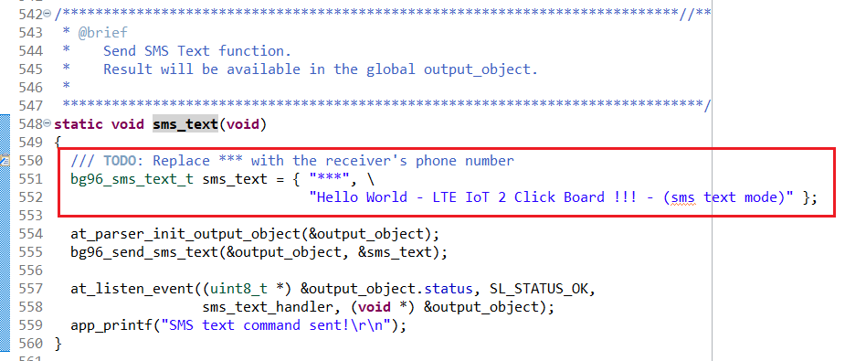
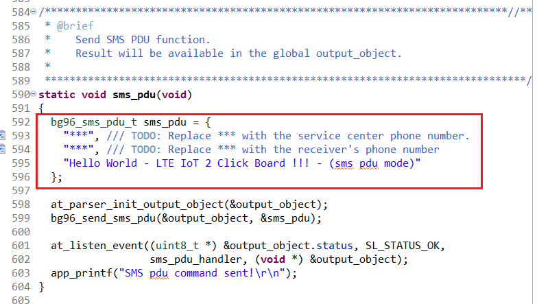

# BG96 - LTE IoT 2 Click (Mikroe) #

## Summary ##

This project shows the implementation of an LTE IoT 2 Click driver using Quectel BG96 LTE module from Mikroe Integrated with Silicon Labs platform based on UART communication.

LTE IoT 2 Click is a Click board™ that allows connection to the LTE networks, featuring Quectel BG96 LTE module, which offers two LTE technologies aimed at Machine to Machine communication (M2M) and the Internet of Things (IoT). This module is an embedded IoT communication solution that supports the LTE Cat M1 and NB1 technologies, offering an alternative to similar Low Power Wide Area Network (LPWAN) solutions, such as the ones provided by Sigfox and LoRa. The LTE CAT1 and NB1 technologies are designed with specific requirements of the IoT network in mind. LTE IoT 2 click also offers various other features, allowing simple and reliable connection to these new 3GPP IoT technologies.

## Required Hardware ##

- 1x [XG24-EK2703A](https://www.silabs.com/development-tools/wireless/efr32xg24-explorer-kit) EFR32xG24 Explorer Kit

- Or 1x [Wi-Fi Development Kit](https://www.silabs.com/development-tools/wireless/wi-fi) based on SiWG917 (e.g. [SIWX917-DK2605A](https://www.silabs.com/development-tools/wireless/wi-fi/siwx917-dk2605a-wifi-6-bluetooth-le-soc-dev-kit) or [SIWX917-RB4338A](https://www.silabs.com/development-tools/wireless/wi-fi/siwx917-rb4338a-wifi-6-bluetooth-le-soc-radio-board))

- 1x [LTE IoT 2 Click board](https://www.mikroe.com/lte-iot-2-click) based on Quectel BG96 LTE module which running on the firmware version: **BG96MAR02A07M1G**

- 1x [Hologram IoT sim card](https://www.hologram.io/products/global-iot-sim-card/)

- 1x [GSM/GPRS Antenna](https://www.mikroe.com/gsm-gprs-right-angle-rubber)

- 1x [Active GPS Antenna](https://www.mikroe.com/active-gps)

## Hardware Connection ##

- If the EFR32xG24 Explorer Kit is used:

  The LTE IoT 2 Click board supports MikroBus, so it can connect easily to the Explorer Kit via MikroBus header. Assure that the 45-degree corner of Click board matches the 45-degree white line of the Explorer Kit.

  The hardware connection is shown in the images below:

    

- If the Wi-Fi Development Kit is used:

  | Description  | BRD4338A + BRD4002A | BRD2605A     | LTE IOT 2 Click |
  | ----------------- | -------------- | ------------ | --------------- |
  | UART1_RX_PIN      | GPIO_6 [P19]   | GPIO_6       | TX              |
  | UART1_TX_PIN      | GPIO_7 [P20]   | GPIO_7       | RX              |
  | Module Power-Up   | GPIO_47 [P26]  | GPIO_11      | PWK             |
  | Module status     | GPIO_46 [P24]  | GPIO_10      | STA             |

- Insert the SIM into the LTE IoT 2 Click. Ensure that the SIM is inserted properly.

- You need to attach the GSM and GPS antenna to the proper connectors (CN1 is the GSM one, and CN2 is the GPS antenna). Place the GNSS antenna to be able detect GPS satellites. GSM service is also required in the area.

## Setup ##

You can either create a project based on an example project or start with an empty example project.

### Create a project based on an example project ###

1. From the Launcher Home, add your device to My Products, click on it, and click on the **EXAMPLE PROJECTS & DEMOS** tab. Find the example project filtering by **bg96**.

2. Click **Create** button on the **Third Party Hardware Drivers - BG96 - LTE IoT 2 CLick (Mikroe)** example. Example project creation dialog pops up -> click Create and Finish and Project should be generated.

    

3. From the project root folder, open file **app_iostream_cli.c** (if using EFR32xG24 Explorer Kit) or **app_iostream_cli_si91x.c** (if using Wi-Fi Development Kit). Replace " *** " by the receiver's phone number.

    

    If you want to send pdu message replace the " *** " by the service center phone number and the receiver's phone number respectively.

    

    If you want to send data via TCP connection, replace the DEVICE_KEY with your Hologram token found here: <https://support.hologram.io/hc/en-us/articles/360035212714>

    

4. Build and flash this example to the board.

### Start with an empty example project ###

1. Create an "Empty C Project" for your board using Simplicity Studio v5. Use the default project settings.

2. Copy the following files into the project root folder (overwriting the existing file):

    - `app/example/mikroe_lte_iot2_bg96/app.c`
    - `app/example/mikroe_lte_iot2_bg96/app_iostream_cli.h`
    - `app/example/mikroe_lte_iot2_bg96/app_iostream_cli.c` if using EFR32xG24 Explorer Kit
    - `app/example/mikroe_lte_iot2_bg96/app_iostream_cli_si91x.c` if using Wi-Fi Development Kit

3. Install the software components:

    - Open the .slcp file in the project.

    - Select the SOFTWARE COMPONENTS tab.

    - Install the following components:

      **If the EFR32xG24 Explorer Kit is used:**

        - [Services] → [IO Stream] → [IO Stream: EUSART] → default instance name: vcom
        - [Services] → [IO Stream] → [IO Stream: USART] → default instance name: mikroe → Set the "Receive buffer size" to 256
        - [Application] → [Utility] → [Log]
        - [Third-Party Hardware Drivers] → [Sensors] → [BG96 - LTE IoT 2 Click (Mikroe)]
        - [Platform] → [Utilities] → [Circular Queue] → set Max Queue Length to 20

      **If the Wi-Fi Development Kit is used:**

        - [Third-Party Hardware Drivers] → [Sensors] → [BG96 - LTE IoT 2 Click (Mikroe)]
        - [WiSeConnect 3 SDK v3.3.3] → [Device] → [Si91x] → [MCU] → [Peripheral] → [UART] → turn off DMA configuration as below:

            

        - [Platform] → [Utilities] → [Circular Queue] → set Max Queue Length to 20

4. Configure receiver's phone number, refers to step 3 in [Create a project based on an example project](#create-a-project-based-on-an-example-project).

5. Build and flash this example to the board.

**Note:**

- Make sure that the **Third Party Hardware Drivers** extension is installed. If not, follow [this documentation](https://github.com/SiliconLabs/third_party_hw_drivers_extension/blob/master/README.md#how-to-add-to-simplicity-studio-ide).

- **Third Party Hardware Drivers** extension must be enabled for the project to install "BG96 - LTE IoT 2 Click (Mikroe)" component.

## How It Works ##

- The Third Party Hardware Drivers - BG96 - LTE IoT 2 CLick (Mikroe) driver consists of three driver layers and an application layer on the top. The hardware peripheral configuration and low-level handling can be found on the lowest level.
- The core driver schedules the sending of AT commands, maintains a command queue and handles the received responses. It also achieves an error handling that works similarly to exception handling in high-level programming languages. If any error occurs during the communication it can interrupt the command scheduler and report the appropriate error message to the high-level programming interface.
- The high-level functions prepare the AT commands, extend them with parameters if necessary, put them into the command queue and start the scheduler. The basic functions like LTE network configuration, sending mobile sms, data send/receive on a TCP/IP socket and GPS positioning are already implemented but it is possible to write custom high-level functions too. You will find the detailed documentation in the code and a brief example of usage below.

### BG96 - LTE IoT 2 Click general high-level functions ###

- *bg96_init()*
- *bg96_is_alive()*
- *bg96_sleep()*
- *bg96_wake_up()*

### BG96 - LTE IoT 2 Click functional high-level functions ###

- *bg96_nb_init()*
- *bg96_nb_open_connection()*
- *bg96_network_registration()*
- *bg96_nb_close_connection()*
- *bg96_nb_send_data()*
- *bg96_nb_receive_data()*
- *bg96_read_ip()*
- *bg96_read_imei()*
- *bg96_read_infor()*
- *bg96_get_operator()*
- *bg96_set_te_gsm()*
- *bg96_config_service_domain()*
- *bg96_set_sms_mode()*
- *bg96_send_sms_text()*
- *bg96_send_sms_pdu()*
- *bg96_set_sim_apn()*
- *bg96_gnss_start()*
- *bg96_gnss_get_position()*
- *bg96_gnss_stop()*

## Driver Layer Overview ##


## Driver Extension Guide ##

**NOTE:**

- The **Third Party Hardware Drivers - BG96 - LTE IoT 2 CLick (Mikroe) driver** provides a limited set of APIs supporting AT commands for the BG96 module. To add other AT commands, users can follow the instructions below.

### Adding New AT Command ###

To add new AT command to the parser you need to define an AT command line callback which depends on the required response of the command.
The possible AT command responses are found in the [Resources section](#resources). In some cases, one of the predefined line callbacks can be used. e.g.: *at_ok_error_cb()* if the command response is OK or ERROR.

1. Define the appropriate line callback function in *at_parser_core.c*. You can find an example below.

    ```c
    void at_custom_cb(uint8_t *new_line, uint8_t call_number)
      //call_number refers the number of new lines received as response
      //new_line points to a string with the new line data
      switch (call_number) {
      case 1:
        //the value of the new line can be parsed
        if (has_substring(new_line, "OK")) {
            //in case of the last response arrived scheduler can be stepped forward
            at_parser_scheduler_next_cmd();
        }
        if (has_substring(new_line, "ERROR")) {
            //data can be reported to the caller
            at_parser_report_data(new_line);
            //in case of error scheduler can be stopped and error code can be reported
            at_parser_scheduler_error(SL_STATUS_FAIL);
        }
        break;
      default:
        //default case always SHALL be defined
        at_parser_scheduler_error(SL_STATUS_FAIL);
        break;
      }
    ```

2. Add the core process function to the main loop.

    ```c
    void app_process_action (void)
    {
      at_parser_process ();
      ...
    }
    ```

3. The definition of AT command SHALL be implemented in a high-level function. See the section **Creating New High Level Function**.

### Creating New High Level Function ###

Creating a high-level function means a single AT command or a list of AT commands which should be sent after each other to the BG96 IoT module and process their response, indicate errors and define the user data. The predefined high-level function can be found in *mikroe_bg96.c* files.

  ```c
  sl_status_t custom_high_level_function( user_data_t *custom_user_data,          //you can use user data
                                          at_scheduler_status_t *output_object)   //you MUST define an output_object to receive the response
  {
      //define command status variable as SL_STATUS_OK, this will collect the errors of low level functions
    sl_status_t cmd_status = SL_STATUS_OK;
    //define the base and additional parts of the AT command, additional parts can be prameters inherited from user data
    uint8_t extend_str[]= "0,0",
    uint8_t base_cmd[] = "AT+QICLOSE=";

    //create a STATIC command descriptor, this descriptor MUST be allocated during the AT command parsing process!
    static at_cmd_desc_t at_custom = { .cms_string="",                     //use an empty cmd_string if there are additional parameters
                                      .ln_cb=at_custom_cb,                //add the appropriate line callback function
                                      .timeout_ms = AT_DEFAULT_TIMEOUT    //define a timeout for the command (check the BG96 datasheet for the decent timeout)
                                      };
      //prepare the command descriptor (clears the command string)
      at_parser_clear_cmd(&at_custom);

      //for the following functions use validate() function to indicate the errors!
      //extend command descriptor command string with the base command
      validate(cmd_status, at_parser_extend_cmd(&at_custom, base_cmd));
      //extend command descriptor command string with the additional parts
      validate(cmd_status, at_parser_extend_cmd(&at_custom, conn_string));
      //add the command descriptor to the command queue, queue is available only if previous high level function finished
      validate(cmd_status, at_parser_add_cmd_to_q(&at_custom));
      //start command scheduler, scheduler runs until the command queue is empty or error is occourred.
      validate(cmd_status, at_parser_start_scheduler(output_object));
    return cmd_status;
  }
  ```

### Creating New CLI Command ###

1. Add a new element to the *cli_cmds[]* array in *app_iostream_cli.c*. The new element SHALL contain a CLI command string and a perform function. Use a short command and DO NOT use spaces and special characters! The maximum length of a CLI command is defined in *CLI_CMD_LENGTH* macro in *app_iostream_cli.h* and is 10 by default.

    ```c
    static cli_cmd_t cli_cmds[] = {
                                    { "imei", imei },
                                    { "ip", ip },
                                    //you can define new CLI commands here
                                    {"custom_cmd", custom_cmd}
                                    };
    ```

2. Define the CLI command to perform a function. This is the function defined in the new element of *cli_cmd[]* array. Use static keywords!

    ```c
    static void custom_cmd()
    {
        //prepare an output object for receiving data from a high level function
        at_parser_init_output_object(&output_object);
        //call a high level function
        custom_high_level_function(&output_object);
        //create an event listener for the output object and define the event handler function
        at_listen_event(&output_object.status,      //pointer to a variable to check
                        SL_STATUS_OK,               //the state the status variable should be equal to
                        custom_cmd_handler,         //event handler function
                        (void*) &output_object);    //parameter of event handler function

        //you can write a short log if command perform function has run. Do not forget the \r\n at the end of the message!
        printf("Custom command has been performed!\r\n");
    }
    ```

3. Define the event handler function you gave in the event listener parameter list.

    ```c
    static void custom_cmd_handler(void *handler_data)
    {
        //handler data is a pointer to the user data passed by the event listener
        //at_scheduler_state is a good option to propagate because it contains the AT command response
        at_scheduler_status_t *l_output = (at_scheduler_status_t*) handler_data;

        //check the error code and handle it
        if (l_output->error_code) {
            printf("Error while running custom command %d\r\n", l_output->error_code);
        } else {
            //print the response data if it was reported by the AT command line callback
            printf("Custom command response: %s\r\n", l_output->response_data);
        }
    }
    ```

4. Add the event listener and IOstream process functions to the main loop.

    ```c
      void app_process_action (void)
      {
          app_iostream_usart_process_action ();
          at_event_process ();
          ...
      }
    ```

### Testing ###

You can launch Console that's integrated into Simplicity Studio or use a third-party terminal tool like Tera Term to receive the data from the USB. In this example, we build a simple command line interface application. There are commonly used commands predefined in the `app_iostream_cli.c` file. When the user wants to test a feature, just call the corresponding commands.

#### Using the general functions ####

- After the chip has finished booting, the user needs to start the LTE IoT 2 module. Enter the command "wakeup" into Tera Term and end with an "Enter" key. A logline is printed confirming the command has been executed. The lower layer library will control the GPIO pin connected to the PWK pin to power the LTE IoT 2 module. After a few seconds the module boots up, and it will respond with a successful boot confirmation.
- Users can check basic parameters such as getting imei code, and getting revision by "imei", "infor" commands. The user then calls the "service" command to configure the service domain type CS and PS. Next, the user calls the command "gsm" to select TE character set to GSM.
- In this example, we send a text message from LTE IoT 2 Click module to a given phone number. There are two operating modes "textmode" and "pdumode" need to call these 2 commands first to put the module into operation mode respectively. The user can then invoke the "smstext" and "smspdu" commands to send the message. After confirming the successful message delivery, there will be a response, which contains the reference information of that sms.
  
  

#### Using the GPS functions ####

- First, users need to turn on the GPS module with the "gpsstart" command. After the LTE IoT 2 Click module captures the satellite signal, the user can get the location coordinates with the "location" command. After getting the results, users can use the longitude and latitude values ​​entered into Google Maps to check the actual location. In addition, the command also returns information such as UTC, altitude, date, etc. After use, the user can turn off the GPS function with the command "gpsstop", this is to save energy for the system.

  

#### Using the TCP functions ####

- To test these functions a activated [Hologram IoT sim card](https://www.hologram.io/products/global-iot-sim-card/) needs to be inserted into the LTE IoT 2 Click.

- Make sure that the Hologram SIM is activated on the Dashboard. Here is a [link](https://hologram.io/docs/guide/connect/connect-device/#sim-activation) that walks you through that process.

- Follow the commands below to test the TCP functions:

   

- Navigate to the Hologram Dashboard and click All Activity at the bottom of the screen to expand the log. The message should appear, and that's it!

   

## Resources ##

- [BG96 AT Commands Manual](https://github.com/wwxxyx/Quectel_BG96/blob/master/BG96/Software/Quectel_BG96_AT_Commands_Manual_V2.2.pdf)

- [BG96 GNSS AT Commands Manual](https://github.com/wwxxyx/Quectel_BG96/blob/master/BG96/Software/Quectel_BG96_GNSS_AT_Commands_Manual_V1.1.pdf)

- [BG96 TCP/IP AT Commands Manual](https://github.com/wwxxyx/Quectel_BG96/blob/master/BG96/Software/Quectel_BG96_TCP(IP)_AT_Commands_Manual_V1.0.pdf)

## Report Bugs & Get Support ##

To report bugs in the Application Examples projects, please create a new "Issue" in the "Issues" section of [third_party_hw_drivers_extension](https://github.com/SiliconLabs/third_party_hw_drivers_extension) repo. Please reference the board, project, and source files associated with the bug, and reference line numbers. If you are proposing a fix, also include information on the proposed fix. Since these examples are provided as-is, there is no guarantee that these examples will be updated to fix these issues.

Questions and comments related to these examples should be made by creating a new "Issue" in the "Issues" section of [third_party_hw_drivers_extension](https://github.com/SiliconLabs/third_party_hw_drivers_extension) repo.
