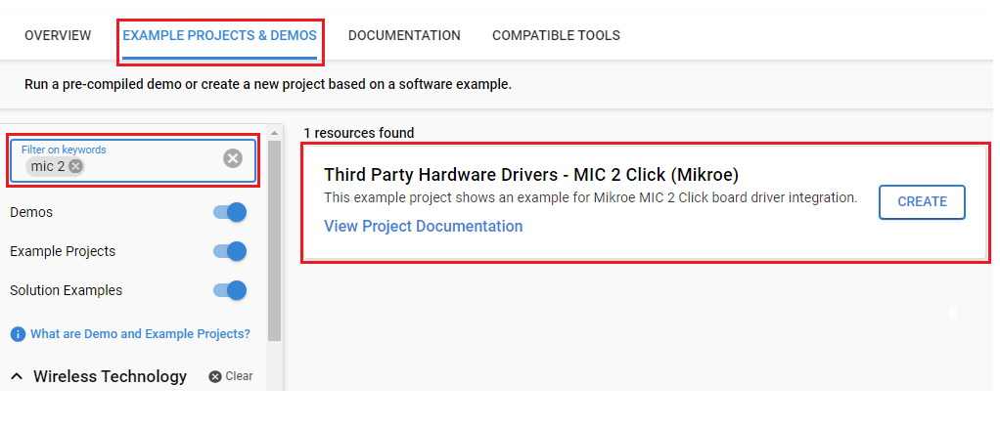
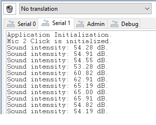

# MIC 2 Click (Mikroe) #

## Summary ##

This example project shows an example of Mikroe MIC 2 Click board driver integration with the Silicon Labs Platform.

MIC 2 click is equipped with a small electret microphone, accompanied by a suitable pre-amplifying circuit. The small omnidirectional electret microphone features a reasonably flat frequency response, and it can be used within the frequency range between 100 Hz and 20 kHz. This range is perfectly suited for audio and/or speech applications. It can be used for the development of various audio and speech-related applications: speech or audio digitizing, digital audio monitoring and surveillance, digital "bugs", etc.

This example can be used to determine the sound intensity of your location. The combination of the EFR32xG24 Explorer Kit and Mikroe MIC 2 Click can act as a sound intensity measurement device.

## Required Hardware ##

- 1x [XG24-EK2703A](https://www.silabs.com/development-tools/wireless/efr32xg24-explorer-kit) EFR32xG24 Explorer Kit

- Or 1x [Wi-Fi Development Kit](https://www.silabs.com/development-tools/wireless/wi-fi) based on SiWG917 (e.g. [SIWX917-DK2605A](https://www.silabs.com/development-tools/wireless/wi-fi/siwx917-dk2605a-wifi-6-bluetooth-le-soc-dev-kit) or [SIWX917-RB4338A](https://www.silabs.com/development-tools/wireless/wi-fi/siwx917-rb4338a-wifi-6-bluetooth-le-soc-radio-board))

- 1x [MIC 2 Click](https://www.mikroe.com/mic-2-click)

## Hardware Connection ##

- If the EFR32xG24 Explorer Kit is used:

  The MIC 2 Click board supports MikroBus, so it can connect easily to the Explorer Kit via MikroBus header. Assure that the 45-degree corner of the Click board matches the 45-degree white line of the Explorer Kit.

  The hardware connection is shown in the image below:

  

- If the Wi-Fi Development Kit is used:

  | Description  | BRD4338A + BRD4002A | BRD2605A     | MIC 2 Click  |
  | -------------| -----------| -------------| ------------------------|
  | I2C_SDA      | ULP_GPIO_6 [EXP_16] | ULP_GPIO_6   | SDA            |
  | I2C_SCL      | ULP_GPIO_7 [EXP_15] | ULP_GPIO_7   | SCL            |
  | Positive analog input | ULP_GPIO_1 [P16]    | ULP_GPIO_1   | AN    |

## Setup ##

You can either create a project based on an example project or start with an empty example project.

> [!IMPORTANT]
> - Make sure that the [Third Party Hardware Drivers](https://github.com/SiliconLabsSoftware/third_party_hw_drivers_extension) extension is installed as part of the SiSDK. If not, follow [this documentation](https://github.com/SiliconLabsSoftware/third_party_hw_drivers_extension/blob/master/README.md#how-to-add-to-simplicity-studio-ide).
> - **Third Party Hardware Drivers** extension must be enabled for the project to install the required components from this extension.

> [!TIP]
> To show all components in the **Third Party Hardware Drivers** extension, the **Evaluation** quality must be enabled in the Software Component view.

1. From the Launcher Home, add your board to My Products, click on it, and click on the **EXAMPLE PROJECTS & DEMOS** tab. Find the example project filtering by **"mic 2"**.

2. Click **Create** button on the **Third Party Hardware Drivers - MIC 2 Click (Mikroe)** example. Example project creation dialog pops up -> click Create and Finish and Project should be generated.

   

### Start with an empty example project ###

1. Create an "Empty C Project" for your board using Simplicity Studio v5. Use the default project settings.

2. Copy the file `app/example/mikroe_mic2/app.c` into the project root folder (overwriting the existing file).

3. Install the software components:

    - Open the .slcp file in the project.

    - Select the SOFTWARE COMPONENTS tab.

    - Install the following components:

      **If the EFR32xG24 Explorer Kit is used:**

        - [Services] → [IO Stream] → [IO Stream: USART] → default instance name: **vcom**
        - [Application] → [Utility] → [Log]
        - [Services] → [Timers] → [Sleep Timer]
        - [Third Party Hardware Drivers] → [Audio & Voice] → [MIC 2 Click (Mikroe)] → use the default configuration

      **If the Wi-Fi Development Kit is used:**

        - [WiSeConnect 3 SDK] → [Device] → [Si91x] → [MCU] → [Service] → [Sleep Timer for Si91x]
        - [WiSeConnect 3 SDK] → [Device] → [Si91x] → [MCU] → [Peripheral] → [ADC] → [channel_1] → use default configuration
        - [WiSeConnect 3 SDK] → [Device] → [Si91x] → [MCU] → [Peripheral] → [I2C] → [i2c2]
        - [Third Party Hardware Drivers] → [Audio & Voice] → [MIC 2 Click (Mikroe)] → use the default configuration

4. Enable **Printf float**

   - Open Properties of the project.
   - Select C/C++ Build → Settings → Tool Settings → GNU ARM C Linker → General → Check **Printf float**.

5. Build and flash this example to the board.

## How It Works ##

### Driver Layer Diagram ###

### Testing ###

This example reads the ADC value and converts this value to Decibel (dB) value. With decibel value, you can perceive the noise level of the surrounding environment.

After the sensor is initialed successfully, the application reads the analog signal every 500 milliseconds. Right after getting this value, it will be converted to a Decibel value.

To test the functionality, you can change the sound intensity surrounding the sensor in many ways. You can talk louder or applaud near the sensor. Then you will see the Decibel value change on the console in Simplicity Studio or other third-party terminal tools.

You can launch Console that's integrated into Simplicity Studio or use a third-party terminal tool like TeraTerm to receive the data from the USB. A screenshot of the console output is shown in the figure below.

## Report Bugs & Get Support ##

To report bugs in the Application Examples projects, please create a new "Issue" in the "Issues" section of [third_party_hw_drivers_extension](https://github.com/SiliconLabsSoftware/third_party_hw_drivers_extension) repo. Please reference the board, project, and source files associated with the bug, and reference line numbers. If you are proposing a fix, also include information on the proposed fix. Since these examples are provided as-is, there is no guarantee that these examples will be updated to fix these issues.

Questions and comments related to these examples should be made by creating a new "Issue" in the "Issues" section of [third_party_hw_drivers_extension](https://github.com/SiliconLabsSoftware/third_party_hw_drivers_extension) repo.
