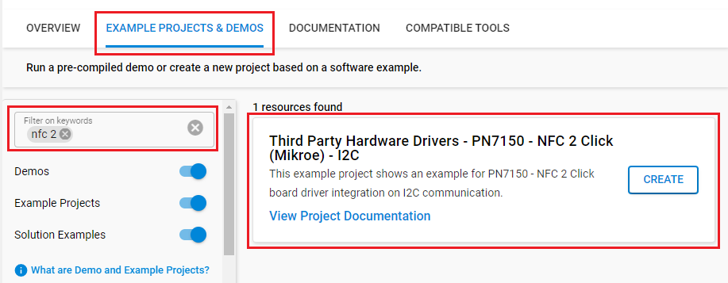

# PN7150 - NFC 2 Click (Mikroe) #

## Summary ##

This example demonstrates the usage of NFC 2 Click board with Silicon Labs platform based on I2C communication.

NFC 2 Click is based on the PN7150, high-performance full NFC solution with integrated firmware and I2C interface designed for contactless communication at 13.56 MHz from NXP.

NFC 2 Click board can be used for the detection of NFC Tag and can be used for rapidly integrating NFC technology in any application.

## Required Hardware ##

- 1x [BGM220-EK4314A](https://www.silabs.com/development-tools/wireless/bluetooth/bgm220-explorer-kit) BGM220 Bluetooth Module Explorer Kit

- Or 1x [Wi-Fi Development Kit](https://www.silabs.com/development-tools/wireless/wi-fi) based on SiWG917 (e.g. [SIWX917-DK2605A](https://www.silabs.com/development-tools/wireless/wi-fi/siwx917-dk2605a-wifi-6-bluetooth-le-soc-dev-kit) or [SIWX917-RB4338A](https://www.silabs.com/development-tools/wireless/wi-fi/siwx917-rb4338a-wifi-6-bluetooth-le-soc-radio-board))

- 1x [NFC 2 Click](https://www.mikroe.com/nfc-2-click)

- 1x T2T tag

## Hardware Connection ##

- If the BGM220P Explorer Kit is used:

  The NFC 2 Click board supports MikroBus, so it can connect easily to the Explorer Kit via MikroBus header. Assure that the 45-degree corner of the Click board matches the 45-degree white line of the Explorer Kit.

  The hardware connection is shown in the image below:

  

- If the Wi-Fi Development Kit is used:

  | Description  | BRD4338A + BRD4002A | BRD2605A     | NFC 2 Click  |
  | -------------| -----------| -------------| ------------------------|
  | Interrupt    | GPIO_46 [P24]       | GPIO_10      | INT            |
  | Reset        | GPIO_47 [P26]       | GPIO_11      | RST            |
  | I2C_SDA      | ULP_GPIO_6 [EXP_16] | ULP_GPIO_6   | SDA            |
  | I2C_SCL      | ULP_GPIO_7 [EXP_15] | ULP_GPIO_7   | SCL            |

## Setup ##

You can either create a project based on an example project or start with an empty example project.

### Create a project based on an example project ###

1. From the Launcher Home, add your board to My Products, click on it, and click on the **EXAMPLE PROJECTS & DEMOS** tab. Find the example project with the filter: *nfc 2*.

2. Click **Create** button on the **Third Party Hardware Drivers - PN7150 - NFC 2 Click (Mikroe) - I2C** example. Example project creation dialog pops up -> click Create and Finish and Project should be generated.

   

3. Build and flash this example to the board.

### Start with an empty example project ###

1. Create an "Empty C Project" for your board using Simplicity Studio v5. Use the default project settings.

2. Copy the file `app/example/mikroe_nfc2_pn7150/app.c` into the project root folder (overwriting the existing file).

3. Install the software components:

    - Open the .slcp file in the project.

    - Select the SOFTWARE COMPONENTS tab.

    - Install the following components:

      **If the EFR32xG24 Explorer Kit is used:**

        - [Services] → [IO Stream] → [IO Stream: USART] → default instance name: **vcom**
        - [Application] → [Utility] → [Log]
        - [Services] → [Timers] → [Sleep Timer]
        - [Third Party Hardware Drivers] → [Wireless Connectivity] → [PN7150 - NFC 2 Click (Mikroe) - I2C] → use default configuration

      **If the Wi-Fi Development Kit is used:**

        - [WiSeConnect 3 SDK] → [Device] → [Si91x] → [MCU] → [Service] → [Sleep Timer for Si91x]
        - [WiSeConnect 3 SDK] → [Device] → [Si91x] → [MCU] → [Peripheral] → [I2C] → [i2c2]
        - [Third Party Hardware Drivers] → [Wireless Connectivity] → [PN7150 - NFC 2 Click (Mikroe) - I2C] → use default configuration

4. Build and flash this example to the board.

**Note:**

- Make sure that the **Third Party Hardware Drivers** extension is installed. If not, follow [this documentation](https://github.com/SiliconLabs/third_party_hw_drivers_extension/blob/master/README.md#how-to-add-to-simplicity-studio-ide).

- **Third Party Hardware Drivers** extension must be enabled for the project to install "PN7150 - NFC 2 Click (Mikroe) - I2C" component.

## How It Works ##

The application is composed of three sections :

- Application Initialization: - Initialization driver enables - I2C,
 hw reset, reset and initialize core, disabling standby mode,
 starting test procedure, set configuration and start discovery, also write log.
- Application process: NFC 2 Click board can be used for the detection of NFC tag and displays its value via USART terminal.

## Testing ##

After initialization, the application automatically looks for nearby compatible tags. Place a T2T tag near NFC 2 Click board. After detecting a tag, the application shows logs on the terminal.

You can launch Console that's integrated into Simplicity Studio or use a third-party terminal tool like TeraTerm to receive the data from the USB. A screenshot of the console output is shown in the figure below.

## Report Bugs & Get Support ##

To report bugs in the Application Examples projects, please create a new "Issue" in the "Issues" section of [third_party_hw_drivers_extension](https://github.com/SiliconLabs/third_party_hw_drivers_extension) repo. Please reference the board, project, and source files associated with the bug, and reference line numbers. If you are proposing a fix, also include information on the proposed fix. Since these examples are provided as-is, there is no guarantee that these examples will be updated to fix these issues.

Questions and comments related to these examples should be made by creating a new "Issue" in the "Issues" section of [third_party_hw_drivers_extension](https://github.com/SiliconLabs/third_party_hw_drivers_extension) repo.
