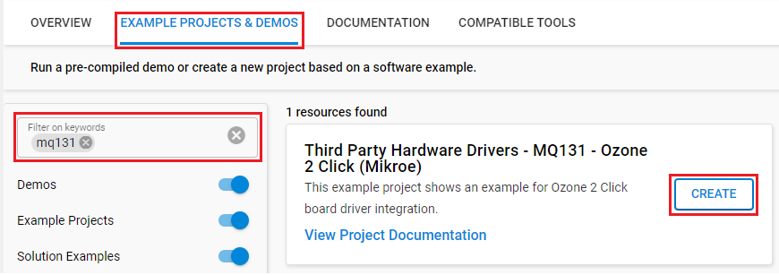
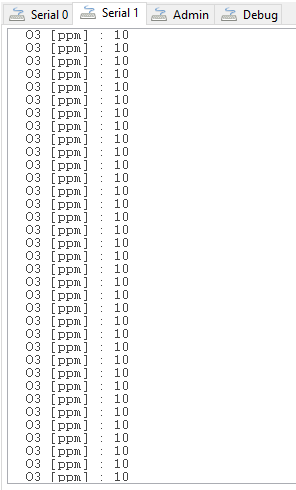

# MQ131 - Ozone 2 Click (Mikroe) #

## Summary ##

This example project shows an example for Mikroe Ozone 2 Click board driver integration with Silicon Labs Platform.

Ozone 2 click is an Ozone detection (O3) sensor, based on the MQ131 gas sensor. This gas sensor has a sensitive layer made of SnO2, which changes its resistance when exposed to ozone. The sensor is able to sense O3 concentration in the range of 10 ppm to 1000 ppm. The Click board™ is also equipped with a trimmer potentiometer, used to adjust the sensitivity and offset of the MQ131 sensor. Low cross-influence of other oxidation gases such as CL2 and NO2, ensures a good accuracy of the sensor.

The analog output of the sensor is sampled by a high-resolution 22-bit A/D converter (ADC), which offers the conversion result on the SPI interface. The analog signal from the sensor is also available, allowing an external ADC to be used.

## Required Hardware ##

- 1x [BGM220-EK4314A](https://www.silabs.com/development-tools/wireless/bluetooth/bgm220-explorer-kit) BGM220 Bluetooth Module Explorer Kit

- Or 1x [Wi-Fi Development Kit](https://www.silabs.com/development-tools/wireless/wi-fi) based on SiWG917 (e.g. [SIWX917-DK2605A](https://www.silabs.com/development-tools/wireless/wi-fi/siwx917-dk2605a-wifi-6-bluetooth-le-soc-dev-kit) or [SIWX917-RB4338A](https://www.silabs.com/development-tools/wireless/wi-fi/siwx917-rb4338a-wifi-6-bluetooth-le-soc-radio-board))

- 1x [Ozone 2 click board](https://www.mikroe.com/ozone-2-click) based on MQ131 gas sensor

## Hardware Connection ##

- If the BGM220P Explorer Kit is used:

  The Ozone 2 click supports MikroBus, so it can connect easily to the Explorer Kit via MikroBus header. Assure that the 45-degree corner of Click board matches the 45-degree white line of the Explorer Kit.

  The hardware connection is shown in the image below:

    

- If the Wi-Fi Development Kit is used:

  | Description  | BRD4338A + BRD4002A | BRD2605A     | Ozone 2 Click Board |
  | ----------------------| ---------------| --------------------------| --------------------|
  | Positive analog input | ULP_GPIO_1 [P16]    | ULP_GPIO_1           | AN                  |
  | CS                    | GPIO_46 [P24]       | GPIO_10              | CS                  |
  | RTE_GSPI_MASTER_CLK_PIN  | GPIO_25 [P25]    | GPIO_25              | SCK                 |
  | RTE_GSPI_MASTER_MISO_PIN | GPIO_26 [P27]    | GPIO_26              | SDO                 |

## Setup ##

You can either create a project based on an example project or start with an empty example project.

> [!IMPORTANT]
> - Make sure that the [Third Party Hardware Drivers](https://github.com/SiliconLabsSoftware/third_party_hw_drivers_extension) extension is installed as part of the SiSDK. If not, follow [this documentation](https://github.com/SiliconLabsSoftware/third_party_hw_drivers_extension/blob/master/README.md#how-to-add-to-simplicity-studio-ide).
> - **Third Party Hardware Drivers** extension must be enabled for the project to install the required components from this extension.

> [!TIP]
> To show all components in the **Third Party Hardware Drivers** extension, the **Evaluation** quality must be enabled in the Software Component view.

### Create a project based on an example project ###

1. From the Launcher Home, add your device to My Products, click on it, and click on the **EXAMPLE PROJECTS & DEMOS** tab. Find the example project filtering by **"mq131"**.

2. Click **Create** button on the **Third Party Hardware Drivers - MQ131 - Ozone 2 Click (Mikroe)** example. Example project creation dialog pops up -> click Create and Finish and Project should be generated.

    

3. Build and flash this example to the board.

### Start with an empty example project ###

1. Create an "Empty C Project" for the your board using Simplicity Studio v5. Use the default project settings.

2. Copy the file `app/example/mikroe_ozone2_mq131/app.c` into the project root folder (overwriting existing file).

3. Install the software components:

    - Open the .slcp file in the project.

    - Select the SOFTWARE COMPONENTS tab.

    - Install the following components:

      **If the BGM220P Explorer Kit is used:**

        - [Services] → [Timers] → [Sleep Timer]
        - [Services] → [IO Stream] → [IO Stream: EUSART] → default instance name: **vcom**
        - [Application] → [Utility] → [Log]
        - [Platform] → [Driver] → [SPI] → [SPIDRV] → [mikroe] → change the configuration for [SPI master chip select (CS) control scheme] to "CS controlled by the application" and select the CS pin to None as below:
           
        - [Third Party Hardware Drivers] → [Sensors] → [MQ131 - Ozone 2 Click (Mikroe)] → use default configuration

      **If the Wi-Fi Development Kit is used:**

        - [WiSeConnect 3 SDK] → [Device] → [Si91x] → [MCU] → [Service] → [Sleep Timer for Si91x]
        - [WiSeConnect 3 SDK] → [Device] → [Si91x] → [MCU] → [Peripheral] → [ADC] → [channel_1] → use default configuration
        - [Third Party Hardware Drivers] → [Sensors] → [MQ131 - Ozone 2 Click (Mikroe)] → use default configuration

4. Build and flash this example to the board.

## How It Works ##

The application reads the level of ozone in the air every repetition of 1 second. This driver is able to get the level of ozone gas in the range from 10 to 1000 ppm.
Be sure that you correctly set the AD convertor which you want to use.
You can launch Console that's integrated into Simplicity Studio or use a third-party terminal tool like TeraTerm to receive the data from the USB. A screenshot of the console output is shown as the figure below.

## Report Bugs & Get Support ##

To report bugs in the Application Examples projects, please create a new "Issue" in the "Issues" section of [third_party_hw_drivers_extension](https://github.com/SiliconLabsSoftware/third_party_hw_drivers_extension) repo. Please reference the board, project, and source files associated with the bug, and reference line numbers. If you are proposing a fix, also include information on the proposed fix. Since these examples are provided as-is, there is no guarantee that these examples will be updated to fix these issues.

Questions and comments related to these examples should be made by creating a new "Issue" in the "Issues" section of [third_party_hw_drivers_extension](https://github.com/SiliconLabsSoftware/third_party_hw_drivers_extension) repo.
