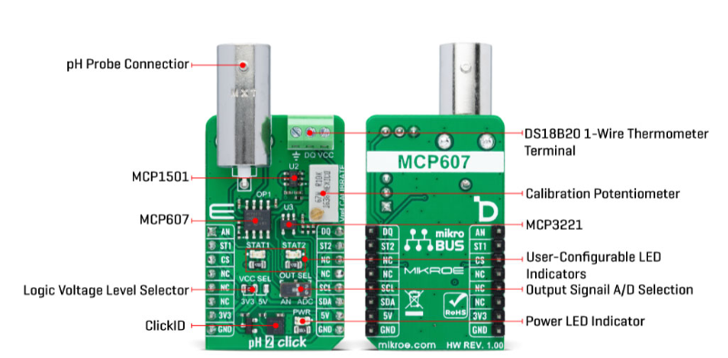
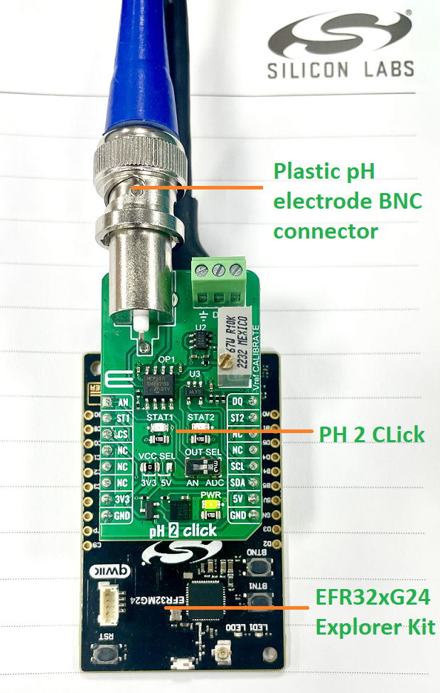
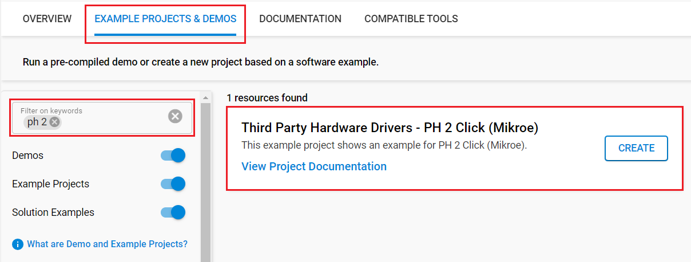
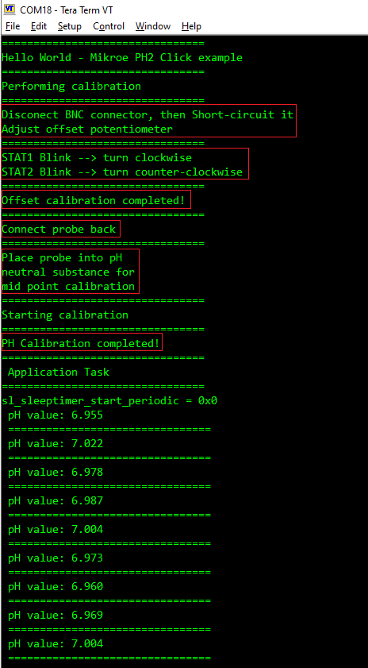

# PH 2 Click (Mikroe) #

## Summary ##

This project shows the driver implementing a PH sensor with the Silicon Labs Platform.

The PH 2 Click is a compact add-on board used to determine the alkalinity or acidity of a sample. This board features the MCP607, a low-bias current Op Amp from Microchip, performing level shifting and high-input impedance buffering in a single-supply pH-electrode circuit. This board measures hydrogen ion activity and produces an electrical potential/voltage, which can be further processed in analog or digital form. In addition to LED signaling, which is under the complete control of the user, there is also the possibility of temperature compensation by connecting an additional thermometer to the board. This Click board™ is suitable for measuring pH in various applications, including water treatment, chemical processing, medical instrumentation, and environmental test systems.

## Required Hardware ##

- [EFR32xG24-EK2703A - EFR32xG24 Explorer Kit](https://www.silabs.com/development-tools/wireless/efr32xg24-explorer-kit?tab=overview)
- Or [SiWx917 Wi-Fi 6 and Bluetooth LE 8 MB Flash SoC Pro Kit](https://www.silabs.com/development-tools/wireless/wi-fi/siwx917-pk6031a-wifi-6-bluetooth-le-soc-pro-kit) (BRD4002 + BRD4338A)
- [PH 2 Click board](https://www.mikroe.com/ph-2-click?srsltid=AfmBOopFxaAypm1QlxPr7ruNB82Cmh6q9HFOFmqI4PDr2ZD2F683cKg3)

## Hardware Connection ##

- **If the EFR32xG24 Explorer Kit is used**:

  The PH 2 Click board supports MikroBus; therefore, it can easily connect to the MikroBus socket of the EFR32xG24 Explorer Kit. Be sure that the 45-degree corner of the Click board matches the 45-degree white line of the Explorer Kit. The hardware connection is shown in the image below:

  

- **If the SiWx917 Wi-Fi 6 and Bluetooth LE 8 MB Flash SoC Pro Kit is used**:

  The hardware connection is shown in the table below:

  | Description  | BRD4338A GPIO | BRD4002 EXP Header | PH 2 Click board   |
  | -------------| ------------- | ------------------ | ------------------ |
  | I2C_SDA      | ULP_GPIO_6    | EXP_16             | SDA                |
  | I2C_SCL      | ULP_GPIO_7    | EXP_15             | SCL                |
  | Status Signal 1  | GPIO_46   | P24        | ST1                |
  | Status Signal 2  | GPIO_47   | P26        | ST2                |
  | Thermometer Data | GPIO_48   | P28        | DQ                 |

## Setup ##

You can either create a project based on an example project or start with an empty example project.

### Create a project based on an example project ###

1. From the Launcher Home, add your board to My Products, click on it, and click on the **EXAMPLE PROJECTS & DEMOS** tab. Find the example project filtering by *"ph 2"*.

2. Click **Create** button on the **Third Party Hardware Drivers - PH 2 Click (Mikroe)** example. Example project creation dialog pops up -> click Create and Finish and Project should be generated.

   

3. Build and flash this example to the board.

### Start with an empty example project ###

1. Create an "Empty C Project" for your board using Simplicity Studio v5. Use the default project settings.

2. Copy the file `app/example/mikroe_ph2/app.c` into the project root folder (overwriting the existing file).

3. Install the software components:

    - Open the .slcp file in the project.

    - Select the SOFTWARE COMPONENTS tab.

    - Install the following components:

        - **If the EFR32xG24 Explorer Kit is used:**
          - [Services] → [Timers] → [Sleep Timer]
          - [Services] → [IO Stream] → [IO Stream: EUSART] → default instance name: vcom
          - [Application] → [Utility] → [Log]
          - [Application] → [Utility] → [Assert]
          - [Third Party Hardware Drivers] → [Sensors] → [PH 2 Click (Mikroe)]

        - **If the SiWx917 Wi-Fi 6 and Bluetooth LE 8 MB Flash SoC Pro Kit is used:**
          - [WiSeConnect 3 SDK] → [Device] → [Si91x] → [MCU] → [Service] → [Sleep Timer for Si91x]
          - [WiSeConnect 3 SDK] → [Device] → [Si91x] → [MCU] → [Peripheral] → [I2C] → [i2c2]
          - [WiSeConnect 3 SDK] → [Device] → [Si91x] → [MCU] → [Peripheral] → [ADC] → [channel_1] → use default configuration
          - [Application] → [Utility] → [Assert]
          - [Third Party Hardware Drivers] → [Sensors] → [PH 2 Click (Mikroe)]

4. Install "Printf float"

   - Open Properties of the project
   - Select C/C++ Build > Settings > Tool Settings > GNU ARM C Linker > General > Check "Printf float"

5. Build and flash this example to the board.

**Note:**

- Make sure that the **Third Party Hardware Drivers** extension is installed. If not, follow [this documentation](https://github.com/SiliconLabs/third_party_hw_drivers_extension/blob/master/README.md#how-to-add-to-simplicity-studio-ide)

- Third-party Drivers Extension must be enabled for the project to install "PH 2 Click (Mikroe)" component

## How It Works ##

After you flash the code to your board and power the connected boards, the application starts running automatically. Use Putty/Tera Term (or another program) to read the values of the serial output. Note that your board uses the default baud rate of 115200.

The main program first performs an offset calibration. It requires the user to disconnect the BNC connector, and then "short-circuit" it. After that, the user must adjust the offset potentiometer until the  STAT LEDs stop blinking. If the STAT1 LED blinks, the user must turn clockwise otherwise if the STAT2 LED blinks, turn counter-clockwise.  

Next, the main program will perform a PH calibration. It requires the user to connect the BNC connector back to the PH 2 Click board. After that, the user must place the probe into PH neutral substance for mid-point calibration (pure water). When the calibration process is done, the program will continue to read the PH value and display it to the console.

There is a periodic timer in the code, which determines the sampling intervals; the default sensor sampling rate is 1000 ms. If you need more frequent sampling, it is possible to change the corresponding timer value of the `app.c` file.

In the image below you can see an example of how the output is displayed.

## Report Bugs & Get Support ##

To report bugs in the Application Examples projects, please create a new "Issue" in the "Issues" section of [third_party_hw_drivers_extension](https://github.com/SiliconLabs/third_party_hw_drivers_extension) repo. Please reference the board, project, and source files associated with the bug, and reference line numbers. If you are proposing a fix, also include information on the proposed fix. Since these examples are provided as-is, there is no guarantee that these examples will be updated to fix these issues.

Questions and comments related to these examples should be made by creating a new "Issue" in the "Issues" section of [third_party_hw_drivers_extension](https://github.com/SiliconLabs/third_party_hw_drivers_extension) repo.
