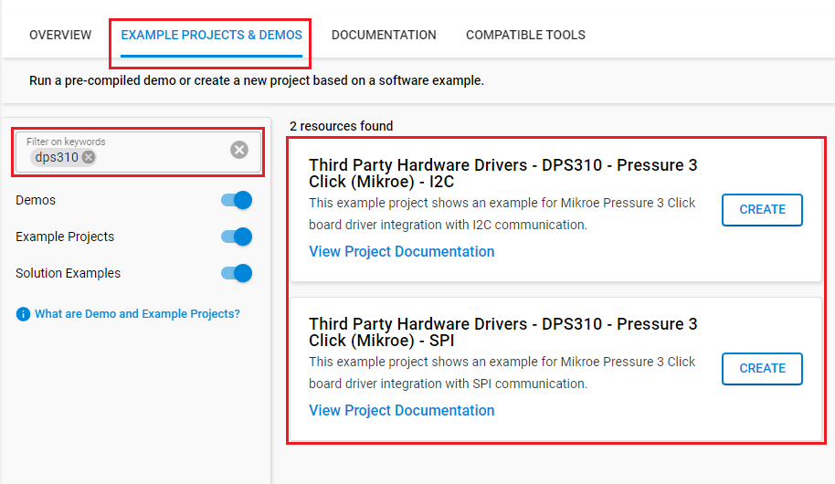
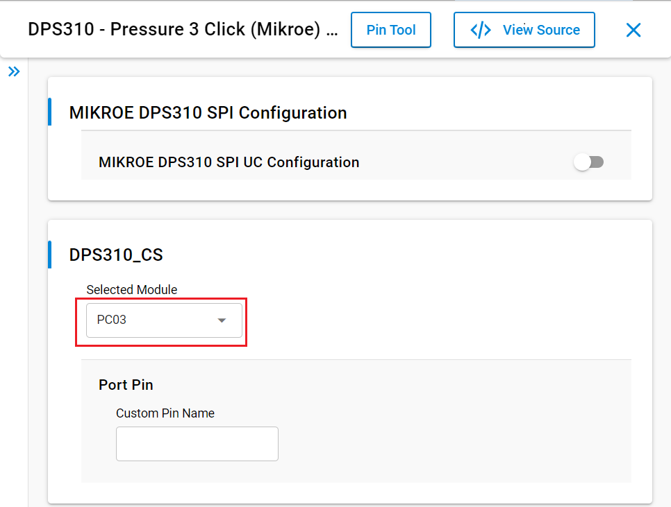
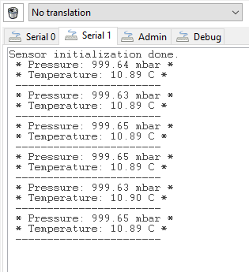

# DPS310 - Pressure 3 click (Mikroe) #

## Summary ##

This project shows the implementation of a barometer-sensor driver using Pressure 3 Click (DPS310) from Mikroe integrated with the Silicon Labs platform.

## Required Hardware ##

- 1x [BGM220-EK4314A](https://www.silabs.com/development-tools/wireless/bluetooth/bgm220-explorer-kit) BGM220 Bluetooth Module Explorer Kit

- Or 1x [Wi-Fi Development Kit](https://www.silabs.com/development-tools/wireless/wi-fi) based on SiWG917 (e.g. [SIWX917-DK2605A](https://www.silabs.com/development-tools/wireless/wi-fi/siwx917-dk2605a-wifi-6-bluetooth-le-soc-dev-kit) or [SIWX917-RB4338A](https://www.silabs.com/development-tools/wireless/wi-fi/siwx917-rb4338a-wifi-6-bluetooth-le-soc-radio-board))

- 1x [Pressure 3 Click board](https://www.mikroe.com/pressure-3-click)

## Hardware Connection ##

- If the BGM220P Explorer Kit is used:

  The Pressure 3 Click board supports MikroBus, so it can connect easily to the Explorer Kit via MikroBus header. Assure that the 45-degree corner of Click board matches the 45-degree white line of the Explorer Kit.

  The hardware connection is shown in the image below:

  

- If the Wi-Fi Development Kit is used:

  The hardware connection is shown in the table below:

  - If the I2C interface is used:

    | Description  | BRD4338A + BRD4002A | BRD2605A     | Pressure 3 Click   |
    | -------------| ------------- | ------------------ | ------------------ |
    | I2C_SDA      | ULP_GPIO_6 [EXP_16]  | ULP_GPIO_6  | SDA                |
    | I2C_SCL      | ULP_GPIO_7 [EXP_15]  | ULP_GPIO_7  | SCL                |

  - If the SPI interface is used:

    | Description  | BRD4338A + BRD4002A | BRD2605A     | Pressure 3 click   |
    | -------------| ------------------------- | -------------------- | ------------------ |
    | CS           | GPIO_46 [P24]             | GPIO_10              | CS                 |
    | RTE_GSPI_MASTER_CLK_PIN  | GPIO_25 [P25] | P25                  | SCK                |
    | RTE_GSPI_MASTER_MISO_PIN | GPIO_26 [P27] | P27                  | SDO                |
    | RTE_GSPI_MASTER_MOSI_PIN | GPIO_27 [P29] | P29                  | SDI                |

## Setup ##

You can either create a project based on an example project or start with an empty example project.

> [!IMPORTANT]
> - Make sure that the [Third Party Hardware Drivers](https://github.com/SiliconLabsSoftware/third_party_hw_drivers_extension) extension is installed as part of the SiSDK. If not, follow [this documentation](https://github.com/SiliconLabsSoftware/third_party_hw_drivers_extension/blob/master/README.md#how-to-add-to-simplicity-studio-ide).
> - **Third Party Hardware Drivers** extension must be enabled for the project to install the required components from this extension.

> [!TIP]
> To show all components in the **Third Party Hardware Drivers** extension, the **Evaluation** quality must be enabled in the Software Component view.

### Create a project based on an example project ###

1. From the Launcher Home, add your board to My Products, click on it, and click on the **EXAMPLE PROJECTS & DEMOS** tab. Find the example project filtering by 'dps310'.

2. Click **Create** button on the example:

    - **Third Party Hardware Drivers - DPS310 - Pressure 3 Click (Mikroe) - I2C** if using the I2C interface.

    - **Third Party Hardware Drivers - DPS310 - Pressure 3 Click (Mikroe) - SPI** if using the SPI interface.

    Example project creation dialog pops up -> click Create and Finish and Project should be generated.
    

3. Build and flash this example to the board.

### Start with an empty example project ###

1. Create an "Empty C Project" for your board using Simplicity Studio v5. Use the default project settings.

2. Copy the file `app/example/mikroe_pressure3_dps310/app.c` into the project root folder (overwriting the existing file).

3. Install the software components:

    - Open the .slcp file in the project.
    - Select the SOFTWARE COMPONENTS tab.
    - Install the following components:

      **If the BGM220P Explorer Kit is used:**

        - [Services] → [Timers] → [Sleep Timer]
        - [Services] → [IO Stream] → [IO Stream: EUSART] → default instance name: vcom
        - [Application] → [Utility] → [Log]
        - If the SPI interface is used:
            - [Platform] → [Driver] → [SPI] → [SPIDRV] → [mikroe] → change the configuration for [SPI master chip select (CS) control scheme] to "CS controlled by the application", select the CS pin to None as below:
               
            - [Third Party Hardware Drivers] → [Sensors] → [DPS310 - Pressure 3 Click (Mikroe) - SPI] → select the CS pin to PC03 as below:
               
        - If the I2C interface is used:
            - [Third Party Hardware Drivers] → [Sensors] → [DPS310 - Pressure 3 Click (Mikroe) - I2C]

      **If the Wi-Fi Development Kit is used:**

        - [WiSeConnect 3 SDK] → [Device] → [Si91x] → [MCU] → [Service] → [Sleep Timer for Si91x]
        - If the SPI interface is used:
          - [Third Party Hardware Drivers] → [Sensors] → [DPS310 - Pressure 3 Click (Mikroe) - SPI] → use default configuration
        - If the I2C interface is used:
          - [WiSeConnect 3 SDK] → [Device] → [Si91x] → [MCU] → [Peripheral] → [I2C] → [i2c2]
          - [Third Party Hardware Drivers] → [Sensors] → [DPS310 - Pressure 3 Click (Mikroe) - I2C]

4. Enable **Printf float**

   - Open Properties of the project.
   - Select C/C++ Build → Settings → Tool Settings → GNU ARM C Linker → General → Check **Printf float**.

      

5. Build and flash this example to the board.

## How It Works ##

This is an example that demonstrates the use of the Pressure 3 Click board. Measured pressure and temperature data from the DPS310 sensor on the Pressure 3 Click board. Results are being sent to the USART Terminal where you can track their changes.
You can launch Console that's integrated into Simplicity Studio or use a third-party terminal tool like TeraTerm to receive the data from the USB. A screenshot of the console output is shown as the figure below.

## Report Bugs & Get Support ##

To report bugs in the Application Examples projects, please create a new "Issue" in the "Issues" section of [third_party_hw_drivers_extension](https://github.com/SiliconLabsSoftware/third_party_hw_drivers_extension) repo. Please reference the board, project, and source files associated with the bug, and reference line numbers. If you are proposing a fix, also include information on the proposed fix. Since these examples are provided as-is, there is no guarantee that these examples will be updated to fix these issues.

Questions and comments related to these examples should be made by creating a new "Issue" in the "Issues" section of [third_party_hw_drivers_extension](https://github.com/SiliconLabsSoftware/third_party_hw_drivers_extension) repo.
