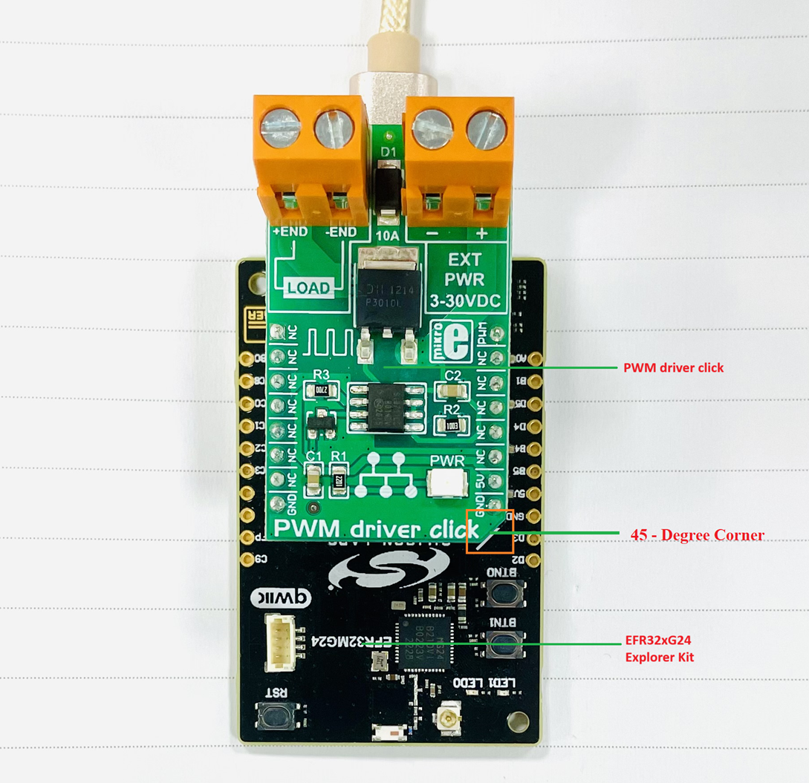

# Si8711CC - PWM Driver Click (Mikroe) #

## Summary ##

This project shows the implementation of an "PWM Driver Click" driver using Si8711CC one-channel isolator from Silicon Labs.

If you need to control DC motors with loads up to 10A, PWM driver click is the perfect solution, thanks to the Silicon Labs Si8711CC one-channel isolator. It communicates with the target MCU over PWM pin, and runs on a 5V power supply. It can be used in a wide variety of ways, from controlling light intensity to serving as an ON/OFF switch to control DC load circuits.

The Si87xx isolators are pin-compatible, one-channel, drop-in replacements for popular optocouplers with data rates up to 15 Mbps. These devices isolate highspeed digital signals and offer performance, reliability, and flexibility advantages not available with optocoupler solutions. The Si87xx series is based on proprietary CMOS isolation technology for low-power and high-speed operation and are resistant to the wear-out effects found in optocouplers that degrade performance with increasing temperature, forward current, and device age. As a result, the Si87xx series offer longer service life and dramatically higher reliability compared to optocouplers. Ordering options include open collector output with and without integrated pull-up resistor and output enable options.

The click contains a P-channel DMP3010LK3 MOSFET transistor. When the click is used for PWM control it is not recommended to use it with loads of wattage over 50W because the MOSFET chip can get overheated. However, this does not apply when the click is used as an ON/OFF switch.

## Required Hardware ##

- [EFR32xG24 Explorer Kit (BRD2703A xG24 Explorer Kit Board)](https://www.silabs.com/development-tools/wireless/efr32xg24-explorer-kit?tab=overview)
- Or [SiWx917 Wi-Fi 6 and Bluetooth LE 8 MB Flash SoC Pro Kit](https://www.silabs.com/development-tools/wireless/wi-fi/siwx917-pk6031a-wifi-6-bluetooth-le-soc-pro-kit) (BRD4002 + BRD4338A)
- [PWM Driver Click board based on Si8711CC one-channel isolator from Silicon Lab](https://www.mikroe.com/pwm-driver-click)

## Hardware Connection ##

- **If EFR32xG24 Explorer Kit is used:**

    The PWM Driver Click board supports MikroBus; therefore, it can easily connect to the MikroBus socket of the EFR32xG24 Explorer Kit. Be sure that the 45-degree corner of the board matches the 45-degree white line of the Explorer Kit. The hardware connection is shown in the image below:

    

- **If the SiWx917 Wi-Fi 6 and Bluetooth LE 8 MB Flash SoC Pro Kit is used**:

    The hardware connection is shown in the table below:

    | Description  | BRD4338A GPIO | BRD4002 Breakout Pad | PWM Driver Click board     |
    | -------------| ------------- | -------------------- | ---------------------------|
    | PWM_H        | GPIO_7        | P20                  | PWM                        |

## Setup ##

You can either create a project based on an example project or start with an empty example project.

### Create a project based on an example project ###

1. From the Launcher Home, add the your board to My Products, click on it, and click on the **EXAMPLE PROJECTS & DEMOS** tab. Find the example project filtering by "si8711cc"

2. Click **Create** button on the **Third Party Hardware Drivers - Si8711CC - PWM Driver Click (Mikroe)** example. Example project creation dialog pops up -> click Create and Finish and Project should be generated

    

3. Build and flash this example to the board

### Start with an empty example project ###

1. Create an "Empty C Project" for your board using Simplicity Studio v5. Use the default project settings.

2. Copy the file `app/example/mikroe_pwm_driver_si8711cc/app.c` into the project root folder (overwriting the existing file).

3. Install the software components:

    - Open the .slcp file in the project.

    - Select the SOFTWARE COMPONENTS tab.

    - Install the following components:

      **If EFR32xG24 Explorer Kit is used:**

        - [Services] → [Timers] → [Sleep Timer]
        - [Services] → [IO Stream] → [IO Stream: USART] → default instance name: vcom
        - [Application] → [Utility] → [Log]
        - [Third-Party Hardware Drivers] → [Motor Control] → [Si8711CC - PWM Driver Click (Mikroe)]

      **If the SiWx917 Wi-Fi 6 and Bluetooth LE 8 MB Flash SoC Pro Kit is used:**

       - [WiSeConnect 3 SDK] → [Device] → [Si91x] → [MCU] → [Service] → [Sleep Timer for Si91x]
       - [WiSeConnect 3 SDK] → [Device] → [Si91x] → [MCU] → [Peripheral] → [PWM] → [channel_0] → use default configuration
       - [Third-Party Hardware Drivers] → [Motor Control] → [Si8711CC - PWM Driver Click (Mikroe)]

4. Build and flash this example to the board.

**Note:**

- Make sure that the **Third Party Hardware Drivers** extension is installed. If not, follow [this documentation](https://github.com/SiliconLabs/third_party_hw_drivers_extension/blob/master/README.md#how-to-add-to-simplicity-studio-ide)
- Third-party Hardware Drivers Extension must be enabled for the project to install "Si8711CC - PWM Driver Click (Mikroe)" component

## How It Works ##

- Use a terminal program, such as the Console that is integrated in Simplicity Studio or a third-party tool terminal like PuTTY to receive the logs from the virtual COM port. Note that your board uses the default baud rate of 115200. In this example, we build a simple application that generates a PWM signal with frequency = 1000Hz, and duty level = 10% at startup. This duty level will be increased by 10% each 2000ms. If the duty level >= 100% then the duty level will be set to 10%.

- A screenshot of the console output is shown in the figure below:

  

  

  

  
  
## Report Bugs & Get Support ##

To report bugs in the Application Examples projects, please create a new "Issue" in the "Issues" section of [third_party_hw_Drivers_extension](https://github.com/SiliconLabs/third_party_hw_Drivers_extension) repo. Please reference the board, project, and source files associated with the bug, and reference line numbers. If you are proposing a fix, also include information on the proposed fix. Since these examples are provided as-is, there is no guarantee that these examples will be updated to fix these issues.

Questions and comments related to these examples should be made by creating a new "Issue" in the "Issues" section of [third_party_hw_Drivers_extension](https://github.com/SiliconLabs/third_party_hw_Drivers_extension) repo.
