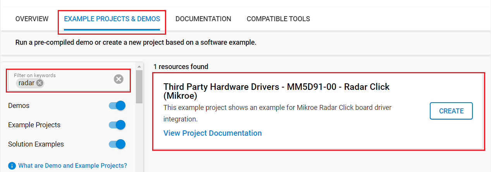
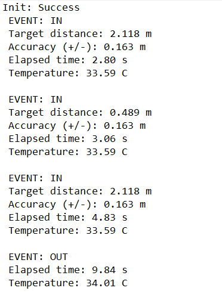

# MM5D91-00 - Radar Click (Mikroe) #

## Summary ##

This project shows the implementation of Radar-sensor driver using MM5D91-00 with Silicon Labs platform based on UART communication.

Radar Click as its foundation uses the MM5D91-00 presence detection sensor module with an integrated mmWave technology from Jorjin Technologies Inc. It is capable of counting the number of people who passed an entrance or entered a room. It simplifies the implementation of mmWave sensors in the band of 61.0 to 61.5 GHz range. The board includes an ARM Cortex-M4F-based processor system with 1Tx 3Rx antenna and an onboard regulator.
The device is beneficial for various presence sensing applications, ranging from offices and homes to commercial buildings and infrastructures.

## Required Hardware ##

- 1x [XG24-EK2703A](https://www.silabs.com/development-tools/wireless/efr32xg24-explorer-kit) EFR32xG24 Explorer Kit

- Or 1x [Wi-Fi Development Kit](https://www.silabs.com/development-tools/wireless/wi-fi) based on SiWG917 (e.g. [SIWX917-DK2605A](https://www.silabs.com/development-tools/wireless/wi-fi/siwx917-dk2605a-wifi-6-bluetooth-le-soc-dev-kit) or [SIWX917-RB4338A](https://www.silabs.com/development-tools/wireless/wi-fi/siwx917-rb4338a-wifi-6-bluetooth-le-soc-radio-board))

- 1x [Radar Click board](https://www.mikroe.com/radar-click) based on MM5D91-00 sensor

## Hardware Connection ##

- If the EFR32xG24 Explorer Kit is used:

  The Radar Click board supports MikroBus, so it can connect easily to the Explorer Kit via MikroBus header. Assure that the 45-degree corner of Click board matches the 45-degree white line of the Explorer Kit.

  

- If the Wi-Fi Development Kit is used:

  | Description  | BRD4338A + BRD4002A | BRD2605A     | Radar click |
  | ----------------- | ------------------------ | -------------------- | ----------- |
  | UART1_RX_PIN      | GPIO_6 [P19]             | GPIO_6               | TX          |
  | UART1_TX_PIN      | GPIO_7 [P20]             | GPIO_7               | RX          |
  | RESET             | GPIO_46 [P24]            | GPIO_10                  | RST         |
  | General Purpose 0 | GPIO_47 [P26]            | GPIO_11                  | GP0         |
  | General Purpose 1 | GPIO_48 [P28]            | GPIO_12                  | GP1         |
  | General Purpose 2 | GPIO_49 [P30]            | GPIO_30                  | GP2         |

## Setup ##

You can either create a project based on an example project or start with an empty example project.

### Create a project based on an example project ###

1. From the Launcher Home, add your device to My Products, click on it, and click on the **EXAMPLE PROJECTS & DEMOS** tab. Find the example project filtering by *radar*.

2. Click **Create** button on the **Third Party Hardware Drivers - MM5D91-00 - Radar Click (Mikroe)** example. Example project creation dialog pops up -> click Create and Finish and Project should be generated.

   

3. Build and flash this example to the board.

### Start with an empty example project ###

1. Create an "Empty C Project" for your board using Simplicity Studio v5. Use the default project settings.

2. Copy the file `app/example/mikroe_radar_mm5d91_00/app.c` into the project root folder (overwriting the existing file).

3. Install the software components:

    - Open the .slcp file in the project.

    - Select the SOFTWARE COMPONENTS tab.

    - Install the following components:

      **If the EFR32xG24 Explorer Kit is used:**

        - [Services] → [IO Stream] → [IO Stream: EUSART] → default instance name: vcom
        - [Services] → [IO Stream] → [IO Stream: USART] → default instance name: mikroe
        - [Application] → [Utility] → [Log]
        - [Third Party Hardware Drivers] → [Sensors] → [MM5D91-00 - Radar Click (Mikroe)] → use default configuration

      **If the Wi-Fi Development Kit is used:**

        - [WiSeConnect 3 SDK] → [Device] → [Si91x] → [MCU] → [Service] → [Sleep Timer for Si91x]
        - [Third Party Hardware Drivers] → [Sensors] → [MM5D91-00 - Radar Click (Mikroe)] → use default configuration
        - [WiSeConnect 3 SDK] → [Device] → [Si91x] → [MCU] → [Peripheral] → [UART] → disable "UART1 DMA"

4. Enable printf float support

   - Open Properties of the project.
   - Select C/C++ Build > Settings > Tool Settings > GNU ARM C Linker > General > Check "Printf float".

5. Build and flash this example to the board.

**Note:**

- Make sure that the **Third Party Hardware Drivers** extension is installed. If not, follow [this documentation](https://github.com/SiliconLabs/third_party_hw_drivers_extension/blob/master/README.md#how-to-add-to-simplicity-studio-ide).

- **Third Party Hardware Drivers** extension must be enabled for the project to install "MM5D91-00 - Radar Click (Mikroe)" component.

## How It Works ##

The application waits for the detection event and then displays on the USB UART the distance of detected object, accuracy, elapsed time since last reset, and the module's internal temperature.
You can launch Console that's integrated into Simplicity Studio or use a third-party terminal tool like PuTTY to receive the data from the Serial port. A screenshot of the console output is shown in the figure below.

## Report Bugs & Get Support ##

To report bugs in the Application Examples projects, please create a new "Issue" in the "Issues" section of [third_party_hw_drivers_extension](https://github.com/SiliconLabs/third_party_hw_drivers_extension) repo. Please reference the board, project, and source files associated with the bug, and reference line numbers. If you are proposing a fix, also include information on the proposed fix. Since these examples are provided as-is, there is no guarantee that these examples will be updated to fix these issues.

Questions and comments related to these examples should be made by creating a new "Issue" in the "Issues" section of [third_party_hw_drivers_extension](https://github.com/SiliconLabs/third_party_hw_drivers_extension) repo.
