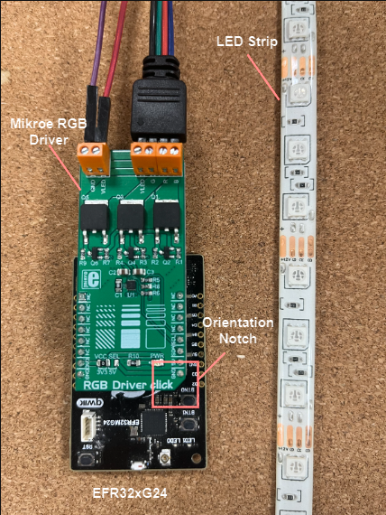
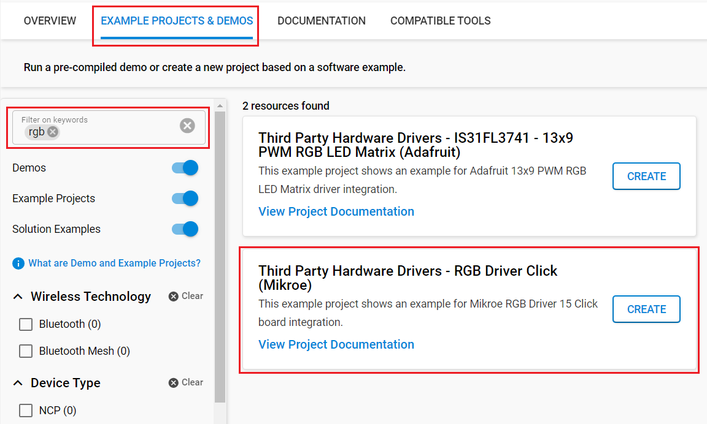

# RGB Driver Click (Mikroe) #

## Summary ##

This project shows the driver implementation of a RGB Driver with the Silicon Labs Platform.

RGB Driver click is an RGB LED driver, capable of driving RGB LED stripes, LED fixtures and other RGB LED applications that demand an increased amount of current and voltage.

## Required Hardware ##

- 1x [XG24-EK2703A](https://www.silabs.com/development-tools/wireless/efr32xg24-explorer-kit) EFR32xG24 Explorer Kit

- Or 1x [Wi-Fi Development Kit](https://www.silabs.com/development-tools/wireless/wi-fi) based on SiWG917 (e.g. [SIWX917-DK2605A](https://www.silabs.com/development-tools/wireless/wi-fi/siwx917-dk2605a-wifi-6-bluetooth-le-soc-dev-kit) or [SIWX917-RB4338A](https://www.silabs.com/development-tools/wireless/wi-fi/siwx917-rb4338a-wifi-6-bluetooth-le-soc-radio-board))

- 1x [RGB Driver Click board](https://www.mikroe.com/rgb-driver-click).

## Hardware Connection ##

- **If the EFR32xG24 Explorer Kit is used:**

  The RGB Driver Click board supports MikroBus, so it can connect easily to the Explorer Kit via MikroBus header. Be sure that the 45-degree corner of the Click Board™ matches the 45-degree white-line of the Silicon Labs Explorer Kit.

  The hardware connection is shown in the image below:

  

- **If the Wi-Fi Development Kit is used:**

  | Description | BRD4338A + BRD4002A  | BRD2605A           | RGB Driver Click |
  | ----------- | -------------------  | ------------------ | ---------------- |
  | I2C_SDA     | ULP_GPIO_6 [EXP_16]  | ULP_GPIO_6         | SDA              |
  | I2C_SCL     | ULP_GPIO_7 [EXP_15]  | ULP_GPIO_7         | SCL              |

## Setup ##

You can either create a project based on an example project or start with an empty example project.

> [!IMPORTANT]
> - Make sure that the [Third Party Hardware Drivers](https://github.com/SiliconLabsSoftware/third_party_hw_drivers_extension) extension is installed as part of the SiSDK. If not, follow [this documentation](https://github.com/SiliconLabsSoftware/third_party_hw_drivers_extension/blob/master/README.md#how-to-add-to-simplicity-studio-ide).
> - **Third Party Hardware Drivers** extension must be enabled for the project to install the required components from this extension.

> [!TIP]
> To show all components in the **Third Party Hardware Drivers** extension, the **Evaluation** quality must be enabled in the Software Component view.

### Create a project based on an example project ###

1. From the Launcher Home, add your board to My Products, click on it, and click on the **EXAMPLE PROJECTS & DEMOS** tab. Find the example project with filtering by *rgb*.

2. Click **Create** button on the **Third Party Hardware Drivers - RGB Driver Click (Mikroe)** example. Example project creation dialog pops up -> click Create and Finish and Project should be generated.

3. Build and flash this example to the board.

### Start with an empty example project ###

1. Create an "Empty C Project" for your board using Simplicity Studio v5. Use the default project settings.

2. Copy the file `app/example/mikroe_rgb_driver/app.c` into the project root folder (overwriting the existing file).

3. Install the software components:

    - Open the .slcp file in the project.

    - Select the SOFTWARE COMPONENTS tab.

    - Install the following components:

      - **If the EFR32xG24 Explorer Kit is used:**
        - [Application] → [Utility] → [Log]
        - [Services] → [Timers] → [Sleep Timer]
        - [Services] → [IO Stream] → [IO Stream: USART] → default instance name: vcom
        - [Platform] → [Driver] → [I2C] → [I2CSPM] → instance name: mikroe
        - [Third Party Hardware Drivers] → [Miscellaneous] → [RGB Click (Mikroe)]

      - **If the Wi-Fi Development Kit is used:**
        - [WiSeConnect 3 SDK] → [Device] → [Si91x] → [MCU] → [Service] → [Sleep Timer for Si91x]
        - [WiSeConnect 3 SDK] → [Device] → [Si91x] → [MCU] → [Peripheral] → [I2C] → [i2c2]
        - [Third Party Hardware Drivers] → [Miscellaneous] → [RGB Click (Mikroe)]

4. Build and flash this example to the board.

## How It Works ##

After you flashed the code to your board and powered the connected boards, the application starts running automatically.
The application changes the color of RGB LED tape connected to the click board every 2 seconds.

## Report Bugs & Get Support ##

To report bugs in the Application Examples projects, please create a new "Issue" in the "Issues" section of [third_party_hw_drivers_extension](https://github.com/SiliconLabsSoftware/third_party_hw_drivers_extension) repo. Please reference the board, project, and source files associated with the bug, and reference line numbers. If you are proposing a fix, also include information on the proposed fix. Since these examples are provided as-is, there is no guarantee that these examples will be updated to fix these issues.

Questions and comments related to these examples should be made by creating a new "Issue" in the "Issues" section of [third_party_hw_drivers_extension](https://github.com/SiliconLabsSoftware/third_party_hw_drivers_extension) repo.
