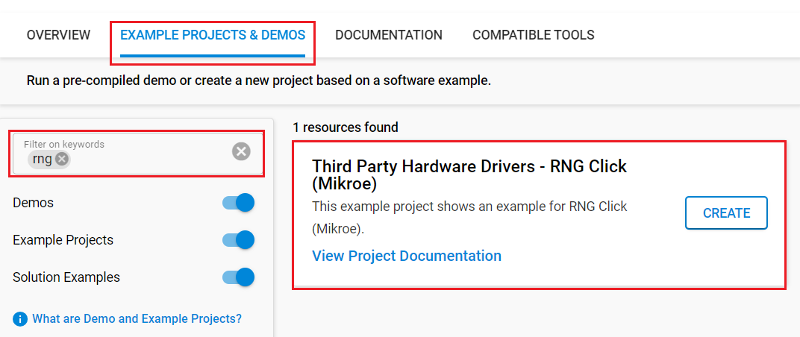

# RNG Click (Mikroe) #

## Summary ##

This project shows the driver implementation of a random number generator (RNG) using the ADS1115 - 16 bit sigma-delta ADC IC with the Silicon Labs Platform.

RNG Click (random number generator) is a device that generates a sequence of numbers or symbols that cannot be reasonably predicted better than by a random chance. This Click board™ is true hardware random-number generator (HRNG), which generate genuinely random numbers. Random number generators have applications in gambling, statistical sampling, computer simulation, cryptography, completely randomized design, and various other areas.

This Click Board™ uses I2C communication interface. It is designed to be operated only with 3.3V logic levels. A proper logic voltage level conversion should be performed before the Click board™ is used with MCUs with logic levels of 5V.

## Required Hardware ##

- [**XG24-EK2703A** EFR32xG24 Explorer Kit](https://www.silabs.com/development-tools/wireless/efr32xg24-explorer-kit?tab=overview)

- Or [SiWx917 Wi-Fi 6 and Bluetooth LE 8 MB Flash SoC Pro Kit](https://www.silabs.com/development-tools/wireless/wi-fi/siwx917-pk6031a-wifi-6-bluetooth-le-soc-pro-kit) (BRD4002 + BRD4338A)

- [**RNG Click**](https://www.mikroe.com/rng-click)

## Hardware Connection ##

- If the EFR32xG24 Explorer Kit is used:

  The RNG Click board supports MikroBus, so it can connect easily to BGM220P Explorer Kit via MikroBus header. Assure that the board's 45-degree corner matches the Explorer Kit's 45-degree white line.

  The hardware connection is shown in the image below:

  

- If the SiWx917 Wi-Fi 6 and Bluetooth LE 8 MB Flash SoC Pro Kit is used:

  | Description  | BRD4338A GPIO | BRD4002 EXP Header | RNG Click   |
  | -------------| ------------- | ------------------ | ------------------ |
  | I2C_SDA      | ULP_GPIO_6    | EXP_16             | SDA                |
  | I2C_SCL      | ULP_GPIO_7    | EXP_15             | SCL                |

## Setup ##

You can either create a project based on an example project or start with an empty example project.

### Create a project based on an example project ###

1. From the Launcher Home, add your device to My Products, click on it, and click on the **EXAMPLE PROJECTS & DEMOS** tab. Find the example project with the filter "rng".

2. Click **Create** button on the **Third Party Hardware Drivers - RNG Click (Mikroe)** example. Example project creation dialog pops up -> click Create and Finish and Project should be generated.

   

3. Build and flash this example to the board.

### Start with an empty example project ###

1. Create an "Empty C Project" for your board using Simplicity Studio v5. Use the default project settings.

2. Copy the file `app/example/mikroe_rng/app.c` into the project root folder (overwriting the existing file).

3. Install the software components:

    - Open the .slcp file in the project.

    - Select the SOFTWARE COMPONENTS tab.

    - Install the following components:

      **If the EFR32xG24 Explorer Kit is used:**

        - [Services] → [Timers] → [Sleep Timer]
        - [Services] → [IO Stream] → [IO Stream: USART] → default instance name: vcom
        - [Application] → [Utility] → [Log]
        - [Third Party Hardware Drivers] → [Miscellaneous] → [RNG Click (Mikroe)]

      **If the SiWx917 Wi-Fi 6 and Bluetooth LE 8 MB Flash SoC Pro Kit is used:**

        - [WiSeConnect 3 SDK] → [Device] → [Si91x] → [MCU] → [Service] → [Sleep Timer for Si91x]
        - [WiSeConnect 3 SDK] → [Device] → [Si91x] → [MCU] → [Peripheral] → [I2C] → [i2c2]
        - [Third Party Hardware Drivers] → [Miscellaneous] → [RNG Click (Mikroe)]

4. Install printf float

    - Open Properties of the project.

    - Select C/C++ Build > Settings > Tool Settings >GNU ARM C Linker > General. Check Printf float.

5. Build and flash this example to the board.

**Note:**

- Make sure that the **Third Party Hardware Drivers** extension is installed. If not, follow [this documentation](https://github.com/SiliconLabs/third_party_hw_drivers_extension/blob/master/README.md#how-to-add-to-simplicity-studio-ide).

- Third-party Drivers Extension must be enabled for the project to install "RNG Click (Mikroe)" component.

## How It Works ##

### Driver Layer Diagram ###

### Testing ###

After you flashed the code to your board and powered the connected boards, the application starts running automatically. Use Putty/Tera Term (or another program) to read the values of the serial output. Note that the Silicon Labs's board uses the default baud rate of 115200.

In the below image, you can see an example of how the output is displayed. The main program reads the raw ADC value from the sensor.

There is a periodic timer in the code, which determines the sampling intervals; the default sensor sampling rate is 500 ms. If you need more frequent sampling, it is possible to change the corresponding timer value of the "app.c" file.

## Report Bugs & Get Support ##

To report bugs in the Application Examples projects, please create a new "Issue" in the "Issues" section of [third_party_hw_drivers_extension](https://github.com/SiliconLabs/third_party_hw_drivers_extension) repo. Please reference the board, project, and source files associated with the bug, and reference line numbers. If you are proposing a fix, also include information on the proposed fix. Since these examples are provided as-is, there is no guarantee that these examples will be updated to fix these issues.

Questions and comments related to these examples should be made by creating a new "Issue" in the "Issues" section of [third_party_hw_drivers_extension](https://github.com/SiliconLabs/third_party_hw_drivers_extension) repo.
