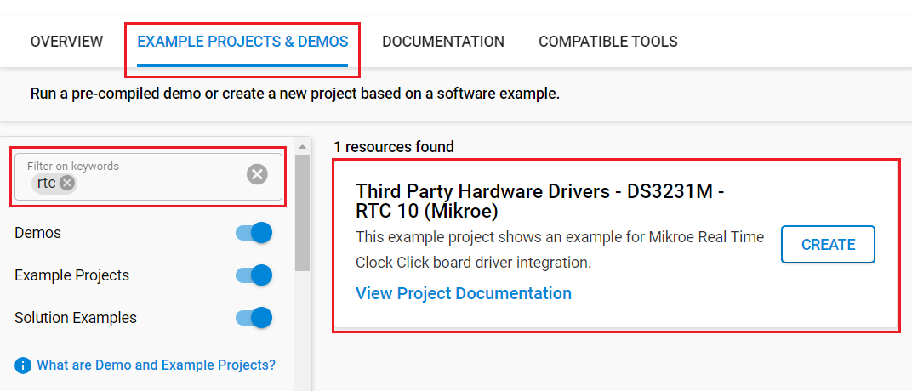

# DS3231M - RTC 10 Click (Mikroe) #

## Summary ##

This example project shows an example of Mikroe RTC 10 Click board driver integration with the Silicon Labs Platform.

RTC 10 Click is a real-time clock module which has an extremely low power consumption, allowing it to be used with a single button cell battery, for an extended period of time. It features the DS3231M, a low-cost, extremely accurate, I2C real-time clock (RTC) from Analog Devices. The device incorporates a battery input and maintains accurate timekeeping when main power to the device is interrupted. The integration of the microelectromechanical systems (MEMS) resonator enhances the long-term accuracy of the device and reduces the piecepart count in a manufacturing line.

This example can be used to demonstrate the capability of maintaining timekeeping of the Mikroe RTC 10 Click board.

## Required Hardware ##

- 1x [XG24-EK2703A](https://www.silabs.com/development-tools/wireless/efr32xg24-explorer-kit) EFR32xG24 Explorer Kit

- Or 1x [Wi-Fi Development Kit](https://www.silabs.com/development-tools/wireless/wi-fi) based on SiWG917 (e.g. [SIWX917-DK2605A](https://www.silabs.com/development-tools/wireless/wi-fi/siwx917-dk2605a-wifi-6-bluetooth-le-soc-dev-kit) or [SIWX917-RB4338A](https://www.silabs.com/development-tools/wireless/wi-fi/siwx917-rb4338a-wifi-6-bluetooth-le-soc-radio-board))

- 1x [RTC 10 Click board](https://www.mikroe.com/rtc-10-click) based on the DS3231M

## Hardware Connection ##

- If the EFR32xG24 Explorer Kit is used:

    The RTC Click board supports MikroBus, so it can connect easily to EFR32xG24 Explorer Kit via MikroBus header. Assure that the board's 45-degree corner matches the Explorer Kit's 45-degree white line.

    

- If the Wi-Fi Development Kit is used:

  The hardware connection is shown in the table below:

  | Description  | BRD4338A + BRD4002A | BRD2605A     | Mikroe RTC 10 Click  |
  | ----------------------| -----------| -------------| ---------------------|
  | I2C_SDA               | ULP_GPIO_6 [EXP_16] | ULP_GPIO_6   | SDA         |
  | I2C_SCL               | ULP_GPIO_7 [EXP_15] | ULP_GPIO_7   | SCL         |
  | Reset Out             | GPIO_46 [P24]   | GPIO_10          | RST         |
  | Analog ECG signal OUT | GPIO_47 [P26]   | GPIO_11          | AN          |
  | Interrupt OUT         | GPIO_48 [P28]   | GPIO_12          | INT         |

## Setup ##

You can either create a project based on an example project or start with an empty example project.

### Create a project based on an example project ###

1. From the Launcher Home, add your device to My Products, click on it, and click on the **EXAMPLE PROJECTS & DEMOS** tab. Find the example project filtering by *rtc*.

2. Click **Create** button on the **Third Party Hardware Drivers - DS3231M - RTC10 Click (Mikroe)** example. Example project creation dialog pops up -> click Create and Finish and Project should be generated.

    

3. Build and flash this example to the board.

### Start with an empty example project ###

1. Create an "Empty C Project" for the your board using Simplicity Studio v5. Use the default project settings.

2. Copy the app.c file (located in the `app/example/mikroe_rtc10_ds3231m` folder) into the project root folder (overwriting existing file).

3. Install the software components:

   - Open the .slcp file in the project.

   - Select the SOFTWARE COMPONENTS tab.

   - Install the following components:

      **If the EFR32xG24 Explorer Kit is used:**

        - [Services] → [Timers] → [Sleep Timer]
        - [Services] → [IO Stream] → [IO Stream: USART] → default instance name: **vcom**
        - [Application] → [Utility] → [Log]
        - [Third Party Hardware Drivers] → [Clock & Timing] → [DS3231M - RTC 10 Click (Mikroe)] → use default configuration

      **If the Wi-Fi Development Kit is used:**
        - [WiSeConnect 3 SDK] → [Device] → [Si91x] → [MCU] → [Service] → [Sleep Timer for Si91x]
        - [WiSeConnect 3 SDK] → [Device] → [Si91x] → [MCU] → [Peripheral] → [I2C] → [i2c2]
        - [Third Party Hardware Drivers] → [Clock & Timing] → [DS3231M - RTC 10 Click (Mikroe)] → use default configuration

4. Enable **Printf float**

   - Open Properties of the project.
   - Select C/C++ Build → Settings → Tool Settings → GNU ARM C Linker → General → Check **Printf float**.

      

5. Build and flash this example to the board.

**Note**:

- Make sure that the **Third Party Hardware Drivers** extension is installed. If not, follow [this documentation](https://github.com/SiliconLabs/third_party_hw_drivers_extension/blob/master/README.md#how-to-add-to-simplicity-studio-ide).

- **Third Party Hardware Drivers** extension must be enabled for the project to install the **DS3231M - RTC 10 Click (Mikroe)** component.

## How It Works ##

### Driver Layer Diagram ###

### Testing ###

This example sets time and date for the RTC Click in the initialization step. And then it starts tracking the time and display it every one second. The temperature is displayed every 60 seconds.

You can launch Console that's integrated into Simplicity Studio or use a third-party terminal tool like TeraTerm to receive the data from the USB. A screenshot of the console output is shown in the figure below.

## Report Bugs & Get Support ##

To report bugs in the Application Examples projects, please create a new "Issue" in the "Issues" section of [third_party_hw_drivers_extension](https://github.com/SiliconLabs/third_party_hw_drivers_extension) repo. Please reference the board, project, and source files associated with the bug, and reference line numbers. If you are proposing a fix, also include information on the proposed fix. Since these examples are provided as-is, there is no guarantee that these examples will be updated to fix these issues.

Questions and comments related to these examples should be made by creating a new "Issue" in the "Issues" section of [third_party_hw_drivers_extension](https://github.com/SiliconLabs/third_party_hw_drivers_extension) repo.
