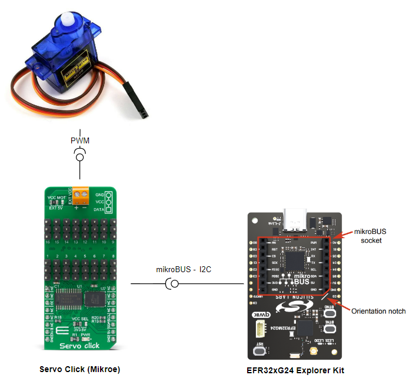
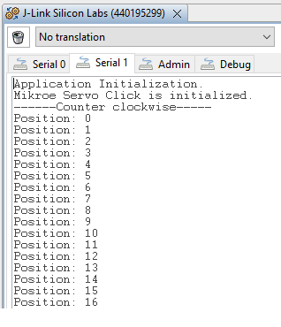

# PCA9685 - Servo Click (Mikroe) #

## Summary ##

This example project shows an example of Mikroe Servo Click board driver integration with the Silicon Labs Platform.

Servo Click is a compact add-on board that contains a PWM servo driver with voltage-sensing circuitry. This board features the PCA9685, an integrated 12-bit, 16-channel PWM driver, which can be configured to either sink 25mA per channel or drive each channel sourcing up to 10mA from NXP. Each channel has its duty cycle independently set from 0% to 100%. It can be used to simultaneously control 16 servo motors, each with its own programmable PWM signal.

This example can be used to demonstrate the capability of controlling the servo motor with the Mikroe Servo Click board.

## Required Hardware ##

- 1x [XG24-EK2703A](https://www.silabs.com/development-tools/wireless/efr32xg24-explorer-kit) EFR32xG24 Explorer Kit

- Or 1x [Wi-Fi Development Kit](https://www.silabs.com/development-tools/wireless/wi-fi) based on SiWG917 (e.g. [SIWX917-DK2605A](https://www.silabs.com/development-tools/wireless/wi-fi/siwx917-dk2605a-wifi-6-bluetooth-le-soc-dev-kit) or [SIWX917-RB4338A](https://www.silabs.com/development-tools/wireless/wi-fi/siwx917-rb4338a-wifi-6-bluetooth-le-soc-radio-board))

- 1x [Servo Click board](https://www.mikroe.com/servo-click) based on the PCA9685

- 1x Servo Motor GS-90

## Hardware Connection ##

- If the EFR32xG24 Explorer Kit is used:

  The MIC 2 Click board supports MikroBus, so it can connect easily to the Explorer Kit via MikroBus header. Assure that the 45-degree corner of Click board matches the 45-degree white line of the Explorer Kit.

  The hardware connection is shown in the image below:

  

- If the Wi-Fi Development Kit is used:

  | Description  | BRD4338A + BRD4002A | BRD2605A    | Servo Click        |
  | --------------------- | ------------- | -------- | ------------------ |
  | I2C_SDA               | ULP_GPIO_6 [EXP_16]  | ULP_GPIO_6   | SDA                |
  | I2C_SCL               | ULP_GPIO_7 [EXP_15]  | ULP_GPIO_7   | SCL                |
  | Output Enable         | GPIO_46 [P24]        | GPIO_10      | OE                 |

## Setup ##

You can either create a project based on an example project or start with an empty example project.

> [!IMPORTANT]
> - Make sure that the [Third Party Hardware Drivers](https://github.com/SiliconLabsSoftware/third_party_hw_drivers_extension) extension is installed as part of the SiSDK. If not, follow [this documentation](https://github.com/SiliconLabsSoftware/third_party_hw_drivers_extension/blob/master/README.md#how-to-add-to-simplicity-studio-ide).
> - **Third Party Hardware Drivers** extension must be enabled for the project to install the required components from this extension.

> [!TIP]
> To show all components in the **Third Party Hardware Drivers** extension, the **Evaluation** quality must be enabled in the Software Component view.

### Create a project based on an example project ###

1. From the Launcher Home, add the BRD2703A to My Products, click on it, and click on the **EXAMPLE PROJECTS & DEMOS** tab. Find the example project filtering by **"servo"**.

2. Click **Create** button on the **Third Party Hardware Drivers - PCA9685 - Servo Click (Mikroe)** example. Example project creation dialog pops up -> click Create and Finish and Project should be generated.

### Start with an empty example project ###

1. Create an "Empty C Project" for the your board using Simplicity Studio v5. Use the default project settings.

2. Copy the file `app/example/mikroe_servo_pca9685/app.c` into the project root folder (overwriting existing file).

3. Install the software components:

    - Open the .slcp file in the project.

    - Select the SOFTWARE COMPONENTS tab.

    - Install the following components:

      **If the EFR32xG24 Explorer Kit is used:**

        - [Services] → [Timers] → [Sleep Timer]
        - [Services] → [IO Stream] → [IO Stream: USART] → default instance name: **vcom**
        - [Application] → [Utility] → [Log]
        - [Platform] → [Driver] → [I2C] → [I2CSPM] → default instance name: mikroe
        - [Third Party Hardware Drivers] → [Sensors] → [PCA9685 - Servo Click (Mikroe)] → use default configuration

      **If the Wi-Fi Development Kit is used:**

        - [WiSeConnect 3 SDK] → [Device] → [Si91x] → [MCU] → [Service] → [Sleep Timer for Si91x]
        - [WiSeConnect 3 SDK] → [Device] → [Si91x] → [MCU] → [Peripheral] → [I2C] → [i2c2]
        - [Third Party Hardware Drivers] → [Sensors] → [PCA9685 - Servo Click (Mikroe)] → use the default configuration
4. Build and flash this example to the board.

## How It Works ##

### Driver Layer Diagram ###

### Testing ###

This example sets the position of the servo motor according to the user's settings. With its ability to precisely control motors and control 16 servo motors simultaneously, Mikroe Servo Click can be used in applications where a large number of servos need to be easily controlled, such as in the movie or theater industry (animatronics), robotics, RC toys, and similar.

You can launch Console that's integrated into Simplicity Studio or use a third-party terminal tool like TeraTerm to receive the data from the USB. A screenshot of the console output is shown in the figure below.

This example uses the I2CSPM driver with the "mikroe" instance to interact with the Mikroe Servo Click board. After the click board is initialized, the application changes the position of the servo motor every 10 milliseconds. The motor will run in a counterclockwise direction when it reaches the limited position and then turn back in a clockwise direction to the original position.

To test the functionality, you can follow the movement of the motor shaft and check if it meets your expectations or not.

You can see the servo motor operation below:

## Report Bugs & Get Support ##

To report bugs in the Application Examples projects, please create a new "Issue" in the "Issues" section of [third_party_hw_drivers_extension](https://github.com/SiliconLabsSoftware/third_party_hw_drivers_extension) repo. Please reference the board, project, and source files associated with the bug, and reference line numbers. If you are proposing a fix, also include information on the proposed fix. Since these examples are provided as-is, there is no guarantee that these examples will be updated to fix these issues.

Questions and comments related to these examples should be made by creating a new "Issue" in the "Issues" section of [third_party_hw_drivers_extension](https://github.com/SiliconLabsSoftware/third_party_hw_drivers_extension) repo.
