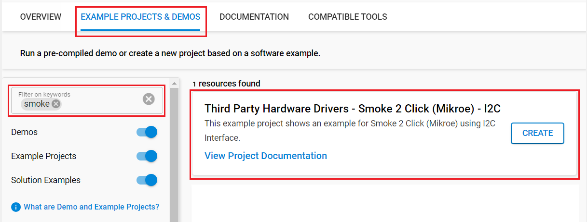
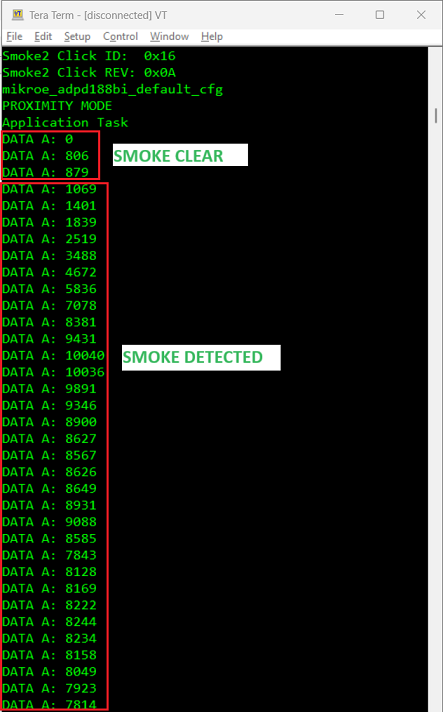

# ADPD188BI - Smoke 2 Click (Mikroe) #

## Summary ##

This project shows the driver implementation of the Smoke 2 Click module, which implements the ADPD188BI IC with the Silicon Labs Platform.

Smoke 2 Click is based on the ADPD188BI, a complete photometric system for smoke detection using optical dual-wavelength technology from Analog Devices. The module combines the dual photodetector with two separate LEDs and a mixed-signal photometric front-end ASIC, and prevents light from going directly from the LED to the photodiode without first entering the smoke detection chamber. The dual-wavelength combination in a scattering measurement, a 470nm blue LED and an 850nm IR LED, allows particle size discrimination between different types of smoke, dust, or steam. The core circuitry stimulates the LEDs and measures the corresponding optical return signals. This integrated solution enables low power and reduces false smoke alarms in harsh environments due to dust, steam, and other nuisance sources.

## Required Hardware ##

- 1x [XG24-EK2703A](https://www.silabs.com/development-tools/wireless/efr32xg24-explorer-kit) EFR32xG24 Explorer Kit

- Or 1x [Wi-Fi Development Kit](https://www.silabs.com/development-tools/wireless/wi-fi) based on SiWG917 (e.g. [SIWX917-DK2605A](https://www.silabs.com/development-tools/wireless/wi-fi/siwx917-dk2605a-wifi-6-bluetooth-le-soc-dev-kit) or [SIWX917-RB4338A](https://www.silabs.com/development-tools/wireless/wi-fi/siwx917-rb4338a-wifi-6-bluetooth-le-soc-radio-board))

- 1x [Smoke 2 Click](https://www.mikroe.com/smoke-2-click)

## Hardware Connection ##

- **If the EFR32xG24 Explorer Kit is used**:

  The Smoke 2 Click board supports MikroBus, so it can connect easily to MikroBus header of EFR32xG24 Explorer Kit. Be sure that the 45-degree corner of the Click Board™ matches the 45-degree white line of the Silicon Labs Explorer Kit. The hardware connection is shown in the image below:

  

- **If the Wi-Fi Development Kit is used**:

  | Description  | BRD4338A + BRD4002A | BRD2605A    | Smoke 2 Click Board |
  | ------------ | ------------- | ----------------- | ------------------- |
  | I2C_SDA      | ULP_GPIO_6 [EXP_16]  | ULP_GPIO_6 | SDA                 |
  | I2C_SCL      | ULP_GPIO_7 [EXP_15]  | ULP_GPIO_7 | SCL                 |
  | GPIO_INT     | GPIO_46 [P24]        | GPIO_10    | INT                 |

## Setup ##

You can either create a project based on an example project or start with an empty example project.

### Create a project based on an example project ###

1. From the Launcher Home, add your board to My Products, click on it, and click on the **EXAMPLE PROJECTS & DEMOS** tab. Find the example project filtering by **"smoke"**.

2. Click on the **Create** button on the **Third Party Hardware Drivers - Smoke 2 Click (Mikroe) - I2C** example. Example project creation dialog pops up -> click Create and Finish and Project should be generated.

    

3. Build and flash this example to the board.

### Start with an empty example project ###

1. Create an "Empty C Project" for your board using Simplicity Studio v5. Use the default project settings.

2. Copy the file `app/example/mikroe_smoke2_adpd188bi/app.c` into the project root folder (overwriting the existing file).

3. Install the software components:

    - Open the .slcp file in the project.

    - Select the SOFTWARE COMPONENTS tab.

    - Install the following components:

      **If the EFR32xG24 Explorer Kit is used:**

        - [Services] → [Timers] → [Sleep Timer]
        - [Services] → [IO Stream] → [IO Stream: EUSART] → default instance name: vcom
        - [Application] → [Utility] → [Log]
        - [Platform] → [Driver] → [I2C] → [I2CSPM] → default instance name: **mikroe**
        - [Third Party Hardware Drivers] → [Sensors] → [ADPD188BI - Smoke 2 Click (Mikroe) - I2C]

      **If the Wi-Fi Development Kit is used:**

        - [WiSeConnect 3 SDK] → [Device] → [Si91x] → [MCU] → [Service] → [Sleep Timer for Si91x]
        - [Third Party Hardware Drivers] → [Sensors] → [ADPD188BI - Smoke 2 Click (Mikroe) - I2C]
        - If using the I2C interface: [WiSeConnect 3 SDK] → [Device] → [Si91x] → [MCU] → [Peripheral] → [I2C] → [i2c2]

4. Build and flash this example to the board.

**Note:**

- Make sure that the **Third Party Hardware Drivers** extension is installed. If not, follow [this documentation](https://github.com/SiliconLabs/third_party_hw_drivers_extension/blob/master/README.md#how-to-add-to-simplicity-studio-ide).

- **Third Party Hardware Drivers** extension must be enabled for the project to install "ADPD188BI - Smoke 2 Click (Mikroe) - I2C" component.

## How It Works ##

Driver Layer Diagram is shown in the image below:

After you flashed the code to the Explorer Kit and powered the connected boards, the application starts running automatically. Use Putty/Tera Term (or another program) to read the values of the serial output. Note that the EFR32xG24 Explorer Kit board uses the default baud rate of 115200.

In the below image, you can see an example of how the output is displayed. There are two modes of operation in this example. If the user uses "EXAMPLE_MODE_SMOKE" then after the driver initializes the smoke2 click sensor, it will start calibration process. The programe will continuously compare the current sensor value with the threshold value to provide smoke detection status.

If the user uses "EXAMPLE_MODE_PROXIMITY" then after the driver initializes the smoke2 click sensor, it will continuously get the raw value from channel A, channel B, and FIFO and display it to the log. These raw values ​​will be small when no smoke is detected, and will increase significantly when higher concentrations of smoke are detected.

The user can choose the mode of operation via "EXAMPLE_MODE" macro at the begining of the "app.c".

## Report Bugs & Get Support ##

To report bugs in the Application Examples projects, please create a new "Issue" in the "Issues" section of [third_party_hw_drivers_extension](https://github.com/SiliconLabs/third_party_hw_drivers_extension) repo. Please reference the board, project, and source files associated with the bug, and reference line numbers. If you are proposing a fix, also include information on the proposed fix. Since these examples are provided as-is, there is no guarantee that these examples will be updated to fix these issues.

Questions and comments related to these examples should be made by creating a new "Issue" in the "Issues" section of [third_party_hw_drivers_extension](https://github.com/SiliconLabs/third_party_hw_drivers_extension) repo.
