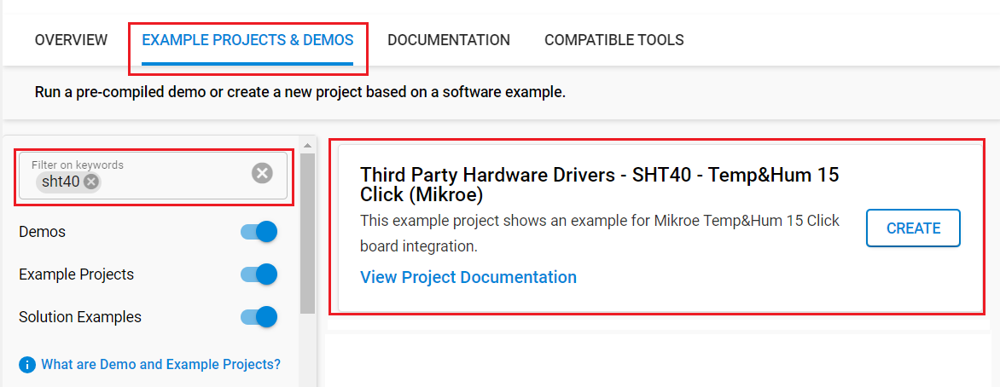
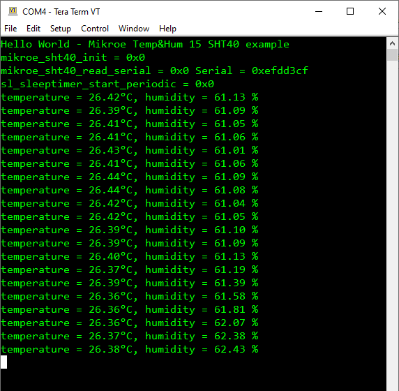

# SHT40 - Temp&Hum 15 Click (Mikroe) #

## Summary ##

This project shows the driver implementation of an I2C temperature and humidity sensor using the SHT40 sensor with the Silicon Labs Platform.

Temp-Hum 15 click is a smart temperature and humidity sensing Click Board™, packed with features that allow simple integration into any design. It can measure a wide range of temperature and relative humidity values with high accuracy. This Click Board™ is an ideal solution for the development of a range of different applications, including battery-operated weather stations, thermostats and humidistats, microenvironment centers, respiratory therapy applications, air conditioners, and other similar applications.

## Required Hardware ##

- 1x [BGM220-EK4314A](https://www.silabs.com/development-tools/wireless/bluetooth/bgm220-explorer-kit) BGM220 Bluetooth Module Explorer Kit

- Or 1x [Wi-Fi Development Kit](https://www.silabs.com/development-tools/wireless/wi-fi) based on SiWG917 (e.g. [SIWX917-DK2605A](https://www.silabs.com/development-tools/wireless/wi-fi/siwx917-dk2605a-wifi-6-bluetooth-le-soc-dev-kit) or [SIWX917-RB4338A](https://www.silabs.com/development-tools/wireless/wi-fi/siwx917-rb4338a-wifi-6-bluetooth-le-soc-radio-board))

- 1x [Temp&Hum 15 Click board](https://www.mikroe.com/temphum-15-click) based on SHT40 sensor

## Hardware Connection ##

- If the BGM220P Explorer Kit is used:

  The Temp&Hum 15 Click board supports MikroBus, so it can connect easily to Explorer Kit via MikroBus header. Assure that the board's 45-degree corner matches the Explorer Kit's 45-degree white line.

  The hardware connection is shown in the image below:

  

- If the Wi-Fi Development Kit is used:

  | Description  | BRD4338A + BRD4002A | BRD2605A | Temp&Hum 15 Click  |
  | -------------| ------------- | ------------------ | ---------------- |
  | I2C_SDA      | ULP_GPIO_6 [EXP_16]  | ULP_GPIO_6  | SDA              |
  | I2C_SCL      | ULP_GPIO_7 [EXP_15]  | ULP_GPIO_7  | SCL              |

## Setup ##

You can either create a project based on an example project or start with an empty example project.

### Create a project based on an example project ###

1. From the Launcher Home, add your device to My Products, click on it, and click on the **EXAMPLE PROJECTS & DEMOS** tab. Find the example project filtering by *sht40*.

2. Click **Create** button on the **Third Party Hardware Drivers - SHT40 - Temp&Hump 15 Click (Mikroe)** example. Example project creation dialog pops up -> click Create and Finish and Project should be generated.

   

3. Build and flash this example to the board.

### Start with an empty example project ###

1. Create an "Empty C Project" for your board using Simplicity Studio v5. Use the default project settings.

2. Copy the file `app/example/mikroe_temphum15_sht40/app.c` into the project root folder (overwriting the existing file).

3. Install the software components:

    - Open the .slcp file in the project.

    - Select the SOFTWARE COMPONENTS tab.

    - Install the following components:

      **If the BGM220P Explorer Kit is used:**

        - [Services] → [Timers] → [Sleep Timer]
        - [Services] → [IO Stream] → [IO Stream: USART] → default instance name: vcom
        - [Application] → [Utility] → [Log]
        - [Third Party Hardware Drivers] → [Sensors] → [SHT40 - Temp&Hump 15 Click (Mikroe)]

      **If the Wi-Fi Development Kit is used:**

        - [WiSeConnect 3 SDK] → [Device] → [Si91x] → [MCU] → [Service] → [Sleep Timer for Si91x]
        - [WiSeConnect 3 SDK] → [Device] → [Si91x] → [MCU] → [Peripheral] → [I2C] → [i2c2]
        - [Third Party Hardware Drivers] → [Sensors] → [SHT40 - Temp&Hump 15 Click (Mikroe)]

4. Enable **Printf float**

   - Open Properties of the project.
   - Select C/C++ Build → Settings → Tool Settings → GNU ARM C Linker → General → Check **Printf float**.

5. Build and flash this example to the board.

**Note:**

- Make sure that the **Third Party Hardware Drivers** extension is installed. If not, follow [this documentation](https://github.com/SiliconLabs/third_party_hw_drivers_extension/blob/master/README.md#how-to-add-to-simplicity-studio-ide).

- **Third Party Hardware Drivers** extension must be enabled for the project to install "SHT40 - Temp&Hump 15 Click (Mikroe)" component.

## How It Works ##

After you flashed the code to your board and powered the connected boards, the application starts running automatically. Use Putty/Tera Term (or another program) to read the values of the serial output. Note that the board uses the default baud rate of 115200.

In the below image, you can see an example of how the output is displayed. The application returns the measured temperature and humidity values automatically.

There is a timer in the code, which determines the sampling intervals; the default sensor sampling rate is 1 second. If you need more frequent sampling, it is possible to change the corresponding timer value of the `app.c` file.

## Report Bugs & Get Support ##

To report bugs in the Application Examples projects, please create a new "Issue" in the "Issues" section of [third_party_hw_drivers_extension](https://github.com/SiliconLabs/third_party_hw_drivers_extension) repo. Please reference the board, project, and source files associated with the bug, and reference line numbers. If you are proposing a fix, also include information on the proposed fix. Since these examples are provided as-is, there is no guarantee that these examples will be updated to fix these issues.

Questions and comments related to these examples should be made by creating a new "Issue" in the "Issues" section of [third_party_hw_drivers_extension](https://github.com/SiliconLabs/third_party_hw_drivers_extension) repo.
