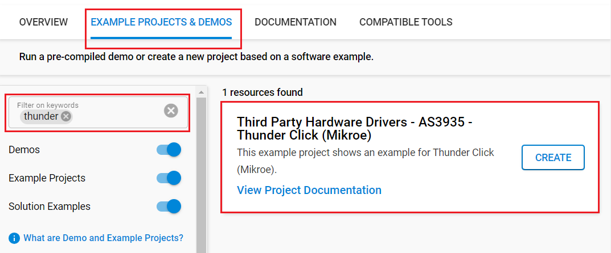
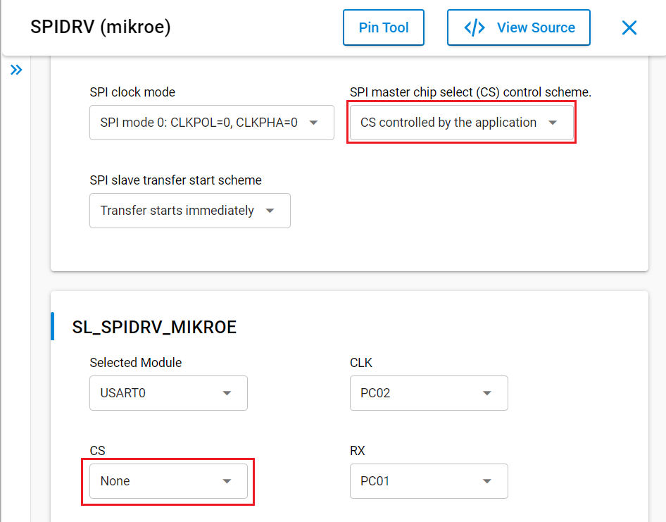
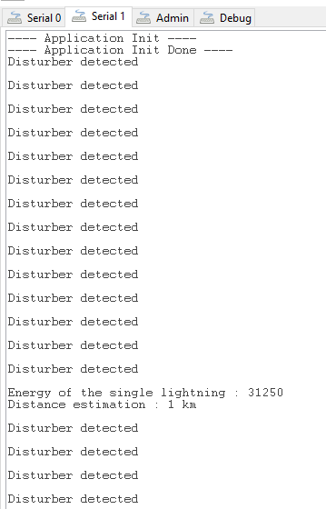

# AS3935 - Thunder Click (Mikroe) #

## Summary ##

This project shows the driver implementation of the Thunder Click (SPI) with the Silicon Labs Platform.

Thunder Click is a compact add-on board that detects the presence and proximity of potentially hazardous lightning activity in the vicinity. This board features the AS3935, a programmable fully integrated lightning sensor from ScioSense with a sensitive coil antenna, and the MA5532 from Coilcraft. Besides detecting potentially hazardous lightning activity, this Click board™ also provides information on the estimated distance to the center of the storm on the noise level. The AS3935 can detect lightning up to 40km away with an accuracy of 1km to the storm front with a sensitive antenna tuned to pick up lightning events in the 500kHz band. This Click board™ is suitable for weather station applications by adding lightning detection to your design to ensure you are aware of any potentially hazardous weather heading your way.

## Required Hardware ##

- 1x [XG24-EK2703A](https://www.silabs.com/development-tools/wireless/efr32xg24-explorer-kit) EFR32xG24 Explorer Kit

- Or 1x [Wi-Fi Development Kit](https://www.silabs.com/development-tools/wireless/wi-fi) based on SiWG917 (e.g. [SIWX917-DK2605A](https://www.silabs.com/development-tools/wireless/wi-fi/siwx917-dk2605a-wifi-6-bluetooth-le-soc-dev-kit) or [SIWX917-RB4338A](https://www.silabs.com/development-tools/wireless/wi-fi/siwx917-rb4338a-wifi-6-bluetooth-le-soc-radio-board))

- 1x [Thunder Click](https://www.mikroe.com/thunder-click)

## Hardware Connection ##

- If the EFR32xG24 Explorer Kit is used:

  The Thunder Click board supports MikroBus, so it can connect easily to the Explorer Kit via MikroBus header. Assure that the 45-degree corner of Click board matches the 45-degree white line of the Explorer Kit.

  The hardware connection is shown in the image below:

  

- If the Wi-Fi Development Kit is used:

  | Description  | BRD4338A + BRD4002A | BRD2605A | Thunder Click  |
  | -------------| ------------------- | -------------------- | --------------- |
  | IRQ                      | GPIO_46 [P24] | GPIO_10        | IRQ             |
  | CS                       | GPIO_47 [P26] | GPIO_11        | CS              |
  | RTE_GSPI_MASTER_CLK_PIN  | GPIO_25 [P25] | GPIO_25        | SCK             |
  | RTE_GSPI_MASTER_MISO_PIN | GPIO_26 [P27] | GPIO_26        | SDO             |
  | RTE_GSPI_MASTER_MOSI_PIN | GPIO_27 [P29] | GPIO_27        | SDI             |

## Setup ##

You can either create a project based on an example project or start with an empty example project.

> [!IMPORTANT]
> - Make sure that the [Third Party Hardware Drivers](https://github.com/SiliconLabsSoftware/third_party_hw_drivers_extension) extension is installed as part of the SiSDK. If not, follow [this documentation](https://github.com/SiliconLabsSoftware/third_party_hw_drivers_extension/blob/master/README.md#how-to-add-to-simplicity-studio-ide).
> - **Third Party Hardware Drivers** extension must be enabled for the project to install the required components from this extension.

> [!TIP]
> To show all components in the **Third Party Hardware Drivers** extension, the **Evaluation** quality must be enabled in the Software Component view.

### Create a project based on an example project ###

1. From the Launcher Home, add your board to My Products, click on it, and click on the **EXAMPLE PROJECTS & DEMOS** tab. Find the example project filtering by *thunder*.

2. Click **Create** button on the **Third Party Hardware Drivers - AS3935 - Thunder Click (Mikroe)** example. Example project creation dialog pops up -> click Create and Finish and Project should be generated.

   

3. Build and flash this example to the board.

### Start with an empty example project ###

1. Create an "Empty C Project" for your board using Simplicity Studio v5. Use the default project settings.

2. Copy the file `app/example/mikroe_thunder_as3935/app.c` into the project root folder (overwriting the existing file).

3. Install the software components:

    - Open the .slcp file in the project.

    - Select the SOFTWARE COMPONENTS tab.

    - Install the following components:

      **If the EFR32xG24 Explorer Kit is used:**

        - [Services] → [Timers] → [Sleep Timer]
        - [Services] → [IO Stream] → [IO Stream: EUSART] → default instance name: vcom
        - [Application] → [Utility] → [Log]
        - [Platform] → [Driver] → [SPI] → [SPIDRV] → [mikroe] → change the configuration for [SPI master chip select (CS) control scheme] to "CS controlled by the application", select the CS pin to None as below:
          
        - [Third Party Hardware Drivers] → [Sensors] → [AS3935 - Thunder Click (Mikroe)] → use default configuration

      **If the Wi-Fi Development Kit is used:**

        - [WiSeConnect 3 SDK] → [Device] → [Si91x] → [MCU] → [Service] → [Sleep Timer for Si91x]
        - [Third Party Hardware Drivers] → [Sensors] → [AS3935 - Thunder Click (Mikroe)] → use default config

4. Build and flash this example to the board.

## How It Works ##

After you flashed the code to the Explorer Kit and powered the connected boards, the application starts running automatically. Use Putty/Tera Term (or another program) to read the values of the serial output.

In the below image, you can see an example of how the output is displayed. The application returns the energy and the distance of the storm if lighting is detected. Otherwise, it will display "noise" or "disturber" if one of them is detected.

There is a timer in the code, which determines the sampling intervals; the default sensor sampling rate is 1 second. If you need more frequent sampling, it is possible to change the corresponding timer value of the app.c file.

## Report Bugs & Get Support ##

To report bugs in the Application Examples projects, please create a new "Issue" in the "Issues" section of [third_party_hw_drivers_extension](https://github.com/SiliconLabsSoftware/third_party_hw_drivers_extension) repo. Please reference the board, project, and source files associated with the bug, and reference line numbers. If you are proposing a fix, also include information on the proposed fix. Since these examples are provided as-is, there is no guarantee that these examples will be updated to fix these issues.

Questions and comments related to these examples should be made by creating a new "Issue" in the "Issues" section of [third_party_hw_drivers_extension](https://github.com/SiliconLabsSoftware/third_party_hw_drivers_extension) repo.
