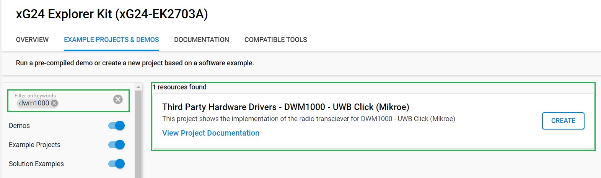

# DWM1000 - UWB Click (Mikroe) #

## Summary ##

This example project showcases the driver integration of the Mikroe DWM1000 - UWB Click board.

UWB Click is an Ultra-Wideband transceiver Click board™ that can be used in 2-way ranging or TDOA location systems to locate assets to a precision of 10 cm and supports data rates of up to 6.8 Mbps. This Click board™ features the DWM1000 module based on Qorvo's DW1000 Ultra-Wideband (UWB) transceiver from Qorvo.

It features a frequency range from 3.5GHz to 6.5GHz, a very precise location of tagged objects, up to 6.8Mbps data rates, low power consumption, and more while the communication with the MCU is accomplished through a standard SPI serial interface. This Click board™ is optimized for applications in real-time location systems and wireless sensor networks across a variety of markets including agriculture, building control and automation, factory automation, healthcare, safety & security, warehousing & logistics, and a range of others.

## Required Hardware ##

- 1x [XG24-EK2703A](https://www.silabs.com/development-tools/wireless/efr32xg24-explorer-kit) EFR32xG24 Explorer Kit
- Or 1x [Wi-Fi Development Kit](https://www.silabs.com/development-tools/wireless/wi-fi) based on SiWG917 (e.g. [SIWX917-DK2605A](https://www.silabs.com/development-tools/wireless/wi-fi/siwx917-dk2605a-wifi-6-bluetooth-le-soc-dev-kit) or [SIWX917-RB4338A](https://www.silabs.com/development-tools/wireless/wi-fi/siwx917-rb4338a-wifi-6-bluetooth-le-soc-radio-board))
- 2 x [UWB Click](https://www.mikroe.com/uwb-click), one is for TX and one is for RX

## Hardware Connection ##

- **If the EFR32xG24 Explorer Kit is used**:

  The DWM1000 - UWB Click board supports MikroBus; therefore, it can easily connect to the MikroBus socket of the EFR32xG24 Explorer Kit. Be sure that the 45-degree corner of the board matches the 45-degree white line of the Explorer Kit.The hardware connection is shown in the image below:

  

- **If the Wi-Fi Development Kit is used**:

   The hardware connection is shown in the table below:

  | Description  | BRD4338A + BRD4002A | BRD2605A | UWB Click Board |
  | -------------| ------------------- | -------------------- | ------------------- |
  | Reset        | GPIO_46 [P24]       |  GPIO_10  | RST   |
  | Interrupt    | GPIO_47 [P26]       |  GPIO_11  | INT   |
  | CS           | GPIO_48 [P28]       |  GPIO_12  | CS    |
  | RTE_GSPI_MASTER_CLK_PIN  | GPIO_25 [P25] | GPIO_25        | SCK                 |
  | RTE_GSPI_MASTER_MISO_PIN | GPIO_26 [P27] | GPIO_26        | SDO                 |
  | RTE_GSPI_MASTER_MOSI_PIN | GPIO_27 [P29] | GPIO_27        | SDI                 |

### Driver Layer Diagram ###

The driver of the DWM1000 - UWB Click board builds upon more than one level of software. On the first layer, there are the SPIDRV and GPIO drivers from Silabs, which focus on interfacing with the motherboard. On top of that, there are multiple layers of drivers, which either work as an interfacing layer between the Click board and the motherboard or control the DWM1000 UWB module. Here you can see the high-level overview of the software layers:

## Setup ##

You can either create a project based on an example project or start with an empty example project.

### Create a project based on an example project ###

1. From the Launcher Home, add your board to My Products, click on it, and click on the **EXAMPLE PROJECTS & DEMOS** tab. Find the example project filtering by "dwm1000".

2. Click **Create** button on the example **Third Party Hardware Drivers - DWM1000 - UWB Click (Mikroe)**

    

    Example project creation dialog pops up -> click Create and Finish and Project should be generated.

3. Build and flash this example to the board.

### Start with an empty example project ###

1. Create an "Empty C Project" for the your board using Simplicity Studio v5. Use the default project settings.

2. Copy the file `app/example/mikroe_uwb_dwm1000/app.c` into the project root folder (overwriting the existing file).

3. Install the software components:

    - Open the .slcp file in the project.

    - Select the SOFTWARE COMPONENTS tab.

    - Install the following components:

        **If the EFR32xG24 Explorer Kit is used**

        - [Services] → [IO Stream] → [IO Stream: EUSART] → default instance name: vcom
        - [Application] → [Utility] → [Log]
        - [Application] → [Utility] → [Assert]
        - [Platform] → [Driver] → [Button] → [Simple Button] → use default instance name: btn0
        - [Third Party Hardware Drivers] → [Wireless Connectivity] → [DWM1000 - UWB Click (Mikroe)] → use default configuration.
        - [Platform] → [Driver] → [SPI] → [SPIDRV] → [mikroe] → change the configuration for [SPI master chip select (CS) control scheme] to "CS controlled by the application"

        **If the Wi-Fi Development Kit is used**:

        - [Application] → [Utility] → [Assert]
        - [WiSeConnect 3 SDK] → [Device] → [Si91x] → [MCU] → [Hardware] → [Button] → [btn0] → [Button Interrupt Configuration] → "Fall Edge Interrupt"
        - [Third Party Hardware Drivers] → [Wireless Connectivity] → [DWM1000 - UWB Click (Mikroe)] → use default configuration.

4. Build and flash this example to the board.

**Note:**

- Make sure that the **Third Party Hardware Drivers** extension is installed. If not, follow [this documentation](https://github.com/SiliconLabs/third_party_hw_drivers_extension/blob/master/README.md#how-to-add-to-simplicity-studio-ide).

- **Third Party Hardware Drivers** extension must be enabled for the project to install "DWM1000 - UWB Click (Mikroe)" component

- Make sure that the SPI CS Control scheme is set to "CS controlled by the application", otherwise the driver is not able to communicate with the module properly

## How It Works ##

This is an example that demonstrates the use of the DWM1000 - UWB Click board. First, you have to decide whether you would like to use the device in Transmitter (Tx) or Receiver (Rx) mode, which you can do by setting the dev_mode to either **MIKROE_DWM1000_MODE_TX** or **MIKROE_DWM1000_MODE_RX**.

In Tx mode, the device transmits a packet upon startup. The packet is re-transmitted every time when the BTN0 is pressed on the xG24 Explorer kit. The screenshot of the console can be seen below:

In Rx mode, the device enters receiver mode upon startup, and it prints each received packet after every IRQ event. The screenshot of the console can be seen below:

## Report Bugs & Get Support ##

To report bugs in the Application Examples projects, please create a new "Issue" in the "Issues" section of [third_party_hw_drivers_extension](https://github.com/SiliconLabs/third_party_hw_drivers_extension) repo. Please reference the board, project, and source files associated with the bug, and reference line numbers. If you are proposing a fix, also include information on the proposed fix. Since these examples are provided as-is, there is no guarantee that these examples will be updated to fix these issues.

Questions and comments related to these examples should be made by creating a new "Issue" in the "Issues" section of [third_party_hw_drivers_extension](https://github.com/SiliconLabs/third_party_hw_drivers_extension) repo.
