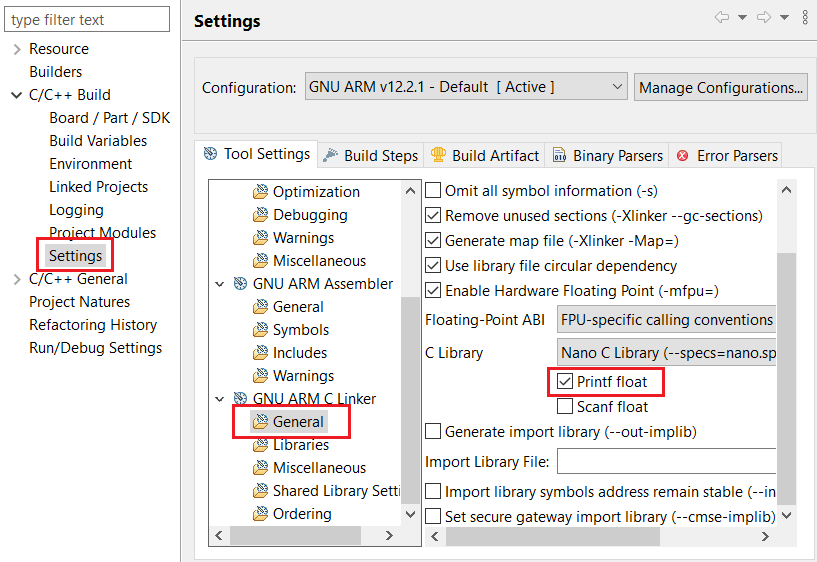

# Pocket Geiger Radiation - Type 5 (Sparkfun) #

## Overview ##

This project aims to show the hardware driver that is used to interface with the Type5 Geiger Sensor using Silicon Labs platform.

The Type 5 Pocket Geiger Radiation Sensor from Radiation Watch is a highly sensitive radiation sensor designed for the embedded systems market. It is capable of detecting Gamma and Beta radiation. The sensor has a simple pulsed output that can be used with any microcontroller. It is beneficial for detecting the levels of ionizing radiation, used as a medical equipment, and as personal dosimeters. By combining this sensor with Silicon Labs wireless technology, it is possible to send the collected information to a data center or trigger a remote protection system.

> [!NOTE]
> These small Geiger sensors feature a measurement range of 0.05uSv/h to 10mSv/h at 0.01cpm to 300Kcpm with a required measurement time of two minutes.

## Hardware Required ##

- 1x [BGM220-EK4314A](https://www.silabs.com/development-tools/wireless/bluetooth/bgm220-explorer-kit) BGM220 Bluetooth Module Explorer Kit

- Or 1x [Wi-Fi Development Kit](https://www.silabs.com/development-tools/wireless/wi-fi) based on SiWG917 (e.g. [SIWX917-DK2605A](https://www.silabs.com/development-tools/wireless/wi-fi/siwx917-dk2605a-wifi-6-bluetooth-le-soc-dev-kit) or [SIWX917-RB4338A](https://www.silabs.com/development-tools/wireless/wi-fi/siwx917-rb4338a-wifi-6-bluetooth-le-soc-radio-board))

- 1x Pocket Geiger Radiation Sensor - Type 5

## Connections Required ##

  Connect the Pocket Geiger Type 5 board to the Silicon Labs Kit through GPIO.

  

  By default, the binding used is as the table below:

  | Description                   | BGM220 Explorer Kit pin | BRD4338A + BRD4002A | BRD2605A | Pocket Geiger Radiation Sensor - Type 5 |
  | ----------------------------- | ----------------------- | -------------- | -------------------- | ----------------- |
  | DC 3V~9V                      | 5V                      | 5V             | 5V                   | +V                |
  | GND                           | GND                     | GND            | GND                  | GND               |
  | Radiation-detection pulse pin | PB2                     | GPIO_46 [P24]  | GPIO_10              | SIG               |
  | Noise-detection pulse pin     | PB3                     | GPIO_47 [P26]  | GPIO_11              | NS                |

## Setup ##

You can either create a project based on an example project or start with an empty example project.

> [!IMPORTANT]
> - Make sure that the [Third Party Hardware Drivers](https://github.com/SiliconLabsSoftware/third_party_hw_drivers_extension) extension is installed as part of the SiSDK. If not, follow [this documentation](https://github.com/SiliconLabsSoftware/third_party_hw_drivers_extension/blob/master/README.md#how-to-add-to-simplicity-studio-ide).
> - **Third Party Hardware Drivers** extension must be enabled for the project to install the required components from this extension.

> [!TIP]
> To show all components in the **Third Party Hardware Drivers** extension, the **Evaluation** quality must be enabled in the Software Component view.

### Create a project based on an example project ###

1. From the Launcher Home, add your board to My Products, click on it, and click on the **EXAMPLE PROJECTS & DEMOS** tab. Find the example project filtering by *radiation*.

2. Click **Create** button on the **Third Party Hardware Drivers - Pocket Geiger Radiation Sensor - Type 5 (Sparkfun)** example. Example project creation dialog pops up -> click Create and Finish and Project should be generated.

   

3. Build and flash this example to the board.

### Start with an empty example project ###

1. Create an "Empty C Project" for the "BGM220 Explorer Kit Board" using Simplicity Studio v5. Use the default project settings.

2. Copy the file `app/example/sparkfun_dosimeter_type5/app.c` into the project root folder (overwriting existing file).

3. Install the software components:

    - Open the .slcp file in the project.

    - Select the SOFTWARE COMPONENTS tab.

    - Install the following components:

      - **If the BGM220P Explorer Kit is used:**
        - [Services] → [IO Stream] → [IO Stream: USART] → default instance name: vcom
        - [Application] → [Utility] → [Log]
        - [Third Party Hardware Drivers] → [Sensors] → [Pocket Geiger Radiation - Type 5 (Sparkfun)] → use default configuration
      - **If the Wi-Fi Development Kit is used:**
        - [Third Party Hardware Drivers] → [Sensors] → [Pocket Geiger Radiation - Type 5 (Sparkfun)] → use default configuration

4. Enable **Printf float**

   - Open Properties of the project.
   - Select C/C++ Build → Settings → Tool Settings → GNU ARM C Linker → General → Check **Printf float**.

      

5. Build and flash this example to the board.

## How It Works ##

### API Overview ###

`sparkfun_type5_config.h`: Used to configure the GPIO Pins for the sensor and some specific values for the radiation measurement process. You need to config 2 pins (SIGNAL and NOISE), the period process, history length and the history unit.

`sparkfun_type5.h`: Containing public APIs of the sensor that will be called by the application.

`sparkfun_type5.c`: The source file of the driver which contains the implementation of all the public functions that will be used by users.

### Testing ###

The application monitors the Pocket Geiger through interrupts, processes and allows to get back the data using a callback function.
Use Putty or other program to read the serial output. The board uses by default a baudrate of 115200. You should expect a similar output to the one below.

## Report Bugs & Get Support ##

To report bugs in the Application Examples projects, please create a new "Issue" in the "Issues" section of [third_party_hw_drivers_extension](https://github.com/SiliconLabsSoftware/third_party_hw_drivers_extension) repo. Please reference the board, project, and source files associated with the bug, and reference line numbers. If you are proposing a fix, also include information on the proposed fix. Since these examples are provided as-is, there is no guarantee that these examples will be updated to fix these issues.

Questions and comments related to these examples should be made by creating a new "Issue" in the "Issues" section of [third_party_hw_drivers_extension](https://github.com/SiliconLabsSoftware/third_party_hw_drivers_extension) repo.
