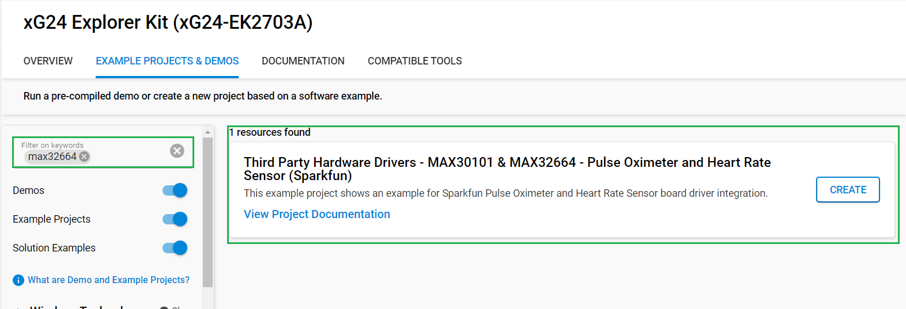
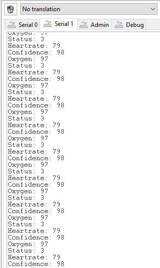

# MAX30101 & MAX32664 - Pulse Oximeter and Heart Rate Sensor (Sparkfun) #

## Summary ##

This example project shows an example for health parameters collection with the SparkFun Pulse Oximeter and Heart Rate Sensor driver integration with the Silicon Labs Platform.

The SparkFun Pulse Oximeter and Heart Rate Sensor is an I2C based biometric sensor, utilizing two chips from Maxim Integrated: the MAX32664 and MAX30101. MAX32664 is a Biometric Sensor Hub while MAX30101 is a Pulse Oximetry and Heart Rate Module. While the latter does all the sensing, the former is an incredibly small and fast Cortex M4 processor that handles all of the algorithmic calculations, digital filtering, pressure/position compensation, advanced R-wave detection, and automatic gain control.

## Required Hardware ##

- 1x [XG24-EK2703A](https://www.silabs.com/development-tools/wireless/efr32xg24-explorer-kit) EFR32xG24 Explorer Kit
- Or 1x [Wi-Fi Development Kit](https://www.silabs.com/development-tools/wireless/wi-fi) based on SiWG917 (e.g. [SIWX917-DK2605A](https://www.silabs.com/development-tools/wireless/wi-fi/siwx917-dk2605a-wifi-6-bluetooth-le-soc-dev-kit) or [SIWX917-RB4338A](https://www.silabs.com/development-tools/wireless/wi-fi/siwx917-rb4338a-wifi-6-bluetooth-le-soc-radio-board))
- 1x [SparkFun Pulse Oximeter and Heart Rate Sensor - MAX30101 & MAX32664 (Qwiic)](https://www.sparkfun.com/products/15219)

## Hardware Connection ##

- **If the EFR32xG24 Explorer Kit is used**:

  The SparkFun Pulse Oximeter and Heart Rate Sensor board support Qwiic, so it can connect easily to the Qwiic header of the Explorer Kit.

  

- **If the Wi-Fi Development Kit is used**:

   The hardware connection is shown in the table below:

  | Description  | BRD4338A + BRD4002A | BRD2605A | MAX30101 & MAX32664 sensor board |
  | -------------| ------------------- | ------------ | ------------------ |
  | I2C_SDA      | ULP_GPIO_6 [EXP_16] | Qwiic cable  | SDA                |
  | I2C_SCL      | ULP_GPIO_7 [EXP_15] | Qwiic cable  | SCL                |

> [!NOTE]
> This board has two additional pins on its header: the RESET and MFIO pin. These pins are required for the board to function because they determine if the board enters data collection mode or not.

## Setup ##

You can either create a project based on an example project or start with an empty example project.

> [!IMPORTANT]
> - Make sure that the [Third Party Hardware Drivers](https://github.com/SiliconLabsSoftware/third_party_hw_drivers_extension) extension is installed as part of the SiSDK. If not, follow [this documentation](https://github.com/SiliconLabsSoftware/third_party_hw_drivers_extension/blob/master/README.md#how-to-add-to-simplicity-studio-ide).
> - **Third Party Hardware Drivers** extension must be enabled for the project to install the required components from this extension.

> [!TIP]
> To show all components in the **Third Party Hardware Drivers** extension, the **Evaluation** quality must be enabled in the Software Component view.

### Create a project based on an example project ##

1. From the Launcher Home, add your board to My Products, click on it, and click on the **EXAMPLE PROJECTS & DEMOS** tab. Find the example project filtering by "max32664".

2. Click **Create** button on the project **Third Party Hardware Drivers - MAX30101 & MAX32664 - Pulse Oximeter and Heart Rate Sensor (Sparkfun)**. Example project creation dialog pops up -> click Create and Finish and Project should be generated.

    

3. Build and flash this example to the board.

### Start with an empty example project ##

1. Create an "Empty C Project" project for your board using Simplicity Studio v5. Use the default project settings

2. Copy the file `app/example/sparkfun_hr_po_max30101_max32664/app.c` into the project root folder (overwriting existing file)

3. Set the test mode in the *app.c* file

4. Install the software components:

    - Open the .slcp file in the project

    - Select the SOFTWARE COMPONENTS tab

    - Install the following components:

      **If the EFR32xG24 Explorer Kit is used:**

      - [Services] → [IO Stream] → [IO Stream: USART] → default instance name: vcom
      - [Application] → [Utility] → [Log]
      - [Platform] → [Driver] → [I2C] → [I2CSPM] → default instance name: qwiic
      - [Third Party Hardware Drivers] → [Sensors] → [MAX30101 & MAX32664 - Pulse Oximeter and Heart Rate Sensor (Sparkfun)] → use default configuration

      **If the Wi-Fi Development Kit is used:**

      - [WiSeConnect 3 SDK] → [Device] → [Si91x] → [MCU] → [Peripheral] → [I2C] → [i2c2]
      - [Third Party Hardware Drivers] → [Sensors] → [MAX30101 & MAX32664 - Pulse Oximeter and Heart Rate Sensor (Sparkfun)] → use default configuration

5. Build and flash the project to your device

## How It Works ##

### MAX30101 - Pulse Oximeter and Heart Rate Monitor ###

The MAX30101 gets your heart rate (BPM) and blood oxygen levels (SpO2) through the process of photoplethysmography, which is the process of obtaining the aforementioned biometric data with light. The SparkFun Pulse Oximeter works by placing your finger gently on the sensor which shines red, infrared, and sometimes green light through your skin. The capillaries filled with blood under your skin will absorb this light, or not, and the MAX30101 sensor will read which light comes back. This light data will then be sent back to the Biometric Sensor Hub which handles all the calculations to determine heart rate and blood oxygen levels.

### MAX32664 - Biometric Sensor Hub ###

The MAX32664 Biometric Sensor Hub is a very small Cortex M4 microcontroller dedicated to receiving the data it receives from the MAX30101 and running the calculations to determine heart rate and blood oxygen. When you're interfacing with the SparkFun Pulse Oximeter and Heart Rate Monitor, you are in effect interfacing with this wicked fast microcontroller. There are a multitude of settings to tailor the sensor to the persons you'll be monitoring made available through the driver library.

### Reference Tables and Sensor Settings ###

#### BioData Information ####

As shown below, the library uses a type that is unique to the SparkFun Pulse Oximeter and Heart Rate Monitor. The name of this type is bio_hub_data_t which is described in the table below

| BioData Members | Information |
| --- | --- |
| body.heart_rate | Heart rate |
| body.oxygen | Blood Oxygen Levels |
| body.confidence | The Sensor's confidence in the reported data. |
| body.status | Finger Detection |
| body.ir_led | Number of IR LED Samples |
| body.red_led | Number of Red LED Samples |

#### BioData Mode 2 ####

In addition to the information above, mode 2 also gives the following two data points.

| BioData Members | Information |
| --- | --- |
| body.r_value | Sp02 r Value |
| body.extStatus | Extended Finger Status Message |

#### Finger Status ####

Below is a reference table for the body.status member which tells you if the sensor has detected a finger or some other object that is not a finger. It relays this information with four numbers: 0-3.

| Status Number | Description |
| --- | --- |
| 0 | No Object Detected |
| 1 | Object Detected |
| 2 | Object Other Than Finger Detected |
| 3 | Finger Detected |

Below is a reference table for the body.exStatus member which is an expansion of the first finger status messaging. This is enabled in mode 2 and contains 8 different values.

| Status Number | Description |
| --- | --- |
|  0  | Success |
|  1  | Not Ready |
| -1  | Object Detected |
| -2  | Excessive Sensor Device Motion |
| -3  | No object detected |
| -4  | Pressing too hard |
| -5  | Object other than finger detected |
| -6  | Excessive finger motion |

#### Pulse Width vs. Sample Collection ####

There is trade off between higher resolution (i.e. longer pulse width) and the number of samples that you can collect per second. The table below shows how the resolution and sample rate interact.

| Samples/Second | Pulse | Width | (uS) |     |
| -------------- | ----- | ----- | ---- |-----|
|                | 69    | 118   | 215  | 411 |
| 50             | O     | O     | O    | O   |
| 100            | O     | O     | O    | O   |
| 200            | O     | O     | O    | O   |
| 400            | O     | O     | O    | O   |
| 800            | O     | O     | O    |     |
| 1000           | O     | O     |      |     |
| 1600           | O     |       |      |     |
| 3200           |       |       |      |     |
| Resolution (bits) | 15 | 16    | 17   | 18  |

### Testing ###

This example demonstrates some of the available features of the Pulse Oximeter and Heart Rate Sensor. Follow the below steps to test the example:

1. On your PC open a terminal program, such as the Console that is integrated in Simplicity Studio or a third-party tool terminal like TeraTerm to receive the logs from the virtual COM port. Note that your board uses the default baud rate of 115200.

2. Try to put your finger on the sensor with a proper pressure (solid contact between the finger and the sensor without optical leakage and don’t press with force) and check the logs on the terminal.

    

## Report Bugs & Get Support ##

To report bugs in the Application Examples projects, please create a new "Issue" in the "Issues" section of [third_party_hw_drivers_extension](https://github.com/SiliconLabsSoftware/third_party_hw_drivers_extension) repo. Please reference the board, project, and source files associated with the bug, and reference line numbers. If you are proposing a fix, also include information on the proposed fix. Since these examples are provided as-is, there is no guarantee that these examples will be updated to fix these issues.

Questions and comments related to these examples should be made by creating a new "Issue" in the "Issues" section of [third_party_hw_drivers_extension](https://github.com/SiliconLabsSoftware/third_party_hw_drivers_extension) repo.
