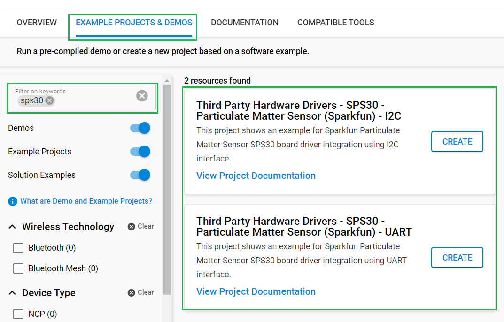

# SPS30 - Particulate Matter Sensor (Sparkfun) #

## Summary ##

This project aims to show the hardware driver that is used to interface with the SPS30 sensor using Silicon Labs platform. This driver is based on [SPS30 Sensor API](https://github.com/Sensirion/embedded-sps) from Sensirion.

The Sensirion Particulate Matter Sensor SPS30 is a compact, high quality, optical particle sensor that uses laser scattering and the innovative contamination resistance technology of Sensirion to achieve superior binning and particle measurement. This sensor allows users to measure mass concentration and number of particles of 1 µg/m^3, 2.5 µg/m^3, 4 µg/m^3, and 10 µg/m^3.

The compact form factor, measuring just under 41mm x 41mm x 12mm, combined with a sensor lifetime of over 8 years and a self cleaning procedure, makes the SPS30 the perfect sensor for projects in difficult to access locations. An easy to use 5-pin cable is included to make using the SPS30 a snap. The 1.5mm connector is broken out into 5 breadboard friendly wires color coded to make hooking up the SPS30 easy.

The SPS30 has a five-pin interface that can communicate over two different protocols: UART and I2C. The SPS30 requires a 5V power supply, but can work with 3.3V and 5V microcontrollers. The logic is 5V and 3.3V tolerant.

## Required Hardware ##

- 1x [XG24-EK2703A](https://www.silabs.com/development-tools/wireless/efr32xg24-explorer-kit) EFR32xG24 Explorer Kit
- Or 1x [Wi-Fi Development Kit](https://www.silabs.com/development-tools/wireless/wi-fi) based on SiWG917 (e.g. [SIWX917-DK2605A](https://www.silabs.com/development-tools/wireless/wi-fi/siwx917-dk2605a-wifi-6-bluetooth-le-soc-dev-kit) or [SIWX917-RB4338A](https://www.silabs.com/development-tools/wireless/wi-fi/siwx917-rb4338a-wifi-6-bluetooth-le-soc-radio-board))
- 1x [Particulate Matter Sensor - SPS30](https://www.sparkfun.com/products/15103)

## Hardware Connection ##

- **If the EFR32xG24 Explorer Kit is used**:

  The hardware connection is shown in the image below:

  
  

  ---------------------------------------------------------------------------------------------

  | Pin | SPS30      | Connect to | EFR32xG24 Explorer Kit                                     |
  | --- | ---------- | ---------- | -----------------------------------------------------------|
  | 1.  | VDD        | <========> | 5V                                                         |
  | 2.  | RX/SDA     | <========> | TX/SDA                                                     |
  | 3.  | TX/SCL     | <========> | RX/SCL                                                     |
  | 4.  | SEL        | <========> | Leave floating to select UART or Pull to GND to select I2C |
  | 5.  | GND        | <========> | GND                                                        |

  ---------------------------------------------------------------------------------------------

- **If the Wi-Fi Development Kit is used**:

  The hardware connection is shown in the table below:

  **- If using I2C interface:**

  | Description  | BRD4338A + BRD4002A | BRD2605A     | SPS30        |
  | -------------| ------------------- | ------------ | ------------ |
  | I2C_SDA      | ULP_GPIO_6 [EXP_16] |  ULP_GPIO_6  | PIN 2 (SDA)  |
  | I2C_SCL      | ULP_GPIO_7 [EXP_15] |  ULP_GPIO_7  | PIN 3 (SCL)  |
  | GND          |                     |              | PIN 4 (SEL)  |
  | +5V          |                     |              | PIN 1 (+5V)  |
  | GND          |                     |              | PIN 5 (GND)  |

  **- If using UART interface:**

  | Description  | BRD4338A + BRD4002A  | BRD2605A | SPS30               |
  | ------------ | -------------------- | -------- | ------------------- |
  | UART1_RX_PIN | GPIO_6 [P19]         | GPIO_6   | PIN 3 (TX)          |
  | UART1_TX_PIN | GPIO_7 [P20]         | GPIO_7   | PIN 2 (RX)          |
  | Floating     |                      |          | PIN 4 (SEL)         |
  | +5V          |                      | +5V      | PIN 1 (+5V)         |
  | GND          |                      | GND      | PIN 5 (GND)         |

## Setup ##

You can either create a project based on an example project or start with an empty example project.

> [!IMPORTANT]
> - Make sure that the [Third Party Hardware Drivers](https://github.com/SiliconLabsSoftware/third_party_hw_drivers_extension) extension is installed as part of the SiSDK. If not, follow [this documentation](https://github.com/SiliconLabsSoftware/third_party_hw_drivers_extension/blob/master/README.md#how-to-add-to-simplicity-studio-ide).
> - **Third Party Hardware Drivers** extension must be enabled for the project to install the required components from this extension.

> [!TIP]
> To show all components in the **Third Party Hardware Drivers** extension, the **Evaluation** quality must be enabled in the Software Component view.

### Create a project based on an example project ###

1. From the Launcher Home, add your board to My Products, click on it, and click on the **EXAMPLE PROJECTS & DEMOS** tab. Find the example project filtering by 'sps30'.

2. Click **Create** button on the example:

   - **Third Party Hardware Drivers - SPS30 - Particulate Matter Sensor (Sparkfun) - I2C** if using the I2C interface.

   - **Third Party Hardware Drivers - SPS30 - Particulate Matter Sensor (Sparkfun) - UART** if using the UART interface.

   Example project creation dialog pops up -> click Create and Finish and Project should be generated.

      

3. Build and flash this example to the board.

### Start with an empty example project ###

1. Create an "Empty C Project" for the your board using Simplicity Studio v5. Use the default project settings.

2. Copy the file `app/example/sparkfun_particulate_matter_sensor_sps30/app.c` into the project root folder (overwriting the existing file).

3. Install the software components:

    - Open the .slcp file in the project.

    - Select the SOFTWARE COMPONENTS tab.

    - Install the following components:

        **If the EFR32xG24 Explorer Kit is used**:

        - [Services] → [IO Stream] → [IO Stream: EUSART] → default instance name: vcom
        - [Application] → [Utility] → [Log]
        - If using the I2C interface:
          - [Third Party Hardware Drivers] → [Sensors] → [SPS30 - Particulate Matter Sensor (Sparkfun) - I2C] → use default configuration
        - If using the UART interface:
          - [Services] → [IO Stream] → [IO Stream: USART] → [mikroe] → set "Receive buffer size" to 256
          - [Third Party Hardware Drivers] → [Sensors] → [SPS30 - Particulate Matter Sensor (Sparkfun) - UART] → use default configuration

        **If the Wi-Fi Development Kit is used**:
        - If using the I2C interface:
          - [WiSeConnect 3 SDK] → [Device] → [Si91x] → [MCU] → [Peripheral] → [I2C] → [i2c2]
          - [Third Party Hardware Drivers] → [Sensors] → [SPS30 - Particulate Matter Sensor (Sparkfun) - I2C] → use default configuration
        - If using the UART interface:
          - [Third Party Hardware Drivers] → [Sensors] → [SPS30 - Particulate Matter Sensor (Sparkfun) - UART] → use default configuration
          - [WiSeConnect 3 SDK] → [Device] → [Si91x] → [MCU] → [Peripheral] → [UART] → disable "UART1 DMA"

4. Enable **Printf float**

   - Open Properties of the project.
   - Select C/C++ Build → Settings → Tool Settings → GNU ARM C Linker → General → Check **Printf float**.

      

5. Build and flash this example to the board.

## How It Works ##

Driver Layer Diagram is shown in the image below:

After you flash the code to the Explorer Kit and power the connected boards, the application starts running automatically. Use Putty/Tera Term (or another program) to read the values of the serial output. Note that your board uses the default baud rate of 115200.

In the image below, you can see an example how the output is displayed. The main program performs a sensor probing at first, then it reads the serial number and feature set version. The main program starts the measurements and continuously receives measured values ​​(pm1.0, pm2.5, pm4.0, pm10.0 ... concentration).

There is a periodic timer in the code, which determines the sampling intervals; the default sensor sampling rate is 3000 ms. If you need more frequent sampling, it is possible to change the corresponding timer value of the "app.c" file.

## Report Bugs & Get Support ##

To report bugs in the Application Examples projects, please create a new "Issue" in the "Issues" section of [third_party_hw_drivers_extension](https://github.com/SiliconLabsSoftware/third_party_hw_drivers_extension) repo. Please reference the board, project, and source files associated with the bug, and reference line numbers. If you are proposing a fix, also include information on the proposed fix. Since these examples are provided as-is, there is no guarantee that these examples will be updated to fix these issues.

Questions and comments related to these examples should be made by creating a new "Issue" in the "Issues" section of [third_party_hw_drivers_extension](https://github.com/SiliconLabsSoftware/third_party_hw_drivers_extension) repo.
