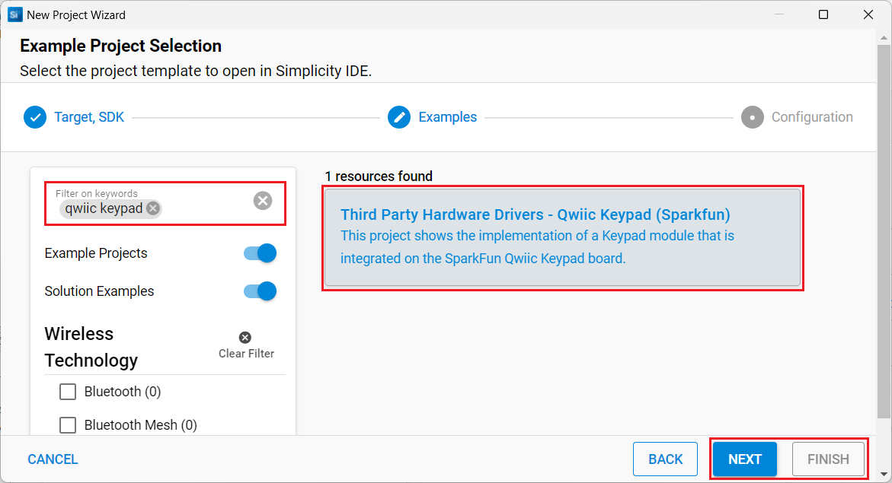

# Qwiic Keypad (Sparkfun) #

## Summary ##

This project shows the implementation of a Keypad module that is integrated into the SparkFun Qwiic Keypad board.

The SparkFun Qwiic Keypad board combines the convenience of the Qwiic connection system and a matrix keypad with a controller IC, so you don't need to mess with any pull-up resistors or configure multiple GPIO pins. You only need to connect the Qwiic interfaces and initialize the I2C peripheral on your development board.

For more information about the SparkFun Qwiic Keypad, see the [specification page](https://learn.sparkfun.com/tutorials/qwiic-keypad-hookup-guide).

## Required Hardware ##

- [An EFR32xG24 Explorer Kit - xG24-EK2703A](https://www.silabs.com/development-tools/wireless/efr32xg24-explorer-kit?tab=overview#user-guides)
- Or [SiWx917 Wi-Fi 6 and Bluetooth LE 8 MB Flash SoC Pro Kit](https://www.silabs.com/development-tools/wireless/wi-fi/siwx917-pk6031a-wifi-6-bluetooth-le-soc-pro-kit) (BRD4002 + BRD4338A)
- [A SparkFun Qwiic keypad Board](https://www.sparkfun.com/products/15290)
  
## Hardware Connection ##

- **If the EFR32xG24 Explorer Kit is used**:

  The Sparkfun Qwiic Keypad board can be easily connected to the Explorer Kit by using a [Qwiic cable](https://www.sparkfun.com/products/17259).

  The hardware connection is shown in the image below:
  

- **If the SiWx917 Wi-Fi 6 and Bluetooth LE 8 MB Flash SoC Pro Kit is used**:
  
  The hardware connection is shown in the table below:

  | Description  | BRD4338A GPIO | BRD4002 EXP Header | SparkFun Qwiic Keypad |
  | -------------| ------------- | ------------------ | ------------------ |
  | I2C_SDA      | ULP_GPIO_6    | EXP_16             | SDA                |
  | I2C_SCL      | ULP_GPIO_7    | EXP_15             | SCL                |
  | Interrupt Pin| GPIO_46       | P24                | INT                |

## Setup ##

You can either create a project based on an example project or start with an empty example project.

### Create a project based on an example project ###

1. From the Launcher Home, add your board Products, click on it, and click on the **EXAMPLE PROJECTS & DEMOS** tab. Find the example project filtering by "qwiic keypad".

2. Click **Create** button on the **Third Party Hardware Drivers - Qwiic Keypad (SparkFun)** example. Example project creation dialog pops up -> click Create and Finish and Project should be generated.

   

3. Build and flash this example to the board.

### Start with an empty example project ###

1. Create an "Empty C Project" for your board using Simplicity Studio v5. Use the default project settings.

2. Copy the file `app/example/sparkfun_qwiic_keypad/app.c` into the project root folder (overwriting the existing file).

3. Install the software components:

   - Open the .slcp file in the project.
   - Select the SOFTWARE COMPONENTS tab.
   - Install the following components:

      **If the EFR32xG24 Explorer Kit is used:**

        - [Services] → [IO Stream] → [IO Stream: USART] → default instance name: vcom
        - [Application] → [Utility] → [Log]
        - [Platform] → [Driver] → [I2C] → [I2CSPM] → qwiic instance
        - [Third Party Hardware Drivers] → [Human Machine Interface] → [Qwiic Keypad (Sparkfun)]

      **If the SiWx917 Wi-Fi 6 and Bluetooth LE 8 MB Flash SoC Pro Kit is used:**

        - [WiSeConnect 3 SDK] → [Device] → [Si91x] → [MCU] → [Peripheral] → [I2C] → [i2c2]
        - [Third Party Hardware Drivers] → [Human Machine Interface] → [Qwiic Keypad (Sparkfun)]

4. Build and flash the project to your device.

**Note:**

- Make sure that the **Third Party Hardware Drivers** extension is installed. If not, follow [this documentation](https://github.com/SiliconLabs/third_party_hw_drivers_extension/blob/master/README.md#how-to-add-to-simplicity-studio-ide)

- SDK Extension must be enabled for the project to install the "Qwiic Keypad (Sparkfun)" component

## How It Works ##

### API Overview ###

- *sparkfun_keypad_init()*: Initialize the keypad module. This function should be called before the main loop.

- *sparkfun_keypad_get_firmware_version()*: Read Firmware Version from the Keypad. Helpful for tech support.

- *sparkfun_keypad_set_address()*: Set new I2C address for keypad.

- *sparkfun_keypad_get_address()*: Get current I2C address used of keypad.

- *sparkfun_keypad_scan_address()*: Scan I2C address of all Keypad that connected on the I2C bus.

- *sparkfun_keypad_select_device()*: Select device on the I2C bus based on its I2C address.

- *sparkfun_keypad_read_last_button()*: Read the first element from the FIFO.

- *sparkfun_keypad_time_since_last_button_event()*: Get the time elapsed since the last button was pressed in milliseconds.

- *sparkfun_keypad_update_fifo()*: Send a command to the keypad to update the contents of the fifo inside the device.

- *sparkfun_keypad_present()*: Check whether a keypad is present on the I2C bus or not.

- *sparkfun_keypad_send_command()*: Send a command and read the result over the I2C bus.

- There are two operation modes for this example. One is using interrupt and one is polling using the timer. You can choose this mode via macro "SAPRKFUN_KEYPAD_INT_PIN_EN" in file "app.h"

### Testing ###

This example demonstrates some of the available features of the Keypad module. Follow the below steps to test the example:

1. On your PC open a terminal program, such as the Console that is integrated into Simplicity Studio or a third-party tool terminal like TeraTerm to receive the logs from the virtual COM port.

2. Press one or more buttons on the keypad and check the logs on the terminal.

   

## Report Bugs & Get Support ##

To report bugs in the Application Examples projects, please create a new "Issue" in the "Issues" section of [third_party_hw_drivers_extension](https://github.com/SiliconLabs/third_party_hw_drivers_extension) repo. Please reference the board, project, and source files associated with the bug, and reference line numbers. If you are proposing a fix, also include information on the proposed fix. Since these examples are provided as-is, there is no guarantee that these examples will be updated to fix these issues.

Questions and comments related to these examples should be made by creating a new "Issue" in the "Issues" section of [third_party_hw_drivers_extension](https://github.com/SiliconLabs/third_party_hw_drivers_extension) repo.
