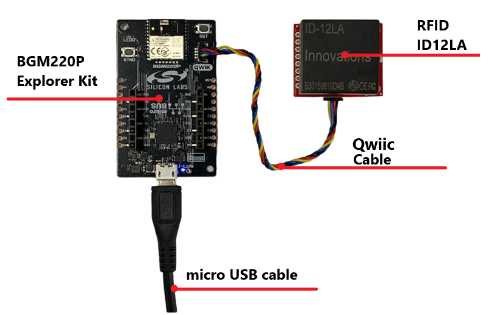
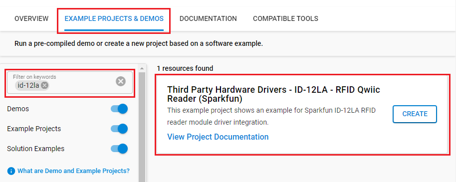
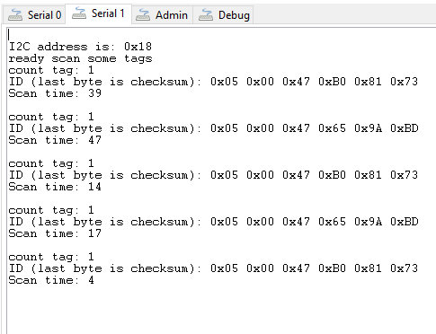

# ID-12LA - RFID Reader Module (Sparkfun) #

## Summary ##

This project shows the implementation of an RFID module that outputs the 10-character unique ID ( 5 bytes ID + 1 byte checksum + 4 bytes timestamp) of a 125kHz RFID card with Silicon Labs platform based on I2C communication.

It can be used for human tracking, checking event attendance, and is also beneficial for electronic wallet applications.

## Required Hardware ##

- 1x [BGM220-EK4314A](https://www.silabs.com/development-tools/wireless/bluetooth/bgm220-explorer-kit) BGM220 Bluetooth Module Explorer Kit

- Or 1x [Wi-Fi Development Kit](https://www.silabs.com/development-tools/wireless/wi-fi) based on SiWG917 (e.g. [SIWX917-DK2605A](https://www.silabs.com/development-tools/wireless/wi-fi/siwx917-dk2605a-wifi-6-bluetooth-le-soc-dev-kit) or [SIWX917-RB4338A](https://www.silabs.com/development-tools/wireless/wi-fi/siwx917-rb4338a-wifi-6-bluetooth-le-soc-radio-board))

- 1x [SparkFun RFID Qwiic Reader](https://www.sparkfun.com/products/15191)

- 1x [RFID Reader ID-12LA](https://www.sparkfun.com/products/11827)

- 1x [RFID Tag (125kHz)](https://www.sparkfun.com/products/14325)

## Hardware Connection ##

- **If the BGM220P Explorer Kit is used**:

  The SparkFun RFID Qwiic Reader board can be easily connected to your board by using a [Qwiic cable](https://www.sparkfun.com/products/17259). The hardware connection is shown in the image below:

  

- **If the Wi-Fi Development Kit is used**:

  The hardware connection is shown in the table below:

  | Description  | BRD4338A + BRD4002A | BRD2605A | SparkFun RFID Qwiic Reader |
  | -------------| ------------------- | ------------ | ------------------ |
  | I2C_SDA      | ULP_GPIO_6 [EXP_16] | Qwiic cable  | SDA                |
  | I2C_SCL      | ULP_GPIO_7 [EXP_15] | Qwiic cable  | SCL                |

## Setup ##

You can either create a project based on an example project or start with an empty example project.

> [!IMPORTANT]
> - Make sure that the [Third Party Hardware Drivers](https://github.com/SiliconLabsSoftware/third_party_hw_drivers_extension) extension is installed as part of the SiSDK. If not, follow [this documentation](https://github.com/SiliconLabsSoftware/third_party_hw_drivers_extension/blob/master/README.md#how-to-add-to-simplicity-studio-ide).
> - **Third Party Hardware Drivers** extension must be enabled for the project to install the required components from this extension.

> [!TIP]
> To show all components in the **Third Party Hardware Drivers** extension, the **Evaluation** quality must be enabled in the Software Component view.

### Create a project based on an example project ###

1. From the Launcher Home, add your board to My Products, click on it, and click on the **EXAMPLE PROJECTS & DEMOS** tab. Find the example project filtering by "ID-12LA".

2. Click **Create** button on the **Third Party Hardware Drivers - ID-12LA - RFID Qwiic Reader (Sparkfun)** example. Example project creation dialog pops up -> click Create and Finish and Project should be generated.

   

3. Build and flash this example to the board.

### Start with an empty example project ###

1. Create an "Empty C Project" for your board" using Simplicity Studio v5. Use the default project settings.

2. Copy the file `app/example/sparkfun_rfid_id12la/app.c` into the project root folder (overwriting the existing file).

3. Install the software components:

   - Open the .slcp file in the project.

   - Select the SOFTWARE COMPONENTS tab.

   - Install the following components:

     - **If the BGM220P Explorer Kit is used:**
       - [Services] → [IO Stream] → [IO Stream: USART] → default instance name: vcom
       - [Application] → [Utility] → [Log]
       - [Application] → [Utility] → [Assert]
       - [Platform] → [Driver] → [I2C] → [I2CSPM] → default instance name: qwiic
       - [Third Party Hardware Drivers] → [Wireless Connectivity] → [ID-12LA - RFID Reader (Sparkfun) - I2C]

     - **If the Wi-Fi Development Kit is used:**
       - [Application] → [Utility] → [Assert]
       - [WiSeConnect 3 SDK] → [Device] → [Si91x] → [MCU] → [Peripheral] → [I2C] → [i2c2]
       - [Third Party Hardware Drivers] → [Wireless Connectivity] → [ID-12LA - RFID Reader (Sparkfun) - I2C] → set the correct I2C address of the RFID Reader

4. Build and flash the project to your device.

## How It Works ##

### API Overview ###

A higher level kit driver I2CSPM (I2C simple poll-based master mode driver) is used for initializing the I2C peripheral as master mode and performing the I2C transfer.

`rfid_id12la.c`: Communicate with the microcontroller through the Silabs I2CSPM platform service as well as implements public APIs to interface with the ID12LA RFID.

### Testing ###

This example demonstrates some of the available features of the ID12LA module. After initialization, the ID-12LA module outputs a packet through I2C ( 5 bytes ID + 1 byte checksum + 4 bytes timestamp) when it scans an RFID card. The "scan" time is not the time of day the RFID card was scanned but rather the time between when the card was scanned and when the user requested the RFID tag from the Qwiic RFID Reader (the time that data is stored in the buffer of ID12LA module). The following diagram shows the program flow as implemented in the app.c file:

Use J-Link Silicon Labs or other program to read the serial output. The BGM220P uses by default a baudrate of 115200. You should expect a similar output to the one below.

## Report Bugs & Get Support ##

To report bugs in the Application Examples projects, please create a new "Issue" in the "Issues" section of [third_party_hw_drivers_extension](https://github.com/SiliconLabsSoftware/third_party_hw_drivers_extension) repo. Please reference the board, project, and source files associated with the bug, and reference line numbers. If you are proposing a fix, also include information on the proposed fix. Since these examples are provided as-is, there is no guarantee that these examples will be updated to fix these issues.

Questions and comments related to these examples should be made by creating a new "Issue" in the "Issues" section of [third_party_hw_drivers_extension](https://github.com/SiliconLabsSoftware/third_party_hw_drivers_extension) repo.
